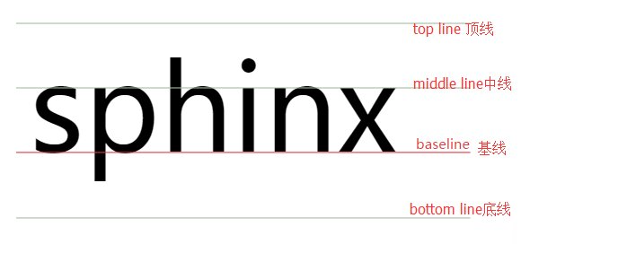

[TOC]

### 选择器

* 相邻选择器：\#lv+div {...} 选择该元素的下一个兄弟元素
* 群组选择器：h3,div,p,span {...}
* 后代选择器：M N   元素M内部所有子元素和后代元素N
* 子代选择器：M>N 元素M内部第一代子元素N
* 兄弟选择器：M~N 元素M之后的所有兄弟元素N
* :first-letter: 选中元素内容第一个字
* :first-line：第一行

| 选择器                                                       | 例子                  | 例子描述                                            | CSS  |
| :----------------------------------------------------------- | :-------------------- | :-------------------------------------------------- | :--- |
| [.*class*](https://www.w3school.com.cn/cssref/selector_class.asp) | .intro                | 选择 class="intro" 的所有元素。                     | 1    |
| [#*id*](https://www.w3school.com.cn/cssref/selector_id.asp)  | #firstname            | 选择 id="firstname" 的所有元素。                    | 1    |
| [*](https://www.w3school.com.cn/cssref/selector_all.asp)     | *                     | 选择所有元素。                                      | 2    |
| [*element*](https://www.w3school.com.cn/cssref/selector_element.asp) | p                     | 选择所有 <p> 元素。                                 | 1    |
| [*element*,*element*](https://www.w3school.com.cn/cssref/selector_element_comma.asp) | div,p                 | 选择所有 <div> 元素和所有 <p> 元素。                | 1    |
| [*element* *element*](https://www.w3school.com.cn/cssref/selector_element_element.asp) | div p                 | 选择 <div> 元素内部的所有 <p> 元素。                | 1    |
| [*element*>*element*](https://www.w3school.com.cn/cssref/selector_element_gt.asp) | div>p                 | 选择父元素为 <div> 元素的所有 <p> 元素。            | 2    |
| [*element*+*element*](https://www.w3school.com.cn/cssref/selector_element_plus.asp) | div+p                 | 选择紧接在 <div> 元素之后的所有 <p> 元素。          | 2    |
| [[*attribute*\]](https://www.w3school.com.cn/cssref/selector_attribute.asp) | [target]              | 选择带有 target 属性所有元素。                      | 2    |
| [[*attribute*=*value*\]](https://www.w3school.com.cn/cssref/selector_attribute_value.asp) | [target=_blank]       | 选择 target="_blank" 的所有元素。                   | 2    |
| [[*attribute*~=*value*\]](https://www.w3school.com.cn/cssref/selector_attribute_value_contain.asp) | [title~=flower]       | 选择 title 属性包含单词 "flower" 的所有元素。       | 2    |
| [[*attribute*\|=*value*\]](https://www.w3school.com.cn/cssref/selector_attribute_value_start.asp) | [lang\|=en]           | 选择 lang 属性值以 "en" 开头的所有元素。            | 2    |
| [:link](https://www.w3school.com.cn/cssref/selector_link.asp) | a:link                | 选择所有未被访问的链接。                            | 1    |
| [:visited](https://www.w3school.com.cn/cssref/selector_visited.asp) | a:visited             | 选择所有已被访问的链接。                            | 1    |
| [:active](https://www.w3school.com.cn/cssref/selector_active.asp) | a:active              | 选择活动链接。                                      | 1    |
| [:hover](https://www.w3school.com.cn/cssref/selector_hover.asp) | a:hover               | 选择鼠标指针位于其上的链接。                        | 1    |
| [:focus](https://www.w3school.com.cn/cssref/selector_focus.asp) | input:focus           | 选择获得焦点的 input 元素。                         | 2    |
| [:first-letter](https://www.w3school.com.cn/cssref/selector_first-letter.asp) | p:first-letter        | 选择每个 <p> 元素的首字母。                         | 1    |
| [:first-line](https://www.w3school.com.cn/cssref/selector_first-line.asp) | p:first-line          | 选择每个 <p> 元素的首行。                           | 1    |
| [:first-child](https://www.w3school.com.cn/cssref/selector_first-child.asp) | p:first-child         | 选择属于父元素的第一个子元素的每个 <p> 元素。       | 2    |
| [:before](https://www.w3school.com.cn/cssref/selector_before.asp) | p:before              | 在每个 <p> 元素的内容之前插入内容。                 | 2    |
| [:after](https://www.w3school.com.cn/cssref/selector_after.asp) | p:after               | 在每个 <p> 元素的内容之后插入内容。                 | 2    |
| [:lang(*language*)](https://www.w3school.com.cn/cssref/selector_lang.asp) | p:lang(it)            | 选择带有以 "it" 开头的 lang 属性值的每个 <p> 元素。 | 2    |
| [*element1*~*element2*](https://www.w3school.com.cn/cssref/selector_gen_sibling.asp) | p~ul                  | 选择前面有 <p> 元素的每个 <ul> 元素。               | 3    |
| [[*attribute*^=*value*\]](https://www.w3school.com.cn/cssref/selector_attr_begin.asp) | a[src^="https"]       | 选择其 src 属性值以 "https" 开头的每个 <a> 元素。   | 3    |
| [[*attribute*$=*value*\]](https://www.w3school.com.cn/cssref/selector_attr_end.asp) | a[src$=".pdf"]        | 选择其 src 属性以 ".pdf" 结尾的所有 <a> 元素。      | 3    |
| [[*attribute**=*value*\]](https://www.w3school.com.cn/cssref/selector_attr_contain.asp) | a[src*="abc"]         | 选择其 src 属性中包含 "abc" 子串的每个 <a> 元素。   | 3    |
| [:first-of-type](https://www.w3school.com.cn/cssref/selector_first-of-type.asp) | p:first-of-type       | 选择属于其父元素的首个 <p> 元素的每个 <p> 元素。    | 3    |
| [:last-of-type](https://www.w3school.com.cn/cssref/selector_last-of-type.asp) | p:last-of-type        | 选择属于其父元素的最后 <p> 元素的每个 <p> 元素。    | 3    |
| [:only-of-type](https://www.w3school.com.cn/cssref/selector_only-of-type.asp) | p:only-of-type        | 选择属于其父元素唯一的 <p> 元素的每个 <p> 元素。    | 3    |
| [:only-child](https://www.w3school.com.cn/cssref/selector_only-child.asp) | p:only-child          | 选择属于其父元素的唯一子元素的每个 <p> 元素。       | 3    |
| [:nth-child(*n*)](https://www.w3school.com.cn/cssref/selector_nth-child.asp) | p:nth-child(2)        | 选择属于其父元素的第二个子元素的每个 <p> 元素。     | 3    |
| [:nth-last-child(*n*)](https://www.w3school.com.cn/cssref/selector_nth-last-child.asp) | p:nth-last-child(2)   | 同上，从最后一个子元素开始计数。                    | 3    |
| [:nth-of-type(*n*)](https://www.w3school.com.cn/cssref/selector_nth-of-type.asp) | p:nth-of-type(2)      | 选择属于其父元素第二个 <p> 元素的每个 <p> 元素。    | 3    |
| [:nth-last-of-type(*n*)](https://www.w3school.com.cn/cssref/selector_nth-last-of-type.asp) | p:nth-last-of-type(2) | 同上，但是从最后一个子元素开始计数。                | 3    |
| [:last-child](https://www.w3school.com.cn/cssref/selector_last-child.asp) | p:last-child          | 选择属于其父元素最后一个子元素每个 <p> 元素。       | 3    |
| [:root](https://www.w3school.com.cn/cssref/selector_root.asp) | :root                 | 选择文档的根元素。                                  | 3    |
| [:empty](https://www.w3school.com.cn/cssref/selector_empty.asp) | p:empty               | 选择没有子元素的每个 <p> 元素（包括文本节点）。     | 3    |
| [:target](https://www.w3school.com.cn/cssref/selector_target.asp) | #news:target          | 选择当前活动的 #news 元素。                         | 3    |
| [:enabled](https://www.w3school.com.cn/cssref/selector_enabled.asp) | input:enabled         | 选择每个启用的 <input> 元素。                       | 3    |
| [:disabled](https://www.w3school.com.cn/cssref/selector_disabled.asp) | input:disabled        | 选择每个禁用的 <input> 元素                         | 3    |
| [:checked](https://www.w3school.com.cn/cssref/selector_checked.asp) | input:checked         | 选择每个被选中的 <input> 元素。                     | 3    |
| [:not(*selector*)](https://www.w3school.com.cn/cssref/selector_not.asp) | :not(p)               | 选择非 <p> 元素的每个元素。                         | 3    |
| [::selection](https://www.w3school.com.cn/cssref/selector_selection.asp) | ::selection           | 选择被用户选取的元素部分。                          | 3    |

### CSS规范

#### 文件命名

reset.css重置，重置元素默认样式；global.css 全局样式；theme主题；module模块；master母版；column专栏；form表单；mend补丁。以上是开发阶段，发布时使用webpack打包

#### id、class命名
为了避免class命名重复，一般取父元素的class名作为前缀：column column-title。
主体命名：wrapper最外层；content/container主体；sidebar侧栏；column栏目；main-left左侧；main主体；menu菜单；submenu
导航：main-nav、sub-nav、side-nav边导航、leftside-nav左导航、top-nav
其他：tool toolbar工具条、related相关文章、siteinfolegal法律声明

#### 书写顺序

按样式功能的重要性排列；对于实现某一功能的集中列出；最好都加注释

| 属性类别   | 举例                                              |
| ---------- | ------------------------------------------------- |
| 布局       | display、position、float、clear                   |
| 自身盒模型 | width、height、padding、marginn、border、overflow |
| 文本       | font、line-height、text-align、text-indent        |
| 装饰       | color、background-color、opacity、cursor          |
| 其他       | content等                                         |

### CSS Rest 重置样式
不同浏览器默认样式不同，需要重置
不建议使用 `*{padding: 0; margin: 0}`，性能低，对于表格、input是不希望去掉的
可以参考Eric Meyer重置样式表，更建议自己根据需求来定制

### 单位
绝对单位：cm、mm、in、pt、pc
相对单位：px、%、em、rem
px属于相对单位是因为屏幕分辨率大小不同，1px大小也不同，但不考虑分辨率就可作为绝对单位
%: width、height、font-size百分比相对于父元素的相同属性值计算的；line-height相对于当前元素的font-size；vertical-align相对于当前元素line-height
1em = 当前元素字体大小font-size的px，当前元素没定义则找父元素，浏览器默认16px。技巧：

* 首行缩进使用text-indent: 2em
* 使用em作为字体大小单位。百分比作为字体大小不符合习惯，使用em，当网页字体需要修改时直接改变根元素的大小即可
* 使用em作为统一单位
  ```
  因为浏览器默认16px，提前声明 body{font-size: 62.5%}，可使默认你字体大小变为16*62.5% = 10px; 则：
  1em = 10px
  0.75em = 7.5px
  1.5em = 15px
  
  例：p元素width 150px，height 75px，font-size 15px，使用em：
  {
  	font-size: 1.5em;
  	width: 10em;
  	height: 5em
  }
  为什么width不是15em，而是10em：因为em相对于当前元素字体大小而言，所以需要以当前元素的font-size值再算一次，则 width: 150px / 15px = 10em
  ```

1rem = 根元素字体大小。css3，移动端布局产常用

### css特性

继承性：除了padding、margin、border等，子元素都会继承父元素的某些样式属性
> 例外：a元素因自身有颜色，所以默认不继承，想要继承使用 {color: inherit};

层叠性：同一个元素重复定义相同属性，权重相同的后面覆盖前面
> 权重：
> 引用方式优先级：行内样式 > (内部样式 = 外部样式)
> 继承方式优先级：最近的祖先最优先；
> 选择器权重：只针对当前元素，不能用于继承样式。行内样式 1000 > id选择器 100 > class选择器=伪类=属性选择器 10 > 元素选择器=伪元素 1 > 通配符 0。权重累加：#outer .inner strong 的权重为 100 + 10 + 1 = 111
> 指定样式 > 继承样式
> !important优先级最高。两个important以后面为主

### css加载方式
外部样式表：使用link，当被应用到多个页面是最理想的选择
内部样式表：某个页面的个别样式表，如果放在公共的外部样式表，会导致每个页面都会加载一次，影响加载速度
行内样式表：出现一两次、修改幅度小、优先级高的样式

### 文字样式

| 属性        | 说明                                                         |
| :---------- | :----------------------------------------------------------- |
| font-family | 字体类型                                                     |
| font-size   | 字体大小 px em 百分比                                        |
| font-weight | 字体粗细                                                     |
| font-style  | 字体斜体 normal; italic斜体; 对于没有斜体的特殊字体，使用oblique将字体倾斜 |
| color       | 颜色                                                         |

### 段落样式

段落样式设涉及多个文字（整个段落）的排版效果，注重整体。font前缀是文字样式，text前缀是段落样式

| 属性            | 说明                                                         |
| :-------------- | :----------------------------------------------------------- |
| text-decoration | 文本修饰。none、下划线underline、删除线line-through、顶划线overline |
| text-transform  | （英文）文本大小写 uppercase lowercase capitalize首字母大写  |
| font-varient    | 将英文文本转换为“小型”大写字母 normal small-caps。不常用     |
| text-indent     | 段落首行缩进值，一个字的缩进值为font-size值                  |
| text-align      | 文本水平对齐方式 left center right justify两端对齐 inherit从父元素继承，只对文本文字和img有效 |
| line-height     | 行高                                                         |
| letter-spacing  | 字距                                                         |
| word-spacing    | 词距                                                         |
| vertical-align  | 垂直对齐                                                     |

#### text-indent

* 2em首行缩进
* -9999px: 一般情况下把网站LOGO放在h1中，标题隐藏。在搜索引擎优化中，h1是非常重要的标签，又想不显示标题，又想使用标题进行搜索引擎优化，设置-9999px。不设置为-999和-99是因为-9999可以保证一定在屏幕外。而设置display:none会被搜索引擎认为是垃圾信息忽略掉

#### text-align

* 可用于inline、inline-block（包含图片）元素，不可用于block
* justify两端对齐会产生一些问题，很少用到
* 两种水平居中的实现方式：1）text-align:center。2）margin:0 auto。2实现的是block元素的水平居中；1定义在父元素，2定义在当前元素

#### line-height



* 一行的高度，两行文字**基线**之间的距离。设置height和line-height相等，可实现当行文字的**垂直居中**

* 设置为百分比或em，是相对于当前元素的font-size值来计算的

* 子元素继承父元素的line-height像素值，而不是百分比

* 设置为无单位数字（css中只有line-height支持）：表示字体大小的倍数——当前元素font-size * 数值（系数）；设置为系数后，**子元素会继承父元素的系数**，而不是数值

  ```
  body {font-size: 30px;}
  #father
  {
  	line-height: 1.5;  实际为 30px * 1.5 = 25px
  }
  #son
  {
  	font-size: 20px;   实际line-height为 20px * 1.5 = 30px
  }
  ```

#### vertical-align

* 每行文字、每个inline-block都可看成一个行盒子，拥有基线等
* 定义周围的 文字、inline、inline-bllock，相对于该元素基线的垂直对齐方式
* 可定义td、table-cell元素**中**内容的对齐方式
* 对block无效，可将div/block定义为table-cell

对于inline/inline-block和tabel-cell的区别

1. 给inline/inline-block设置该属性，是针对周围元素来说的，定义周围元素对于当前元素的对齐方式
2. tabel-cell是针对自身而言，定义内部子元素相对于自身的对齐方式

取值：

* 负值：例-2px，表示该元素相对于基线向上偏移
* 百分比：相对于line-height，当lineheight=20px，该值为50%，那么实际的值为10px，相对于基线向下偏移10px
* 关键字：top 顶部对齐 middle baseline bottom

### 表单效果

#### 单选框或复选框与文字垂直居中对齐

默认情况下这两种元素与它们周围的文本是以vertical-align:baseline的方式对齐的，所以对不齐，解决：文字大小12px/14px时，给框定义vertical-align:-3px/-2px，相对于基线下移3px

（vertical-align:middle 只对行内元素生效，不对块元素生效，即使设置了display:inline-block，对象的确呈内联元素，但内容还是呈块元素展示。可转换成table解决：）

```css
# parent{
	display:table-cell;
  vertical-align:middle
}
```

#### textarea

禁用拖动放大缩小，避免影响布局。css resize:none;（推荐） 或者max-width=width   max-height=height

在Chrome和IE中实现相同外观，即使行列相同，每行字数和列数都不同，且IE有滚动条

```
width: 100px;   // 定义大小
height: 100px;
overflow: auto; // 滚动条自适应
```

#### 表单对齐

左文字，右表单元素的对齐

* 分为左边和右边，左边长度相等，右边长度也相等
* 左右栏都设置为左浮动
* 左text-align为right，文字右对齐
* 每一行中左栏长度和右栏长度的和等于行宽，和包括width、height、margin、padding

```
<!DOCTYPE html>
<html>

<head>
  <style>
    form
    {
      width: 320px;
      font-size: 14px;
      font-weight: bold;
    }
    /* 清除每一个p中的浮动 */
    p {overflow: hidden;} 
    label
    {
      float: left;
      width: 60px;
      height: 40px;
      line-height: 40px;
      text-align: right;
      margin-right: 10px;
    }
    input:not(#submit)
    {
      float: left;
      height: 16px;
      padding: 10px;
      border: 1px solid silver;
    }
    #tel,#pwd
    {
      width:228px;
    }
    #verifyCode
    {
      width: 118px;
      margin-right: 10px;
    }
    #submit
    {
      width: 100px;
      height: 40px;
      border: 1px solid gray;
      padding: 0;
      background-color: #f1f1f;
    }
  </style>
</head>

<body>
  <form>
    <p>
      <label>手机号</label>
      <input id='tel' type='text' />
    </p>
    <p>
      <label>密码</label>
      <input id='pwd' type='password' />
    </p>
    <p>
      <label>验证码</label>
      <input id='verifyCode' type='text' />
      <input id='submit' type='submit' />
    </p>
  </form>
</body>

</html>
```

每行的盒子宽度（width+border+padding+margin）都等于行宽320

### 浮动布局

> * 正常文档流：将页面从上到下分为一行一行，块元素占一行，行内元素在每行从左向右排列，直到该行排满
> * 脱离文档流：浮动或定位

脱离文档流，使元素移到左边或右边，后面元素环绕它，填补空缺位置。可将多个块元素并列在同一行，实现水平方向并排布局。float 取值 left right none

元素定义float:left/right后，变为block元素，会表现为块元素效果，可以定义width、height、padding、margin

对父元素的影响：高度无法对父元素产生影响，无法撑起父元素：如果父元素未设置高度或高度低于浮动元素，浮动元素超出父元素，**父元素高度塌陷**；高度大于子元素高度才会把子元素包起来

对兄弟元素的影响：

1. 都是浮动：同一方向的兄弟元素会从左到右从上到下排列，不同方向的会移向两边
2. 兄弟元素不是浮动：兄弟元素正常显示，但是浮动元素会覆盖住兄弟元素

对子元素的影响：如果父元素和子元素都是浮动，则会自适应的包含子元素

#### 清除浮动

浮动对布局影响很大，所以使用之后要清除浮动：清除浮动元素带来的脱离文档流的影响。例如希望后面的元素回到正常文档流，而不是环绕浮动

* clear:left/right/both：应用于浮动元素后面的元素，而不是应用于浮动元素本身。需要多添加一个div专门用来清除浮动，会增加多余的标签，破坏语义

  ```html
  #left {float:left;}
  #second {float:right;}
  #second {clear:both;}
  <div id='first'></div>
  <div id='second'></div>
  <div id='clear'></div>
  ```

* overflow:hidden：应用于父元素。避免多余标签，不破坏语义，但是会隐藏超出父元素的部分

  父元素塌陷：当父元素没有设置高度，所以父元素无法把子元素包裹起来，导致不能撑开，无法显示背景色，所以为父元素设置overflow:hidden来清除浮动，可将父元素撑开，显示背景色

* ::after伪元素 + clear:both。最好的解决方案，不会增加多余的标签，不会导致超出父元素的内容被隐藏

  ```html
  .clearfix {*zomm:1;} /* *zoom: 1 解决IE6 7的浮动问题 */ 
  .clearfix::after 
  {
  	clear: both;
  	content: '';
  	display: block;
  	height: 0;
  	visibility: hidden;
  }
  
  /* 应用 */
  #left {float:left;}
  #second {float:right;}
  <div id='father' class="clearfix">
  	<div id='first'></div>
  	<div id='second'></div>
  </div>
  ```

  

### 边框样式

任何块元素和行内元素都可设置，div、img、table、span

三个元素要同时设置

| 属性             | 说明                                                         |
| :--------------- | :----------------------------------------------------------- |
| border-width     | 边框的宽度，一般只会用到solid、dashed。 none、hidden 和none相同，对于表解决边框冲突、solid实线、dashed虚线、dotted点线、double双线 |
| border-style     | 边框的外观（3D边框样式） inset内凹、outset外凸、ridge脊线、groove槽线 |
| border-color     | 边框的颜色                                                   |
| border           | 简洁写法 border:1px solid Red;     border: 1px;              |
| border-top-width | 局部样式，可对上下左右的width、style、color设置              |
| border-top       | 局部样式的简洁写法                                           |

### 背景样式
| 属性                  | 说明                                                         |
| :-------------------- | :----------------------------------------------------------- |
| background-color      | 背景色                                                       |
| background-image      | 背景图像的路径（元素必须有宽高） url(...)                    |
| background-repeat     | 背景图如何平铺<br />no-repeat不平铺、repeat-y纵向平铺、repeat-x横向平铺、repeat两个方向都平铺（默认） |
| background-position   | 设置背景图像的位置，只能用于块级元素和替换元素（img、input、textarea、select和object）  <br />像素值：80px 40px 表示距离左边80，上边40<br />关键字：top left左上、center center居中、bottom right右下等 |
| background-attachment | 设置背景图像是随对象滚动还是固定不动 scroll/fixed            |
| background-color      |                                                              |

### 超链接样式 a

a标签外观

去除a的下划线：text-decoration:none;

#### 超链接伪类

使用伪类定义不同状态下a标签的样式，4种样式定义顺序不能改变

| 属性      | 说明                     |
| :-------- | :----------------------- |
| a:link    | 定义a元素未访问时的样式  |
| a:visited | 定义a元素访问后的样式    |
| a:hover   | 定义鼠标经过显示的样式   |
| a:active  | 定义鼠标单击激活时的样式 |

一般情况下只用到两种状态：未访问状态 `a{...}`（不需要a:link）、鼠标经过状态`a:hover{...}`

####鼠标样式

div {cursor: default}  default/pointer/not-allow....

#### hover伪类

:hover伪类可以定义任何一个元素（块元素+行内元素）在鼠标经过时的样式。例 div:hover{}

### 图片样式 img

width/height/border

父元素设置水平对齐 text-align(left right center)

父元素设置垂直对齐 vertical-align(top middle bottom baseline基线对齐)

### 列表样式 ol、ul

在ol、ul中，设置列表符号是通过type定义，在css中使用`list-style-type`，设置为none为去除符号

`list-style-image:url(...)`设置图像

### 表格样式 table

`border-collapse` table独有属性，设置单元格间隙，separate（边框分开）/collapse（边框合并）

border-spacing:px 边框间隔

caption-side:top/bottom 表格标题的位置

### 盒子模型

所有元素都可看做是一个盒子，占据空间，盒子之间互相影响，盒子由content内容、padding内边距、margin外边距、border组成。内容有3个属性：width、height、overflow(指定超出如何处理 visible默认，可见；hidden；scroll显示滚动条；auto在需要时给滚动条)

border:0和border:none：border:0浏览器依然会渲染一个0px的border，占用内存，border:none不占用内存，在IE6IE7有兼容性问题，可忽略

宽高是针对内容区的，只有块元素能设置宽高，行内元素无法设置

```
div {display: inline-block} /* 将块元素转换为inline-block元素 */
```

#### margin叠加 外边距叠加

两个marin相遇，会合并，叠加之后为两个边距的最大值，只有垂直外边距会存在叠加，只针对block、inline-block元素，因为inline的margin无效

解决：（非必要）可统一使用margin-top或margin-bottom，不混合，降低风险

#### 负margin

当margin-left或top为负数，当前元素被拉向指定方向，bottom和right为负数，后续元素拉向指定方向

应用：

1. 图片与文本对齐

   当图片和文字放一起时，底部水平方向是不对齐的，因为都是基线对齐，vertical-align:baseline，可改为vertical-align:text-bottom;或使用负margin

2. 自适应两列布局：其中一列宽度固定，另一列宽度自适应

   用浮动只能实现固定的左右两列布局，无法实现其中一列自适应

   ```css
   #main, #sidebar 
   {
     float:left;
   }
   #main
   {
     width:100%;
     margin-right:-200px;
   }
   #sidebar
   {
     width: 200px;
   }
   #main p {margin-right: 210px;} /* 防止浏览器可视宽度不足发生文本重叠 10为边距 */
   
   <div id="mainn"><p>自适应</p></div>
   <div id="sidebar"><p>固定</p></div>
   ```

3. 元素垂直居中：父元素position:relative; 子元素position:absolute;top:50%;left:50%;margin-top:height一半的负数;margin-left:width一半的负数

### 定位布局 position

> 浮动灵活，但不容易控制，定位缺乏灵活性，但可精准定位

* 默认情况下，固定定位和绝对定位的位置相对于浏览器（body元素）而言的，相对定位是相对于原始位置
* 元素只有定义position属性（static除外）后，top、bottom、left、right才生效
* position:absolute会将元素转为block元素，所以可以设置宽高等

静态定位static，默认，没有定位

固定定位fixed，相对于浏览器窗口位置定位

```css
/* 固定元素，不会随滚动条拖动而改变位置 */
{position:fixed; left:0px; top:10px;}
```

相对定位relative，相对于其本身位置进行定位

```css
{position:relative; left:0px; top:10px;}
```

绝对定位absolute，相对于**不是 static 定位**的第一个父元素进行定位。脱离文档流

**absolve不受父元素padding的影响**

例：实现子元素相对于父元素定位：（可实现二级导航等）

```
父元素 {position: relative;}
子元素 {position: absolute; top...}
```

z-index只有设置positon（非static）时才有效，负、0、正整数

### display
* block 呈现为块元素。独占一行，内部可容纳块元素和行内元素，可定义宽高、margin
* inline 呈现为行内元素。可以和其他元素同一行，内部可容纳行内不可容纳块，无法定义宽高，可定义margin-left和right，无法定义bottom、top
* inline-block 行内块元素。可以和其他元素并列，又可以设置宽高，**最常用的inline-block有img和input**
* table 表格形式显示，类似table
* table-row 表格行形式，类似tr
* table-cell 以表格单元格形式，具有td的特点
* none 隐藏，不占据空间（visibility:hidden 不显示，但是占据空间）

去除inline-block元素间距：父元素{font-size: 0;}

table-cell用途：

1. 图片垂直居中于元素

   ```css
   父元素
   {
   	display: tabel-cell;
     vertical-align:middle;
   }
   img {vertical-align:middle;}
   ```

2. 等高布局：同一行的单元格高度是相等，而且高度由同行高度最大值决定。**自适应等高布局**，可实现左头像，右边内容+评论的样式。（如果使用浮动无法自适应高度）

   ```
   #wrapper {display: table-row;} 父元素具备tr特点
   #img-box 
   {
   	display: table-cell;
   	vertical-align: middle; 垂直居中
   	text-align: center;     水平居中
   }
   #text-box
   {
   	display: table-cell;
   }
   <div id="wrapper">
   	<div id="img-box"></div>
   	<div id="text-box"></div>	
   </div>
   ```

3. 自动平均划分元素：并排，宽度相等的多个元素

   ```
   父元素 {display: table; width: 总宽度}
   子元素 {display: table-cell;}
   ```

### 图形

用图片实现图形会影响页面加载速度，可用css实现三角形、圆角、圆、椭圆

#### 三角形

一般情况下，边框为：

宽高设置为0后：

通过定义边框的不同颜色、大的边框宽度、height=width=0

```
/* 下箭头 */
width: 0;
height: 0;
border-width: 30px;
border-style: soild;
border-color: red transparent transparent transparent;

/* 指向右上方的箭头 */
...
border-color: red red transparent transparent;
```

实例：向上箭头带边框的对话框

```html
<!DOCTYPE html>
<html>

<head>
  <style>
    #wrapper{
      display: inline-block;
      position: relative;
      padding: 20px 30px;
      margin-top: 100px;
      border: 1px solid gray;
      border-radius: 10px;
      font-size: 14px;
      text-align: center;
      background-color: yellow;
    }
    /* 外层三角形 */
    #triangle {
      position: absolute;
      top: -30px;
      /* 实现水平居中 */
      left: 50%;
      margin-left: -15px;
      width: 0;
      height: 0;
      border-width: 15px;
      border-style: solid;
      border-color: transparent transparent black transparent;
    }
    /* 内层三角形 */
    #triangle div {
      position: absolute;
      top: -13px;
      left: -14px;
      width: 0;
      height: 0;
      border-width: 14px;
      border-style: solid;
      border-color: transparent transparent yellow transparent;
    }
  </style>
</head>

<body>
  <div id='wrapper'>
    <div id='triangle'><div></div></div>
    提示
  </div>
</body>

</html>
```

#### 梯形

在三角形的基础上设置width

```
width: 30px;
border: 30px solid transparent;
border-bottom: 30px solid red;
```

#### 平行四边形

```
width: 50px;
height: 50px;
background-color: red;
transform: skew(-30deg);
```

#### 书签

设置一定的高度，和三角形的颜色设为相反：将下边框设为透明，其他边框设置颜色

<div style="width: 0; height: 12px; background-color: red;border: 12px solid transparent; border-bottom: 12px solid white;"></div>

```
width: 0;
height: 12px;
background-color: red;
border: 12px solid transparent;
border-bottom: 12px solid white;
```

#### 下载箭头

下箭头 + box-shadow实现正方形 

  <div style="width: 0;color: red;border: 16px solid transparent;border-top: 16px solid;box-shadow: 0 -24px 0 -8px;"></div>

```
width: 0;
color: red;
border: 16px solid transparent;
border-top: 16px solid;
/* 实现上面的正方形 */
box-shadow: 0 -24px 0 -8px;
```

#### 圆、椭圆

css3 border-radius

### 性能优化

#### 缩写

border、margin、padding

background

font

color:#369 = color:#336699

颜色使用16进制而不是rgb

（CSS压缩工具都可以自动执行）

#### 语法压缩

每段css结尾分号可省略、url()中的引号可省略、属性值为0不需添加单位、属性值为以0开头的小数可省略0（0.5px->.5px）、使用群组选择器合并相同样式、利用继承合并样式

#### 图片压缩

JPEG色彩丰富高品质；PNG无损压缩，为了缩小体积可使用，支持透明

使用 tinypng.com 进行无损压缩

#### 高性能选择器

浏览器是从右向左解析选择器的。`column .content div`是先遍历所有div，再找到父元素class为content的div...效率很低。

选择器匹配效率从高到低：

1. id
2. class
3. 元素
4. 相邻
5. 子
6. 后代
7. 通配符
8. 属性
9. 伪类

技巧：

1. 不要使用通配符(\*)
2. 不要在id选择器以及class选择器前添加元素名
3. 选择器不超过3层，位置靠右的条件尽可能精确
4. 避免使用后代选择器，尽量少用子代选择器（少用不等于不用，不要为了减少子代选择器而增加过多的id和class选择器）

### 技巧

#### 居中

使用css3的fle。可同时实现水平和垂直居中

```
父元素 {
    display: flex;
    align-items: center;
    justify-content: center
}
```

position：可用于所有元素，可同时实现水平和垂直居中。对于高度已知的块元素，且父元素和子元素必须定义宽高。如果只想实现垂直居中，把left、margin-left去掉即可

```
father {position: relative;}
son {
	position: absolute;
	top: 50%;
	left: 50$;
	margin-top: height一半的负值
	margin-left: width一半的负值
}
```

##### 水平居中

**单行文字**：（父元素设置？）text-align: center

**block**：margin:0 auto; 需给本身设置宽度（否则充满最大宽度），起作用的是margin-left/right: auto。可用于页面主体wrapper居中

**inline、inline-***：在父元素设置 text-align: center

##### 垂直居中

**单行文本**：line-height = height

**多行文本**

```
// 父元素必须高度固定
父元素
{
	display: tabel-cell;
	vertical-align: middle; /* 设置inline-block元素为垂直居中 */
	height: 300px;
}
span {display: inline-block;}

// 第二种。display:table 父元素必须设置高度
父元素 {
	  display: table;
    width: 100%;
    height: 100%;
}
span {
	  display: table-cell;
    vertical-align: middle;
}
```

**inline-block**

```
// 父元素必须设置高度
父元素
{
	display: tabel-cell;
	vertical-align: middle; /* 设置inline-block元素为垂直居中 */
}
子元素 {vertical-align: middle;}
```

**block**：使用position

#### CSS Sprite

CSS精灵、CSS雪碧图。将一个个小图合并为一张大图，使用background-position属性定位来取出相应图标。减少http请求次数、缩小图片整体的大小。但是开发和维护比较困难，应该在开发后期使用，前期经常改动。应该按风格、类别、大小分别存放。控制雪碧图大小在200k以内

### iconfont

引入iconfont字体文件，再使用编码来引入图标

### 包含块

> 可决定一个元素的大小和定位的元素。可理解为一个矩形盒子，作用是为这个矩形内部的后代元素提供参考

* 根元素html为初始包含块
* position:fixed的包含块是当前浏览器窗口
* position:static/relative的包含块由离它最近的块级祖先元素创建的，祖先元素必须是block、inline-block、table-cell类型
* position:absolute包含块是最近的position不为static的祖先元素，祖先元素可以是块元素和行内元素，如果找不到，则为body
* 一个元素的CSS盒子为它的内部元素创建了包含块

### 层叠上下文

stacking context，网页是三维概念，包含z轴，z轴用来设定层的先后顺序

根元素（跟层叠上下文）或**z-index**不为auto的定位元素会创建一个层叠上下文，所以如果想创建层叠上下文只能通过设置z-index、层叠上下文可嵌套，内部元素的上下文受制于父元素的上下文

如果两个元素z-index相同，后面的元素在上面

层叠级别决定同一个层叠上下文的背景色及内部元素谁在上谁在下，从低到高：

1. 边框和背景
2. 负z-index
3. 块盒子（block）
4. 浮动盒子（除了position:relative的浮动盒子）
5. 行内盒子（inline）
6. z-index: 0
7. 整z-index

元素浮动后，层叠级别比正常文档流下的块级盒子高

### BFC

#### 格式上下文

页面中的一块渲染区域，决定其内部元素如何定位，以及和其他元素的关系

任何一个元素都可以看做是一个盒子。在普通文档流中，盒子会参与一种格式上下文。一个盒子只能是块盒子（block-level box）或行内盒子（inline-level box），不能同时。块盒子参与BFC（块级格式上下文），行内盒子参与IFC（行级格式上下文）

#### 盒子

又称CSS盒子，css布局的基本单位，一个页面由很多个盒子组成，元素类型和display属性决定盒子的类型，不同类型的盒子参与不同的格式上下文

块盒子：display为block、table、list-item会生成快盒子，并参与BFC

行内盒：inline、inline-block、inline-table会生成行盒子，并参与IFC

#### BFC

块级格式上下文，独立的渲染区域，只有块盒子参与。规定内部的块盒子如何布局，且该区域和外部区域不相关

根元素、float:left/right、position:absolute/fixed、display:inline-blick/table-caption/tabel-cell、overflow不为visible、flex/inline-flex 的元素会创建一个新的BFC

block、table、list-item是参与BFC而不是创建BFC

##### BFC的特点


