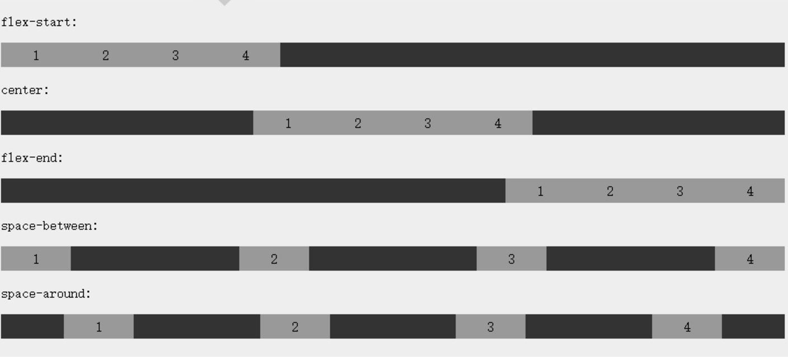

[TOC]

### 基础

can i use 网站查看兼容情况

前端包括CSS3、canvas、svg的坐标系是W3C坐标系，原点在左上角

### 选择器

#### 属性选择器

通过元素的属性来选择元素

* M[attr^="xxx"] attr属性以xxx开头的M元素
* M[attr$="xxx"] attr属性以xxx结尾的M元素
* M[attr*="xxx"] attr属性包含xxx的M元素

#### 子元素伪类选择器

选择某一元素下的子元素

css2：:link、:visited、:hover、:active

css3新增第一类

* M:first-child 父元素下的第一个子元素是M，则选择M（如果第一个子元素不是M的得不到任何元素）
* M:last-child 父元素下的最后一个子元素是M，则选择M
* M:nth-child(n) 父元素下的第n个子元素或奇偶元素，n取数字（第n个，从1开始）、odd奇数、even偶数。可实现隔行换色
* M:nth-child 父元素下唯一的子元素是M，则选择M，该父元素只有一个子元素

css3新增第二类

* M:first-of-type 父元素下的第一个类型是M的子元素
* :last-of-type
* nth-of-type(n) 
* M:nth-of-type 父元素下唯一的M类型的子元素，该父元素可以有多个子元素

#### UI伪类选择器

针对元素的状态来选择元素。包括可用、不可用、选中、未选中、获取焦点、失去焦点等。UI伪类选择器的共同特点是：在默认情况下不起作用，只有在处于某种状态才起作用，大多数都是针对表单元素

* :focus 获取焦点时的样式。用于表单元素、超链接

* ::selection（伪元素） 元素中被选中文本的样式。例：div::section p::section；直接设置::section表示整个页面

* :checked 定义radio、checkbox被选中时的样式（只有Opera支持）

* :enabled 和 :disabled 表单元素可用和不可用状态

* :read-write 和 :read-only 表单元素如文本框的可读写和只读

* :root 根元素（html）（设置整个页面的背景色是针对HTML/:root，而不是body）

* :empty 不包含任何子元素的元素。可用于表格中内容为空的单元格设置不同背景色

* :target 选取页面中某一个target元素，指id被当成页面的锚点链接来使用的元素

  ```
  /* 当点击a时，对应的target（div）中的h3变为红色 */
  :target h3 {
  	color: red;
  }
  <a href='#music'>音乐</a>
  
  <div id="music">
  	<h3>音乐</h3>
  </div>
  ```

* :not() 选择某个元素之外的所有元素。`ul li:not(.first)`表示ul下除了第一个li元素之外的所有li元素

### 圆角、边框、阴影

```
圆角。border-radius 一个值：四个圆角相同；两个值：左上右下，右上左下；三个值：左上，右上左下，右下；四个值：左上，右上，右下，左下
  border-radius:25px;
  border-top-left-radius; top-right; bottom-right; bottom-left
  上半圆：border-radius: 50px 50px 0 0;
  椭圆：border-radius: 20px/40px; 表示水平半径为20，垂直半径为40
  
阴影 box-shadow: 10px 10px 5px #888888;
	x-offset
	y-offset
	blur
	spread 阴影大小
	color
	style 外阴影 outset / 内阴影 inset
四个方向不同阴影，逗号隔开
	左, 上, 下, 右
上左下右透明度、卡片效果
  box-shadow: 0 4px 8px 0 rgba(0, 0, 0, 0.2), 0 6px 20px 0 rgba(0, 0, 0, 0.19);
  
多色边框 border-colors，只有Firfox支持

边框图片 border-image:url(border.png) 30 30 30 30 round;
  			-webkit-border-image:url(border.png) 30 30 round;
  url
	切割宽度 上右下左
	平铺方式 repeat round stretch
* 一张边框图片应该是四条边，中间挖空。例如图片宽高为100，切割宽度为30，平铺repeat，那么图片四个角30*30的部分永远位于4个角，每个边中间40px都不断平铺
* 边框图的每条边的宽度应该和边框宽度相同
```

### 颜色

opacity 会对当前元素、子元素都有效果

rgba 只会对当前元素产生效果，可只改变背景透明度不改变文字透明度

### 背景、渐变

背景TODO

```
背景图 background-image，可设置多个
background-image: url(img_flwr.gif), url(paper.gif); 
background-position: right bottom, left top; 
background-repeat: no-repeat, repeat; 
background: url(img_flwr.gif) right bottom no-repeat, url(paper.gif) left top repeat;

背景图大小 background-size
background:url(img_flwr.gif);
background-size:80px 60px; 或者相对父元素的百分比 100% 100%;
background-repeat:no-repeat;

背景图位置区域，从哪里开始绘制 background-origin: content-box, padding-box, border-box
background-origin:content-box;

背景图哪些位置可以显示 background-clip: content-box, padding-box, border-box

渐变
线性渐变
	background-image: linear-gradient(direction, color-stop1, color-stop2, ...);
	background-image: linear-gradient(to right, red,orange,yellow,green,blue,indigo,violet); 多个颜色
	background-image: linear-gradient(#e66465, #9198e5); 从上到下渐变
	background-image: linear-gradient(to right, red , yellow); 从左到右
	background-image: linear-gradient(to bottom right, red, yellow); 从左上到右下
使用角度
	background-image: linear-gradient(angle, color-stop1, color-stop2);
	background-image: linear-gradient(-90deg, red, yellow);
使用透明度rgba
	background-image: linear-gradient(to right, rgba(255,0,0,0), rgba(255,0,0,1));
重复的线性渐变
	background-image: repeating-linear-gradient(red, yellow 10%, green 20%);

径向渐变。由中心到四周
  background-image: radial-gradient(red, yellow, green); 颜色均匀分布
  background-image: radial-gradient(red 5%, yellow 15%, green 60%); 颜色不均匀分布
  background-image: radial-gradient(circle, red, yellow, green); circle/ellipse设置形状
渐变大小 closest-side farthest-side closest-corner farthest-corner
  background-image: radial-gradient(closest-side at 60% 55%, red, yellow, black);
重复的径向渐变
  background-image: repeating-radial-gradient(red, yellow 10%, green 15%);
```

### 文字

text-shadow 文字阴影 `5px 5px 5px #FF0000`，多个阴影逗号隔开

* 水平阴影x-offset px em % 正数代表阴影向右
* 垂直阴影y-offset px em % 正数代表阴影向下
* 模糊距离blur px em % 可为0不可为负
* 阴影颜色color

text-stroke 文字描边。`width color`。配合`color: transparent`实现镂空文字

text-overflow 文字溢出样式 cllipsis省略号 clip裁切掉

```
单行文本实现省略号必须结合另外两个属性。添加width控制宽度
overflow: hidden;
text-overflow: ellipsis;
white-space: nowrap;

显示多行，多余部分省略号
/* 因使用了WebKit的CSS扩展属性，该方法适用于WebKit浏览器及移动端； */
display: -webkit-box;
-webkit-box-orient: vertical;
-webkit-line-clamp: 3;
overflow: hidden;

/* 显示多行，多余部分不显示，设置高度为：行数x行高，超出部分省略 */
line-height: 20px;
height: 40px;
overflow: hidden;

多行省略号可使用JS或jQ实现，插件：jQuery.dotdotdot.js
```

换行（两个属性都是针对英文）

```
word-wrap: break-word强制换行 normal默认，自动换行
	当url太长超出容器宽度，默认情况下会超出容器，设置为break-word会换行
word-break: keep-all单词内换行 break-all只在半角空格或连字符换行 nomal默认,自动换行
	break-word 长单词如果本行放不下就放在下一行，下一行也放不下才切割
	keep-all长单词直接切割放到下一行
```

text-wrap 任何浏览器都不支持
text-justify 主流不支持

### 嵌入字体 @font-face

把服务器的字体下载到本地电脑，让浏览器显示用户电脑没有安装的自已

不建议嵌入中文字体，太大，可嵌入英文字体，或字体图标iconfont

```
@font-face
{
    font-family: myFirstFont;
    src: url(/path/to/sansation_light.woff);
    font-style: normal/italic/oblique;
    font-weight: normal/bold/100-900;
}
/* 使用 */
div
{
    font-family:myFirstFont;
}
```

### 2D、3D转换

Chrome 和 Safari 要求前缀 -webkit- 版本

transform是属性，表示转换；translate是变换方法，表示移动；transition是属性，表示过渡

| 属性                                                         | 描述                                 |
| :----------------------------------------------------------- | :----------------------------------- |
| [transform](https://www.runoob.com/cssref/css3-pr-transform.html) | 向元素应用 2D 或 3D 转换。           |
| [transform-origin](https://www.runoob.com/cssref/css3-pr-transform-origin.html) | 允许你改变被转换元素的位置。         |
| [transform-style](https://www.runoob.com/cssref/css3-pr-transform-style.html) | 规定被嵌套元素如何在 3D 空间中显示。 |
| [perspective](https://www.runoob.com/cssref/css3-pr-perspective.html) | 规定 3D 元素的透视效果。             |
| [perspective-origin](https://www.runoob.com/cssref/css3-pr-perspective-origin.html) | 规定 3D 元素的底部位置。             |
| [backface-visibility](https://www.runoob.com/cssref/css3-pr-backface-visibility.html) | 定义元素在不面对屏幕时是否可见。     |

```
/* 2D */
/* translate 移动 translateX translateY*/
transform: translate(50px,100px);
-ms-transform: translate(50px,100px); /* IE 9 */
-webkit-transform: translate(50px,100px); /* Safari and Chrome */

/* rotate 旋转 */
transform: rotate(30deg);

/* scale 宽高倍数 scaleX scaleY */
scale(2, 3)

/* skew x、y轴倾斜角度 */
skew(30deg,20deg);

/* matrix合并其他2D转换方法 旋转，缩放，移动，倾斜 */
matrix(0.866,0.5,-0.5,0.866,0,0);

/* 3D */
translate3d(x,y,z) translateZ
scale3d(x, y, z)
rotate3d(x,y,z,angle) rotateZ
perspective 透视视图
matrix3d(...) 16个值的4*4矩阵
```

### 过渡

元素从一种样式逐渐改变为另一种

```
/* 宽度属性过渡，时长为2秒 */
transition: width 2s;
-webkit-transition: width 2s;

/* 设置多个过渡 */
transition: width 2s, height 2s, transform 2s;
-webkit-transition: width 2s, height 2s, -webkit-transform 2s;

transition-property	过渡的css属性名称
transition-duration	过渡时长
transition-timing-function 过渡时间曲线，默认ease，linear 线性, ease-in 渐入, ease-out ease-in-out cubic-bezier(n,n,n,n)贝塞尔曲线，0-1
transition-delay 过渡延时，默认0

/* 简写 */
transition: width 1s linear 2s;

实例：鼠标进入宽度过渡为300px，离开还原为100px
div
{
	width:100px;
	height:100px;
	background:red;
	transition:width 2s;
	-webkit-transition:width 2s; /* Safari */
}
div:hover
{
	width:300px;
}
```

### 动画

元素从一种样式逐渐变化为另一种样式

| 属性                                                         | 描述                                                         |
| :----------------------------------------------------------- | :----------------------------------------------------------- |
| [@keyframes](https://www.runoob.com/cssref/css3-pr-animation-keyframes.html) | 规定动画。                                                   |
| [animation](https://www.runoob.com/cssref/css3-pr-animation.html) | 所有动画属性的简写属性，除了 animation-play-state 属性。     |
| [animation-name](https://www.runoob.com/cssref/css3-pr-animation-name.html) | 规定 @keyframes 动画的名称。                                 |
| [animation-duration](https://www.runoob.com/cssref/css3-pr-animation-duration.html) | 规定动画完成一个周期所花费的秒或毫秒。默认是 0。             |
| [animation-timing-function](https://www.runoob.com/cssref/css3-pr-animation-timing-function.html) | 规定动画的速度曲线。默认 "ease"，和过渡动画类型相同          |
| [animation-fill-mode](https://www.runoob.com/cssref/css3-pr-animation-fill-mode.html) | 规定当动画不播放时（当动画完成时，或当动画有一个延迟未开始播放时），要应用到元素的样式 |
| [animation-delay](https://www.runoob.com/cssref/css3-pr-animation-delay.html) | 规定动画何时开始。默认是 0。                                 |
| [animation-iteration-count](https://www.runoob.com/cssref/css3-pr-animation-iteration-count.html) | 规定动画被播放的次数。默认是 1，infinite无限次               |
| [animation-direction](https://www.runoob.com/cssref/css3-pr-animation-direction.html) | 规定动画是否在下一周期逆向地播放。默认"normal"，reverse 反向播放，alternate 奇数次正向，偶数次反向，用于来回循环，alternate-reverse，inherit 父元素继承 |

```
/* 创建动画 */
@keyframes myfirst
{
    from {background:red;}
    to {background: yellow;}
}
@-webkit-keyframes myfirst
{...}

/* 以百分比来规定变化发生的时间 */
@keyframes myfirst
{
    0%   {background: red; left:0px; top:0px;}
    25%  {background: yellow; left:200px; top:0px;}
    50%  {background: blue; left:200px; top:200px;}
    75%  {background: green; left:0px; top:200px;}
    100% {background: red; left:0px; top:0px;}
}

/* 绑定 */
div
{
    animation: myfirst 5s;
    animation: myfirst 5s linear 2s infinite alternate;
    -webkit-animation: myfirst 5s;
}
```

### 多列

将文本内容设计成像报纸一样的多列布局

| 属性                                                         | 描述                                     |
| :----------------------------------------------------------- | :--------------------------------------- |
| [column-count](https://www.runoob.com/cssref/css3-pr-column-count.html) | 指定元素应该被分割的列数。               |
| [column-fill](https://www.runoob.com/cssref/css3-pr-column-fill.html) | 指定如何填充列                           |
| [column-gap](https://www.runoob.com/cssref/css3-pr-column-gap.html) | 指定列与列之间的间隙                     |
| [column-rule](https://www.runoob.com/cssref/css3-pr-column-rule.html) | 所有 column-rule-* 属性的简写            |
| [column-rule-color](https://www.runoob.com/cssref/css3-pr-column-rule-color.html) | 指定两列间边框的颜色                     |
| [column-rule-style](https://www.runoob.com/cssref/css3-pr-column-rule-style.html) | 指定两列间边框的样式                     |
| [column-rule-width](https://www.runoob.com/cssref/css3-pr-column-rule-width.html) | 指定两列间边框的厚度                     |
| [column-span](https://www.runoob.com/cssref/css3-pr-column-span.html) | 指定元素要跨越多少列                     |
| [column-width](https://www.runoob.com/cssref/css3-pr-column-width.html) | 指定列的宽度                             |
| [columns](https://www.runoob.com/cssref/css3-pr-columns.html) | 设置 column-width 和 column-count 的简写 |

```
.newspaper
{
	-moz-column-count:3; /* Firefox */
	-webkit-column-count:3; /* Safari and Chrome */
	column-count:3;
}

<div class="newspaper">
“当我年轻的时候，我梦想改变这个世界；当我成熟以后，我发现我不能够改变这个世界，我将目光缩短了些，决定只改变我的国家；当我进入暮年以后，我发现我不能够改变我们的国家，我的最后愿望仅仅是改变一下我的家庭，但是，这也不可能。当我现在躺在床上，行将就木时，我突然意识到：如果一开始我仅仅去改变我自己，然后，我可能改变我的家庭；在家人的帮助和鼓励下，我可能为国家做一些事情；然后，谁知道呢?我甚至可能改变这个世界。”
</div>
```

### 图片

```
/* 椭圆图片 */
border-radius: 50%;
/* 外边框实现缩略图 */
img {
    border: 1px solid #ddd;
    border-radius: 4px;
    padding: 5px;
}

/* 外边框缩略图 + 鼠标移动高亮 + 点击跳转到图片 */
a {
    display: inline-block;
    border: 1px solid #ddd;
    border-radius: 4px;
    padding: 5px;
    transition: 0.3s;
}
a:hover {
    box-shadow: 0 0 2px 1px rgba
    (0, 140, 186, 0.5);
}
<a href="paris.jpg">
  
</a>
/* 响应式图片 */
img {
    max-width: 100%;
    height: auto;
}
/* 图片滤镜 */
-webkit-filter: grayscale(100%); /* Chrome, Safari, Opera */
filter: grayscale(100%);
/* 响应式图片相册 */
https://www.runoob.com/try/try.php?filename=trycss_image_gallery_responsive
```

### 按钮样式

[各种按钮样式](https://www.runoob.com/css3/css3-buttons.html)

### 分页

ul.pagination

### 框大小

默认情况下：**width(宽) + padding(内边距) + border(边框) = 元素实际宽度**。所以即使div设置了宽高，因为有内边距，也和实际宽高不一样

css设置box-sizing: border-box后，再设置宽高，会将内边距和边框也算在内

###  弹性盒子

弹性容器通过设置 display 属性的值为 flex 或 inline-flex将其定义为弹性容器

 弹性容器外及弹性子元素内是正常渲染的。弹性盒子只定义了弹性子元素如何在弹性容器内布局。

弹性子元素通常在弹性盒子内一行显示。默认情况每个容器只有一行

```css
.flex-container {
  display: -webkit-flex;
  display: flex;
    
  /* 子元素在容器中的排列方向 row从左到右 row-reverse从右到左 column从上到下 column-reverse */
  flex-direction: row; 
	-webkit-flex-direction: row-reverse;
	
  /* justify-content 子元素沿容器主轴线对齐 flex-start | flex-end | center | space-between | space-around */
  
  /* align-items 子元素在纵轴的对齐方式 flex-start flex-end center baselinne stretch拉伸*/
  
  /* flex-wrap 子元素换行方式 nowrap 单行，超出后溢出 | wrap 多行，溢出部分放置到新行 | wrap-reverse 反转wrap排列 | initial | inherit */
  
  /* align-content 子元素行之间的对齐 flex-start | flex-end | center | space-between | space-around | stretch */
  
  /* flex 弹性子元素如何分配空间 */
}
```



### 多媒体查询 @media

多媒体查询由多种媒体组成，可以包含一个或多个表达式，表达式根据条件是否成立返回 true 或 false。可用于检测：

- viewport(视窗) 的宽度与高度
- 设备的宽度与高度
- 朝向 (智能手机横屏，竖屏) 。
- 分辨率

媒体类型：all、print 打印机、screen 电脑屏幕，平板，手机、speech 屏幕阅读器

```
not表示除掉某些设备
only表示指定某种设备f
@media not|only mediatype and (...) {
  css
}

@media screen and (min-width: 480px) {}
```

