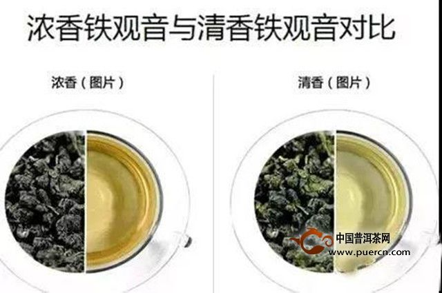

[TOC]

# 茶（思维导图）

## 绿茶

### 特征

#### 不发酵茶，炒青：采下后与高温金属接触加热杀青，破坏氧化酶的活性

#### 富含儿茶素

### 龙井

#### 西湖（狮峰最高档）

#### 清明前采摘为“明前茶”，口味最佳

#### 盖碗冲泡：20-30秒热水浸透茶叶，之后倒满热水，等待1分钟

#### 栗子似的甜香

### 碧螺春

#### 杭州太湖畔的洞庭山

#### 早春采摘最佳

#### 先倒热水再次放茶叶，因为茶叶有绒毛，容易浮在水面，给安插茶叶下沉，一边等待精华溶于水中

#### 微微的柑橘香

## 白茶

### 特征

#### 福建特产，产量不足中国茶叶总量的1%

#### 唯一无需“揉捻”的茶，保留原始形态

#### 披满绒毛，远看白白的，因此得名

#### 泡法：玻璃壶（容易散热）放80度热水，刚好没过茶叶，等待1分钟，再倒热水8分满，等4-5分钟（白毫银针时间稍短）

#### 凉性，去热降火，却不会造成体寒，防癌、解毒、缓解牙痛

### 白毫银针

#### 最高级的白茶

#### 仅选新芽

#### 味道淡，回甘香甜。品质好的会带来强烈的清凉感

### 白牡丹、寿眉

#### 一芽二三叶

#### 不如白毫银针稀有，但是味道却不逊色，价格实惠

#### 有了茎叶，味道更加鲜明

#### 有“白毫银针档次高，白牡丹（寿眉）味道好”的说法

#### 价格实惠

## 黄茶

### 特征

#### 产量和流通量最低

#### 增加闷黄工序，用纸吧茶叶包起来焖一下，茶多酚氧化，茶叶和茶水都会变黄

### 君山银针

#### 只用新芽

## 其他

### 再加工茶

#### 特征

##### 用鲜花熏制的茶叶，或加入花瓣，中草药等配件的茶

#### 茉莉花茶

##### 不是用茉莉的花和叶子做的，是吸收了茉莉花香味的茶叶

##### 北京纬度太高无法种茶树，古代运输技术落后，南方的茶叶运到北方品质大打折扣，所以古人让茶叶吸收花香

##### 低档茶叶用人工香料加工。高档茉莉花茶有无比温柔的风味。影响品质的关键还是茶胚

##### 熏制后的茉莉花为红色，被剔除掉，有时会加入新鲜的白花瓣作为点缀

#### 桂花乌龙茶

#### 荔枝红茶

#### 人参乌龙茶

#### 玫瑰红茶

#### 玫瑰绿茶

#### 工艺茶

##### 特征

###### 一泡就开花的茶

###### 趁新鲜泡

##### 丹桂百合

###### 百合花与桂花

##### 锦上添花

###### 绿茶为底座，菊花内饰

##### 茉莉仙女

## 青茶（乌龙茶）

### 特征

#### 从发酵程度接近绿茶到接近红茶，都属于乌龙茶，范围广

#### 发源于武夷山

### 闽北（福建北部）乌龙

#### 岩茶

##### 大红袍

###### 400多岁的老树，只有几棵，每年每棵产量500g，平常能买到的连扦插繁育的克隆版都不是

##### 铁罗汉

##### 水金龟

##### 白鸡冠

##### 特征

###### 武夷山

###### 长在石缝间的茶树

### 闽南乌龙

#### 铁观音

### 广东乌龙

#### 凤凰单丛茶

##### 广东潮州凤凰山

##### 单丛：单株茶树，必须是从一棵茶树上采摘下来的

##### 浑厚有深度，果香，没有涩味，只有清冽的苦味，香味因树而定，有蜜兰香、黄枝香、桂花香等

##### 干燥的凤凰单丛茶叶不会散发果香，如果没泡就有香味，那就是用香料加工过了

### 台湾高山茶

#### 特征

##### 海拔1000m以上，2000m为稀有茶，越高越贵越稀有

##### 只写高山茶默认是乌龙茶，也有高山白茶、高山绿茶

##### 相同的茶树在不同地产地使用不同的商品名，产地，品种，加工方法都不相同，即使相同，同一种茶的发酵，烘焙程度也会相差很大

#### 冻顶乌龙茶

##### 树名为青心乌龙

##### 产地为名

##### 最主流的是极浅的发酵加轻度烘焙，有清新的花香和甘醇的滋味

#### 东方美人

##### 每年6月采摘，被浮尘子咬伤的嫩芽分泌一种天敌爱闻的物质。加工后的茶叶有蜂蜜香，泡水后有各种妖艳的香味

##### 冲泡温度稍低

#### 文山包种茶

##### 产于台北文山地区

##### 包种茶：发酵程度非常低

#### 台湾铁观音

##### 大陆铁观音以花香见长，台湾铁观音有熟果香，因为保留了传统的烘焙加工方法

#### 金萱茶

##### 杂交而成，香草、牛奶的香味（泡水才有香气）

#### 翠玉茶

##### 改良品种，有茉莉花的清香

#### 四季春茶

##### 杂交产物，浓香，回甘

##### 产量高，易采摘，价格低廉

## 红茶

### 特征

#### 只有正山小种和祁门红茶最主流

### 正山小种

#### 有正露丸的味道，喜欢的人非常喜欢，讨厌的人不想碰

#### 人类发明的第一种红茶

#### 松针将茶叶熏干，松树的精油渗入到茶叶

#### 高质量的茶有类似桂圆的香味，喝起来有浓郁的香甜口味

#### 属于小种红茶

#### 武夷山

### 祁门红茶

#### 安徽祁门县

#### 功夫茶：产于福建外，采用传统加工方法。费时费力，小心翼翼地人工采摘

#### 世界四大红茶之一

#### 高质量茶没有杂味，兰花与玫瑰的花香和甜味，加牛奶喝也很不错。廉价的有浓烈的熏香

### 九曲红梅

#### 浙江

#### 独特的鲜味和清爽口感

### 滇红

#### 大量嫩芽，表面长着绒毛，发酵后嫩芽变为金色，人称金芽

#### 浓烈的香味

### 金骏眉

#### 品质卓越的超级正山小种

#### 武夷海拔千余米的高山，新芽

#### 滋味浓郁，香气芬馥，回味无穷

### 红玉

#### 台湾日月潭畔

#### 档次最高的红茶之一

#### 复杂的香气，闻起来像玳瑁糖的甜香里加了些薄荷和肉桂

## 黑茶

### 特征

#### 发酵过的绿茶

### 普洱

#### 生茶

##### 新鲜茶叶采摘后以自然方式陈放

##### 生茶才有优质老茶

#### 熟茶

##### 人为加湿提温，促进空气中微生物繁殖，加快发酵进程，省时间，一般买到的都是熟茶

##### 带霉味的熟茶是不恰当的发酵

# 茶具

小茶壶适合冲泡茶叶蜷起来的乌龙茶。普洱等一次要喝很多的茶，选容量更大的茶壶。需要开水冲泡的红茶、黑茶和一部分青茶使用保温性能好的陶瓷茶壶。绿茶、白茶、黄茶用低温热水冲泡，使用容易散热的玻璃茶壶

选购茶壶：

1. 拿着是不是趁手
2. 俯视，出水口和把手顶端是否在一条直线上
3. 轻轻旋转茶壶，转起来顺不顺滑
4. 注意不能用手直接递，先放在平面上
5. 不能敲，容易损坏

### 茶壶

1. 陶壶：档次最高的陶壶是紫砂壶，不能用清洁剂洗。反复冲泡，茶叶的成分与香味会渐渐渗透到茶壶中。外侧使用软布等工具擦拭抛光，叫“养壶”
2. 瓷壶：表面光滑，便于打理，能直接呈现出茶叶原原本本的香气与味道
3. 玻璃壶：能看到茶水的颜色，散热快

闻香杯：闻香杯是高杯，主要用于台湾乌龙茶等香味浓郁的产品，是专门用来享受香味的茶具。使用方法：先将茶水倒入闻香杯，再把闻香杯中的茶水转移到茶杯，享受闻香杯中的残香，最后品尝茶水

盖碗：上有盖，下有拖，中有碗。倒入热水焖一会儿，然后将碗盖斜扣在碗上，流出一道缝隙，端碗引用。也可当茶壶用

茶荷：防止待泡干茶叶的器皿，也用于鉴赏茶叶、确认茶叶品质

茶海：将茶壶里的茶水先倒入茶海，再分别倒入小杯，有助于均匀浓度。使用玻璃茶海还可以欣赏茶水的色泽

茶盘：垫在茶具下面，接住热水。有陶制、竹制等类型

茶架：夹起茶渣或烫手的茶具

茶则：把茶叶从茶叶罐里取

茶通：取出堵塞茶壶出口的茶叶

茶漏：漏斗

茶滤：过滤从茶壶中倒出来的茶叶

茶巾：擦拭洒出来的热水和水迹

### 泡茶
茶叶量：茶叶和热水比例1:50（5g茶叶配250ml水），口味因人而异，不必完全按照比例
冲泡时间：久则浓，短则淡
水温：茶叶中含有多种有效成分，他们容易释出的温度不同，所以要知道手头茶叶以哪种成分见长，再确定水温。绿茶80℃。红茶100℃。青茶是半发酵，根据颜色定水温，接近绿色用80℃，绿色和褐色之间90℃。根据颜色深浅定水温

茶壶冲泡步骤
1. 按茶壶、茶海、茶杯的顺序烫热茶具，再将热水倒到茶盘
2. 茶叶倒入茶壶，热水入壶
3. 加盖闷一会儿
4. 将所有茶水倒入茶海
5. 茶海中的茶水导入茶杯

闻香杯冲泡步骤（泡乌龙茶）
1. 茶水倒入闻香杯
2. 闻香杯中的茶水倒入茶杯
3. 感受留在闻香杯中的茶香
4. 享用茶杯中的茶水

盖碗冲泡步骤
1. 茶叶导入烫过的盖碗
2. 倒入热水，加盖闷
3. 将碗盖卸扣在碗上挡住茶叶留出一道缝隙，端碗饮用（也可以当茶壶用）

### 茶点、品茶礼仪
瓜子、葡萄干、糖渍果干（茶的清香和糖的甜味特别搭）
先品茶再享用茶点，能充分领略茶的味道。日本茶偏苦，先吃甜的茶点，趁着甜味还在嘴里的时候再喝茶。不是规矩的问题，而是茶的特点
不能将水壶、茶壶的出水口冲着别人

## 红茶
世界四大红茶：祁门红茶、阿萨姆红茶、大吉岭红茶、锡兰高地红茶
红茶温性，能改善体寒，缓解四肢冰凉、僵硬（绿茶寒性，清热去火）；富含茶多酚，抗氧化作用，预防生活习惯病，延缓机体衰老；抑制脂肪吸收；咖啡因含量高于煎茶、乌龙茶等，消除疲劳、缓解压力、利尿；主要成分茶氨酸能有效抑制摄入咖啡因造成的暂时性亢奋，防止血压飙升，呵护大脑神经细胞

泡法：**5g**茶叶配300ml沸水比较保险。时长与茶叶种类大小有关，大片茶叶3-4分，比较细碎的2-3分。每闷2分钟可尝一次味道

冷后浑：浓茶在冰镇片刻后发白变浑，因为红茶中的某些成分冷却后凝固变白

茶点：死抗病，磅蛋糕，饼干，各种水果挞

### 大吉岭红茶

印度东北部喜马拉雅山麓的大吉岭高原。春天采摘为春摘茶，发酵程度浅，半发酵茶，茶叶青绿，清新；夏季采摘为夏摘茶，质量最高，醇香，滋味鲜美，最具红茶的风范；秋摘茶等级较低但是价格实惠

### 阿萨姆红茶

印度东北部，平原地带，价格不像高原茶叶那么昂贵。相比中国种，它的叶片更大，滋味更浓厚，甜味更明显，最适合做奶茶，加些牛奶，口感堪比奶糖

主流的红茶产品是用CTC发加工而成的可直接冲泡的小颗粒茶粉，能迅速泡出浓厚的茶水，CTC红茶也经常用于茶包

从早春可采到初冬，品质最好的是6-7月的夏摘茶

### 锡兰红茶（乌沃红茶）

斯里兰卡（旧称锡兰）红茶，最具代表性的是乌沃红茶，深橙色的茶水，自带天然香味，几分像玫瑰，几分像薄荷，清爽通鼻。市面上一般添加薄荷香料售卖

# 其他

[清香型铁观音和浓香型铁观音有什么区别](http://www.puercn.com/wulongcha/zhishi/159526.html)

