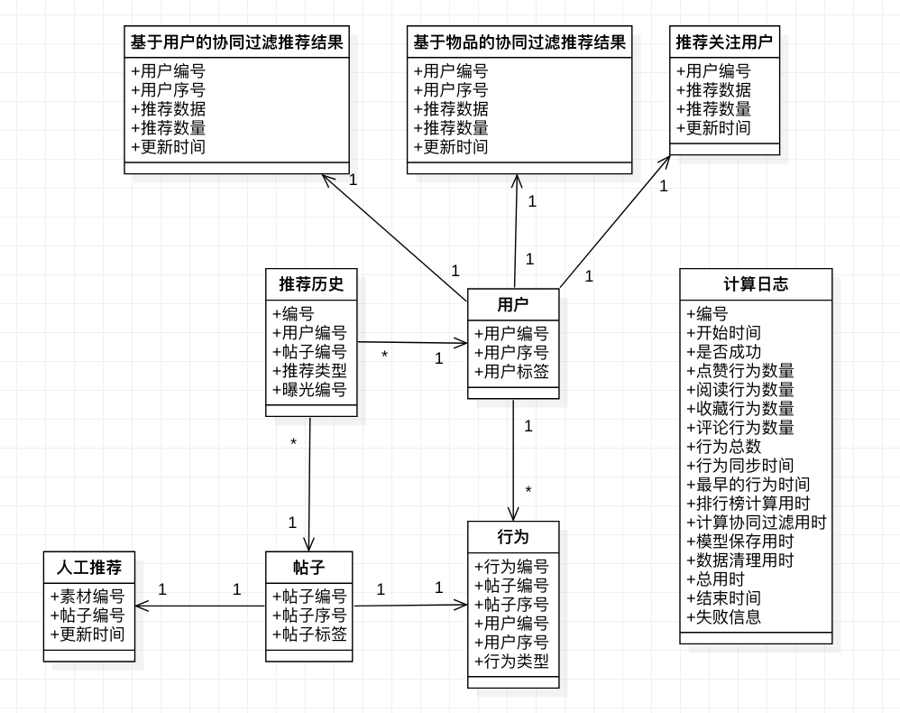
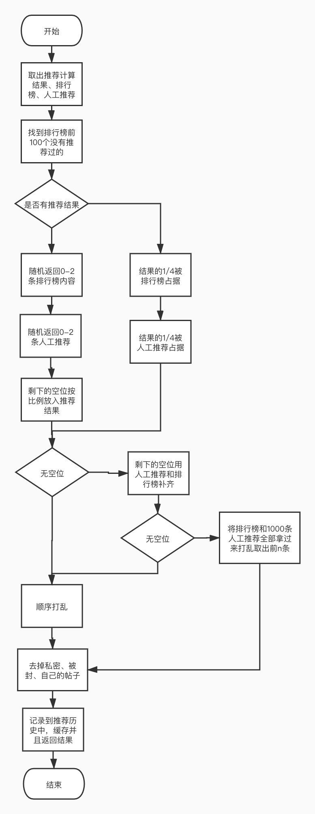

[TOC]

# 推荐系统

## 原理

推荐系统主要分两步，召回和排序，召回就是用各种推荐算法找到给用户推荐的内容，排序阶段对这些内容进行排序，预测哪些是用户更喜欢的，排在前面

在召回阶段基本上所有的推荐算法都是围绕两类，协同过滤算法和基于内容的推荐算法

### 协同过滤

重点就是所有用户之间的协同，是大家的合作，根据大家的行为，找到感兴趣的内容，是通过行为来推荐，不关注内容

基于用户的协同过滤就是：和你相似的用户也喜欢的物品，就是和你相似的用户也喜欢的物品，就认为你也喜欢，喜欢的人越多，你的喜欢程度越高，如果其他人收藏或转发，那么喜欢程度更高

基于物品的协同过滤就是：找你喜欢的物品相似的物品

原理是用户和物品构建为一个矩阵，这里把帖子/文章作为物品来讲，行名和列名为用户和物品，每一项内容为用户对物品的评分，评分可以是是否点赞、是否评论的0和1，也可以是用户对物品的所有行为加权后的累加，例如点赞加1分，评论加2分，转发+5分，那么三连就是8分，什么都没做就是0分。在矩阵中要把用户和物品都改为序号，所以需要一个id和需要的映射表，矩阵长这样：

| 用户/物品 | 1    | 2    | 3    |
| --------- | ---- | ---- | ---- |
| 1         | 0    | 0    | 1    |
| 2         | 1    | 1    | 1    |
| 3         | 1    | 1    | 0    |

对这个表就可以进行计算了，用户1的矩阵就是[0, 0, 1]，用户2的就是[1, 1, 1]，对这两个数组做相似度的计算就可以得到用户1和用户2的相似程度，需要对所有用户进行两两计算，计算量是非常大的，所以需要构建一个稀疏矩阵来优化空间和加快运算，上面的矩阵在真实环境中会有百分之99以上的分值都是0，优化的核心只记录不为0的值，会保存为类似下面的矩阵，真实的结构远远比这个复杂，可以达到更小的空间占用，更优的计算效率

| 用户 | 物品 | 分值 |
| ---- | ---- | ---- |
| 1    | 3    | 1    |
| 2    | 1    | 1    |
| 2    | 2    | 1    |
| 2    | 3    | 1    |
| 3    | 1    | 1    |
| 3    | 2    | 1    |

再通过一些算法来计算相似度，内存、磁盘、计算时间都可以缩小成百上千倍，再根据每个用户的相似用户，找到相似用户喜欢的物品，根据他和用户的相似度，以及相似用户对这个物品的分值，加权得到推荐值。产生的结果就是相似用户和一个排好序的推荐列表，这就是基于用户的协同过滤。把上面的用户和物品矩阵转置一下，使用相同的算法，就是基于物品的协同过滤，可以得到一个物品的相似物品推荐和用户的推荐列表、喜欢它的人也喜欢


### 基于内容

另一类是基于内容的推荐算法，核心就是标签，简单原理是给每个物品提取标签，然后找到用户喜欢的物品，把物品的标签附加到用户身上，标签对于物品的权重越高，用户对物品的喜欢程度越高，这个标签在这个用户身上的权重就越高（用户的标签一定要来源于物品，否则就没有意义了），然后计算相似度，查找感兴趣的内容

优势：

1. 推荐结果可理解：标签
2. 推荐结果稳定性强：对于用户行为不丰富的类型，协同过滤很难找到同兴趣用户或关联产品，稀疏度太高。标签对用户兴趣捕捉稳定性远远高于单个产品
3. 便于人机协作：用户可勾选或关注推荐标签

劣势：

1. 不适合发现惊喜：如果一个产品不易于被标签穷举或标签还没出现，则很难被准确推荐
2. 在线应用复杂度高：需要基于每个用户来计算相似产品

两种方法：

方法一：one-hot编码（独热编码）

1. 取出每个物品权重排名靠前的n个词作为标签，构建稀疏向量

2. 获取每个用户最近操作过的物品的标签，构建稀疏向量

3. 计算用户和物品、物品之间的相似度

4. 用户兴趣标签、人口统计学信息处理

   （将每个标签和性别年龄等分别作为向量的前几个维度，记录每个物品是否有这些属性；用户在选择标签时，将用户标签向量重新赋值，例如 0 1 0 0 xxx 改为 0 0 1 0 xxx）

   用户的兴趣标签可扩展：通过话题聚类或找相似词，将相似的标签给用户（正确的做法是标签归一化，只保留同义标签中最正确的一个）

   标签过滤：

   1. 去掉词频很高的停止词
   2. 去掉同义词

   **可以给新用户打上整个系统最热门的标签（当用户未选择标签时，打上所有标签，数据库中不记录，只在推荐系统做判断）**

方法二：Embedding

1. 将所有物品的文字提取出来构建模型

2. 获取每个物品的embedding

   word2vec：分词，将每个词的词向量累加（或求平均），作为句子/文档的向量，在相关语义计算方面有优势，对于15字以内短句有效；简单的向量相加，丢掉了很多词和词之间的意思，无法更精确表达句子和句子之间的关系

   tf-idf：分词，以每个词的tf-idf为权重，对所有词向量加权平均

   doc2vec：适合长句子（效果较差）

3. 将用户最近操作过的物品的embedding取平均值，作为用户embedding

4. 相似度计算

5. （用户自己选择的兴趣标签和人口统计学信息如何处理）

6. （聚类如何使用）

标签有两种记录方法，对应的算法有有些不同，第一种就是文本的标签，标签什么样就保存为什么样，但是会有问题，对于同义词无法做区分，例如洗发水和洗发露，会占据两个标签，这就引出了另一种标签记录方式，就是词向量，词向量会根据上下文分析词的语义信息，保存为一个计算机才认识的多维矩阵，保存词的含义甚至上下文信息，同义词的词向量是很相似的，那么就可以认为是一个词，可以节省空间，让词库的质量更高，但是比较复杂，研究了一下，计算向量的效率太低，而且资料太少，不知道如何计算相似度，如何过滤同义词，先放弃，将来再研究。词向量想法是美好的，但是大多数还是使用中文的标签，因为词向量是不可解释的，只有机器能看懂，人看不懂，就无法作为文本展示给用户（这个展示的意思是像今日头条文章下面都会有文章标签列出来，还有可作为推荐一句，例如根据你喜欢的xx进行推荐）

分别对每个物品计算权重打标签，把所有的标签聚集起来按照权重和得到前1万-10万个标签，作为推荐标签库，构建物品-标签矩阵

|       | 标签1 | 标签2 | 标签3 |
| ----- | ----- | ----- | ----- |
| 物品1 | 0.1   | 0     | 0.5   |
| 物品2 | 0     | 0.23  | 0     |

再找到每个用户喜欢的物品，把物品的标签附加到用户身上，得到同样的用户-标签矩阵，那么物品1的矩阵为[0.1, 0, 0.5]，再计算每个用户对每个物品的相似度，排序后就得到用户的推荐结果。转换为稀疏矩阵，在一台配置很低的电脑上计算一个用户和10万物品的相似度，只需要0.01-0.1秒，再加上多进程就更快了

这种算法还可以部分解决冷启动问题，就是当一个新用户来时，需要他先填感兴趣的标签，再进行推荐，假如他填德甲，肯定不能只给他推荐德甲，还得推荐意甲、足球，甚至是篮球、运动相关，这就需要再次用到上面的文本库

把物品的所有文本构建一个文本库，这个文本库进行一些不同算法的训练，可得到词向量、话题聚类（机器学习的内容，不深讲，深讲我也不懂），通过词向量可找到一个词的n个相似词，例如通过德甲可以找到意甲；通过话题聚类可以给词库中所有的词分类，可找到一个词所属的类别，例如德甲会被分类到足球，足球会被分类到运动（现在话题聚类的文本库使用的是维基百科的语料库，效果比较好），把这些所有的标签添加到用户身上，会得到一个比较全面的推荐

上面的推荐算法已经可以作为第一版的推荐系统

### 其他召回策略

矩阵分解：把上面的大矩阵，分解成2个小矩阵，每个矩阵保存格式是向量，类似标签向量，除了实时计算，也可以优化达到更好的推荐效果，实质上也是属于协同过滤，只不过在分解的过程中用应用了机器学习的方法

深度学习：探索更深层次的特征关系，达到的效果更好，深度协同过滤

根据深度学习的特点，还可以加上另外一种推荐算法思路，根据所有用户的行为顺序来推测一个用户下一个会点消费什么物品，例如两个用户的顺序分别是1-2-3-4，1-2-4，第三个用户是1-2，那么他下一个想看的内容可能就是4，就把4放在推荐列表的前面，这个也实现了，但是还不准备用，第一版主要上上面两种常见算法

### 排序

以上是召回的过程，通过这些算法分别得到这么多个推荐结果，我们如何知道哪些结果用户会感兴趣，就需要排序。推荐系统虽然核心是召回，但是对于成熟的系统来说，召回更重要，可以提高推荐的效果，而且可以不断的优化，难度也要比召回难的多，对效率和算法的要求也要高很多

排序主要是用模型融合，逻辑回归和梯度提升决策树组合、因子分解机、Wide & Deep 模型等算法，这一步把用户特征、物品特征加入进去，基于人口普查的有用户特征是在排序阶段使用的，例如用户年龄、用户地点、性别、物品创建地点等，再加入每次推荐的结果（用户感不感兴趣、有没有点击）训练模型，进行预测，属于浅层神经网络的机器学习，是根据用户特征预测用户对物品的喜欢程度。例如20岁北京女喜欢化妆品，20岁北京男喜欢玩游戏。但是构建特征数据比较困难，对空间和算法要求较高，也很难就暂时没有研究如何实现

多臂老虎机问题（MAB问题）用来探索新兴趣，主要是试探，它会推荐用户喜欢的和不知道喜不喜欢的物品，如果用户点击了物品，说明喜欢，下次多推，没点击，说明不喜欢，下次少推

### 其他算法

排行榜：一段时间更新一次的排行榜，部分解决冷启动问题，可给新用户已经所有用户推荐一些热门的内容。算法原理是降温，新加入的温度较高，热门物品温度较高，随着时间慢慢冷却，保证老的物品热度随时间降低，给新物品加入热门的机会，保留前1000个，保证前100个是可用的

重复检测：使用布隆过滤器对推荐结果进行去重，已推荐过的就不再推荐，效率高，缺点就是有一定错误概率，概率是可以自定义的，每相差10倍概率就相差10倍的存储空间，所以设置为千分之一的错误概率是可以的，就是1000个推荐文章可能有1个是已经推荐过的

## 实现

> 以下都为简化代码，不考虑数据类型和边界条件等

### 数据库

领域模型图如下



存储数据库用到3个，分别保存在不同的服务器

#### 主数据库（糖水数据库）

需要读取帖子、浏览、点赞、评论、收藏、素材表来同步行为和人工推荐

#### 计算数据库

放在推荐计算服务器的数据库，仅用作本地存储工具，用于计算

**物品表 posts**

| 字段  | 数据类型 | 含义                       | 备注       |
| ----- | -------- | -------------------------- | ---------- |
| id    | String   | 物品id                     |            |
| index | Number   | 物品序号编号，用于矩阵计算 | 唯一、索引 |
| tags  | Strinng  | 权重前10的标签             |            |

**用户表 users**

| 字段  | 数据类型 | 含义                   | 备注       |
| ----- | -------- | ---------------------- | ---------- |
| id    | String   | 用户id                 |            |
| index | Number   | 用户序号，用于矩阵计算 | 唯一、索引 |
| tags  | Strinng  | 权重前100的标签        |            |

**行为表 actions**

* 只记录用户id、物品id、行为类型，其中行为类型用于区分行为分数
* 用户id、物品id使用String而不是ObjectId是为了计算更快而牺牲存储空间，不需要ObjectId和String之间互转

| 字段       | 数据类型 | 含义     |
| ---------- | -------- | -------- |
| id         | ObjectId | 行为id   |
| user_id    | String   | 用户id   |
| post_id    | String   | 物品id   |
| user_index | Number   | 用户序号 |
| post_index | Number   | 物品序号 |
| type       | String   | 动作类型 |

**人工推荐表 articles**

用于实时同步主数据库的人工推荐内容

| 字段       | 数据类型 | 含义     |
| ---------- | -------- | -------- |
| id         | ObjectId | 素材编号 |
| user_id    | String   | 帖子id   |
| author_id  | String   | 作者id   |
| user_index | Number   | 来源     |
| post_index | DateTime | 物品编号 |
| updated_at | DateTime | 动作类型 |

#### 推荐服务数据库

用于推荐API的数据库，保存推荐计算结果、推荐历史、同步日志等数据

**基于物品的协同过滤计算结果表 cf_item_recommends**

| 字段       | 数据类型 | 含义                                 |
| ---------- | -------- | ------------------------------------ |
| id         | String   | 素材编号                             |
| user_index | Number   | 用户序号                             |
| data       | Mixed    | 计算结果，帖子id和推荐值组成的键值对 |
| count      | Number   | 结果数量                             |
| updated_at | DateTime | 更新时间                             |

**基于用户的协同过滤计算结果表 cf_user_recommends**

| 字段       | 数据类型 | 含义                                 |
| ---------- | -------- | ------------------------------------ |
| id         | String   | 用户id                               |
| user_index | Number   | 用户序号                             |
| data       | Mixed    | 计算结果，帖子id和推荐值组成的键值对 |
| count      | Number   | 结果数量                             |
| updated_at | DateTime | 更新时间                             |

**推荐关注用户表 user_follow_recommends**

| 字段       | 数据类型 | 含义                                 |
| ---------- | -------- | ------------------------------------ |
| id         | String   | 用户id                               |
| user_index | Number   | 用户序号                             |
| data       | Mixed    | 计算结果，用户id和相似度组成的键值对 |
| count      | Number   | 结果数量                             |
| updated_at | DateTime | 更新时间                             |

**推荐历史表 recommend_histories**

| 字段        | 数据类型 | 含义     |
| ----------- | -------- | -------- |
| id          | String   | 编号     |
| user_id     | String   | 用户序号 |
| post_id     | Mixed    | 帖子编号 |
| type        | String   | 结果数量 |
| exposure_id | DateTime | 更新时间 |

**同步日志表 async_log**

| 字段            | 数据类型 | 含义             |
| --------------- | -------- | ---------------- |
| id              | String   | 编号             |
| start_at        | DateTime | 开始时间         |
| success         | Boolean  | 是否成功         |
| likes_count     | Number   | 点赞行为数       |
| favorites_count | Number   | 收藏行为数       |
| visites_count   | Number   | 浏览行为数       |
| comments_count  | Number   | 评论行为数       |
| actions_count   | Number   | 总行为数         |
| async_sec       | Number   | 行为同步时间     |
| min_time        | DateTime | 行为最小时间     |
| rank_sec        | Number   | 排行榜计算秒数   |
| cf_sec          | Number   | 协同过滤计算秒数 |
| save_sec        | Number   | 模型保存秒数     |
| clear_sec       | Number   | 数据清除秒数     |
| sec             | Number   | 总耗时秒数       |
| end_at          | DateTime | 结束时间         |
| msg             | String   | 失败信息         |

#### 缓存数据库

用于推荐API的缓存

* 排行榜
* 人工推荐数据
* 推荐结果缓存5秒

### 计算

#### 同步数据

循环从主数据库中获取浏览、点赞、收藏、评论，用户保存在用户表中，物品保存在物品表中，行为保存在行为表中


#### 协同过滤

1. 矩阵

   使用lil矩阵，可动态增减数据，缺点是计算时间略长。得到用户-物品矩阵`user_lil`、物品-用户矩阵`post_lil`

   每当有新的行为，分别给两个矩阵动态增添数据

   ```python
   user_lil[user_id, post_id] += score
   post_lil[post_id, user_id] += score
   ```

   当行为过期后，数据变为0即

   ```
   user_lil[user_id, post_id] = 0
   post_lil[post_id, user_id] = 0
   ```

2. 相似度计算

   相似度计算必须将`lil`矩阵转换为`csr`矩阵，使`lil.tocsr(`)即可

   使用`sklearn.metrics.pairwise.cosine_similarity`计算矩阵列之间的相似度，得到用户之间的相似度`user_sims.csr`、物品之间的相似度`post_sims.csr`

   ```python
   user_sims = cosine_similarity(user_lil.tocsr(), dense_output=False)
   post_sims = cosine_similarity(post_lil.tocsr(), dense_output=False)
   ```


3. 计算推荐分数

   以基于用户的协同过滤为例，当计算某个用户的推荐时候，首先获取到用户的前100个相似用户

   ```python
   # 获取所有相似用户
   user_sims.getrow(user_index)
   # 取出相似用户的index和分数
   arr = sims.toarray()
   where = np.where(arr > 0)
   arr = np.column_stack((where[1], arr[where]))
   # 排序
   arr = arr[arr[:, 1].argsort()][::-1]
   # 返回前100个
   return arr[:100]
   ```

   再从这100个相似用户中分别取出每个用户分数排名前1000的物品

   ```python
   for sim_user, sim_score in user_sim:
   	# 获取相似用户喜欢的物品
   	posts = dc.user_lil.getrow(sim_user)
   	arr = posts.toarray()[0]
   	rows = np.where(arr > 0)
   	posts = np.column_stack((rows[0], arr[rows]))
   	# 排序并取前1000个
   	posts = posts[np.lexsort((-posts[:, 0], -posts[:, 1]))][:1000]
   ```

   得到了全部可能感兴趣的物品，把每个用户对该物品的喜欢程度和用户相似度的乘积累加，得到推荐分数

   ```python
   for post in posts:
     # 过滤器中的不再推荐
     key = str(user_idx) + '-' + str(post_idx)
   	if key in dc.bloom:
   		continue
   	recommend += like_score * sim_score
   ```

   最后对推荐分数排序，取前10000条数据作为推荐结果，保存到数据库中

   ```python
   data = []
   for key in recommends.keys():
   	data.append([int(key), round(recommends[key], 4)])
   data.sort(key=lambda x: -x[1])
   return data
   ```

#### 标签

取标签使用`jieba.analyse.extract_tags()`方法即可

```python
jieba.analyse.extract_tags(
        line,
        topK=10,
        withWeight=True,
        allowPOS=('n', 's', 'ns', 'nsf')) if line else []
```

#### 排行榜

推荐系统的排行榜是实时热度排行榜，根据最近的行为和物品的创建时间来计算，保证推荐的都是较新较实时并且热度较高的物品

热度使用重力排序法或者牛顿冷却法，两种方法的结果差不多都可以使用。必要参数为行为分数`score`和`已创建小时数`

```
# 重力排序
G = 1 # 重力因子 越大衰减越快
score / ((diff_hours + 2) ** G)

# 牛顿冷却
A = [0.03, 0.05, 0.06, 0.24]  # 24小时后翻倍、两倍、三倍、三百倍
score * math.exp(-A[1] * diff_hours)
```

数据来源是行为表，初始化时将最近的10000个行为取出来，保存到pandas表格中，将来每次更新都把新的行为附加进去，计算热度前1000的帖子，最后只保留前1000的帖子对应的行为以及最近两天内的全部行为（保证短期热度不足但是一直有热度的物品不会被误删）

去重，一人一票

```
df.drop_duplicates(subset=[0, 1, 2])  
```

只计算在排行榜中的帖子的行为 + 两天内的行为。并集+交集实现

```
pd.merge(df[df[0].isin(post_ids)], df[df[3] > datetime_to_timestamp(now - timedelta(days=3))], how="outer")
```

#### 布隆过滤器

考虑到布隆过滤器随着时间会越来越大，使用多个过滤器实现自动过期布隆过滤器，有两种方案，针对两种业务需求

1. 写多读少：几个月过期就设置几个过滤器，每个子过滤器只保存当月的数据，过期的过滤器自动删除，每次加入数据只保存到当月的过滤器中，但是每次查询会从所有过滤器查，写入快查询慢
2. 写少读多：依然是几个月过期就设置几个过滤器，每次加入数据都保存到所有子过滤器中，所以最老的过滤器会保存前几个月所有数据，每次只需要从最老的过滤器中查询即可，写入慢查询块，代价是存储空间大大增加

两种都已实现，对于推荐系统来说，第二种更为合适

初始化5个月的过滤器

```python
def new_filter(self, arrow_time):
	if os.path.exists(path):
  	bloom = ScalableBloomFilter.fromfile(open(path, 'rb'))
	else:
  	bloom = ScalableBloomFilter(initial_capacity=512, error_rate=0.01,
    															mode=ScalableBloomFilter.LARGE_SET_GROWTH)
		bloom.tofile(open(path, 'wb+'))
  return bloom
        
self.filter_num = 5
self.filters = []
for i in range(self.filter_num):
	before = now.shift(months=-i)
	self.filters.insert(0, self.new_filter(before))
```

给每个子过滤器添加数据

```
[f.add(key) for f in self.filters]
```

查询第一个过滤器是否有数据

```
self.filters[0].exists(key)
```

查询所有的过滤器是否有数据

```
any([f.exists(key) for f in self.filters])
```

#### 保存到本地

矩阵在保存时中断会导致数据出错，所以需要类似word的方式，先保存到以`~`开头的临时文件，再删除原始文件，将临时文件改名为原始文件

```
filename = path.split('/')[-1]
dir = path.replace(filename, '')
tmp_path = dir + '~' + filename
scipy.sparse.save_npz(tmp_path, data)
os.remove(path)
os.rename(tmp_path, path)
```

#### 实时计算

可以对新的动作进行计算，给新加入的用户实时计算推荐结果，代价就是需要把支持实时计算的lil矩阵常驻内存，对内存的要求更高。在代码中需要把新的动作实时加入到lil矩阵中，再从这些动作中取出用户id，去重后依次为他们计算推荐

实现方案

1. 无限循环。每次从每种行为中取出1000条动作，直到没有新数据为止
2. 提取新动作中全部帖子，给它们打标签，并保存在在数据库中
3. 再取出全部用户，把帖子的标签加到用户标签中，保存在数据库中
4. 把这些行为分别加入到用户矩阵`user_lil`和物品矩阵`post_lil`中
5. 计算用户之间的相似度`user_sims`和物品之间的相似度`post_sims`中
6. 给这些动作中的所有用户计算协同过滤推荐，把推荐结果保存在数据库中
7. 计算排行榜
8. 同步人工推荐数据（articles）
9. 在每天凌晨2点到4点删除一次过期数据
10. 保存矩阵到本地
11. 将每一步的时间以及总时间、错误信息保存到数据库中作为日志
12. 等待5秒，开始下一轮循环

### API

根据用户推荐结果和排行榜、人工推荐给用户生成推荐列表，并且实现了网页版的排行榜列表、用户推荐

实现方案：

1. 取出推荐算法计算结果、排行榜、人工推荐

2. 从推荐历史中找到排行榜前100个没有推荐过的

3. 如果是没有推荐结果的新用户，1/4被排行榜占据；有推荐结果的老用户，随机返回0-2条排行榜内容（不按顺序排是为了防止靠前的内容热度飙升降不下来）

   ```
   hot_count = int(MAX_COUNT / 4) if recommend_count == 0 else choice([0, 0, 1, 2])
   hots = sample(not_seen_hot, min(hot_count, len(not_seen_hot)))
   ```

4. 同样的方法添加人工推荐的内容

5. 剩下的空位按比例放入推荐计算结果

   例如两种推荐结果的数量分别为100、900，要得到10条结果，则分别从两种结果中取出1、9条数据

6. 如果还有空位，剩下的空位用排行榜和人工推荐中没看过的内容补齐

7. 如果还有空位，说明计算服务可能出现异常，为了防止开天窗，将排行榜和1000多条人工推荐全部拿过来顺序打乱取出n条返回

   ```
   shuffle(result)
   ```

8. 列表中的私密、拉黑、自己的帖子删掉

9. 将生成的结果分类型保存到数据库中，作为推荐历史，保存曝光ID

10. 推荐缓存5秒，5秒内的重复请求全都返回一样的结果



### 架构、部署

#### 离线层 + 近线层

推荐计算，用于实时计算，使用docker部署，未使用框架，纯python3实现的无限循环任务

monitor.py用于监控计算服务，如果意外退出则重启docker

```python
client = docker.DockerClient(base_url="unix://var/run/docker.sock")
def monitor():
    try:
        recommend = client.containers.get('recommend')
        if recommend.status != 'running': 
            recommend.start()
            sleep(60)
    except Exception as e:
        traceback.print_exc()


if __name__ == '__main__':
    while True:
        monitor()
        sleep(5)
```

Dockerfile

```
FROM python:3.7
RUN mkdir -p /root/recommend
RUN mkdir -p /root/logs
WORKDIR /root/recommend

COPY requirements.txt ./requirements.txt
COPY pip3install.sh ./pip3install.sh
RUN sh pip3install.sh

COPY . .
CMD nohup python3 -u app/run.py > /root/logs/nohup.$(date +"%Y-%m-%d.%H.%M").out 2>&1
```

#### 在线层

推荐API，使用docker部署，使用MVC框架Flask

Dockerfile

```
FROM python:3.7
RUN mkdir -p /root/recommend_api
RUN mkdir -p /root/logs # 保存log文件
WORKDIR /root/recommend_api

COPY pip3install.sh ./pip3install.sh
COPY requirements.txt ./requirements.txt
RUN sh pip3install.sh

COPY . .
CMD gunicorn -c config.prod.py run:app --access-logfile -
```

