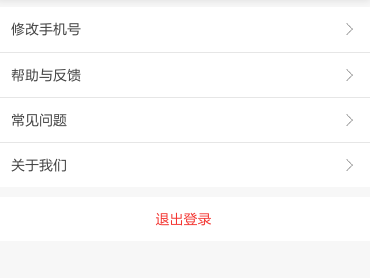

ListView可以使用ScrollView所有属性和方法
##回调
* onEndReached 所有行都被渲染，并且滚动到最下面调用
* renderFooter
* renderHeader
* renderRow
* renderScrollComponent 返回一个可滚动的组件
* renderSectionHeader 返回渲染的头部
* renderSeparator 如果该回调存在，在每一行下（如果最后一行下是另一节的头部将不会渲染）渲染一个分割单元
  
* onChangeVisibleRows(visibleRows, changedRows) 通知哪些行已经成为屏幕上的可见行
##属性
* dataSource
* initialListSize: int 定义了多少行会在ListView创建时被渲染。保证第一屏的List会被一次性渲染，而不是通过多少帧刷新显示出来（可防止初次加载时没必要的动画造成的卡顿）
* onEndReachedThreshold 设置onEndReached到了距离底部多少pt开始调用
* pageSize: int 在一个事件循环中，多少行会被渲染，默认1

##设置简单的数据源
```javascript
export default class MyListView extends React.Component {
  constructor(props) {
    super(props);
    this.listViewDataSource = new ListView.DataSource({
      rowHasChanged: (row1, row2) => row1 !== row2
    });
  }

  render() {
    return (
      <ListView
        dataSource={this.listViewDataSource.cloneWithRows(this.props.data)}
        renderRow={...}
      />
    )
  }
}

```
