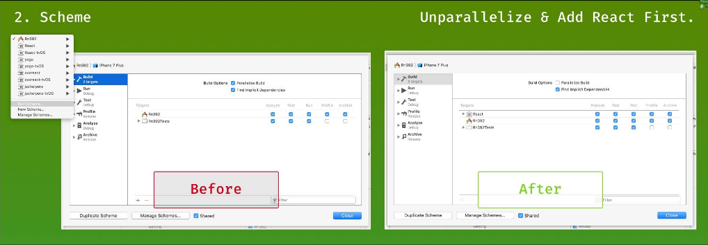

[TOC]
# Xcode8无法书输出的问题

Xcode8会出现原生`NSLog`真机无法输出的问题，可以使用R`CTLog`来输出
```
#import "RCTLog.h"
RCTLog(@"");
```

# 纵向排列的view，里面的text没有垂直居
view:
`justifyContent:'center'`
text:
`flex:0`

# 包含text的view不跟随text的宽度，而是跟随父视图的宽度
设置view的style

```
alignItems:'flex-start'
```

# ListView Bug
## 在其他页面改变DataSource后，ListView消失，需要滚一下才会出现
```
removeClippedSubviews={false}
```
## 不可以为listView的style加marginTop，在android上如果设置为44左右上并且有refreshControl会在顶部有高度为44的空白，当任何一个地方更新状态才会消失。解决办法是使用一个有高度的空白view放在listView之上

# addListener的回调方法中不能执行removeListener，回调方法会失效

# Picker控件的items必须是一个数组，不能是一个个组件，需要把他们加到数组中放在piker标签里

# 遇到RCTViewManager.h not found的情况
在build setting中，header search path添加：
$(SRCROOT)/../node_modules/react-native/React
$(SRCROOT)/../node_modules/react-native/ReactCommon
并设置为**recursive**

# 升级0.40 依然报错<React/.....h/> not found
先编译React，再运行

# 升级0.40 可以成功运行，archive失败
可能修改.a链接文件后，debug运行成功，release失败也可以用这种方法

注意：把React排在第一位，我猜是因为没有build React导致找不到文件，要先build React

# WebView 内显示的高度有问题
网页内JavaScript计算浏览器显示高度，设置startInLoadingState={true}后会使WebView内高度发生改变，需要设置为false


