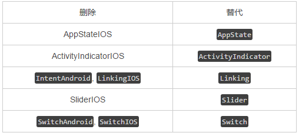

# 0.37
###突出变化：
删除弃用的 API 和模块 

从以下模块中删除回调支持，改用 promise
	·	NetInfo
	
###一般变化
####fixbugs
*	Fix justify content + min dimension usage in root (d376155) - @emilsjolander
*	Fix justify content + min dimension when children overflow (3e332d9) - @emilsjolander
*	Fix flex-shrink when shrinking to zero size (0699a30) - @emilsjolander
*	Fix for TouchableNativeFeedback having Animated.Component direct child (f930270) - @tonysherbondy
*	Override onContentSizeChange prop on ScrollView before rendering (a5698f5) - @jingc
*	Fix Warning: bind(): You are binding a component method to the component (ddb1e44) - @leeight
*	Fix CLI errors if no package.json is found (41f4f1e) - @benhughes
*	Change flex basis to override main axis size (a9d94c2) - @emilsjolander
*	Jest: Mock requireNativeComponent so manual mocking of UIManager properties isn't needed (487171f) - @cpojer
*	Dont override flexShrink, flexGrow, and flexBasis with shorthand flex (dc142ad) - @emilsjolander
*	CSSLayout: Compatibility with Apple TVOS (ef02134)

####New features and enhancements
*	Introduce Button Component (2ae73ff) - @ericvicenti
*	Add disabled prop to Button (c32ab7e) - @gitim
*	Add HorizontalSwipeJumpFromLeft animation to Navigator (2230117) - @yuya-fujimoto
*	Increase laziness in InitializeJavaScriptAppEngine (606fc11) - @javache
*	Implement a postMessage function and an onMessage event for webviews (abb8ea3) - @jacobp100
*	Enable native animations when possible in NavigationExperimental (f9779e3) - @ericvicenti

