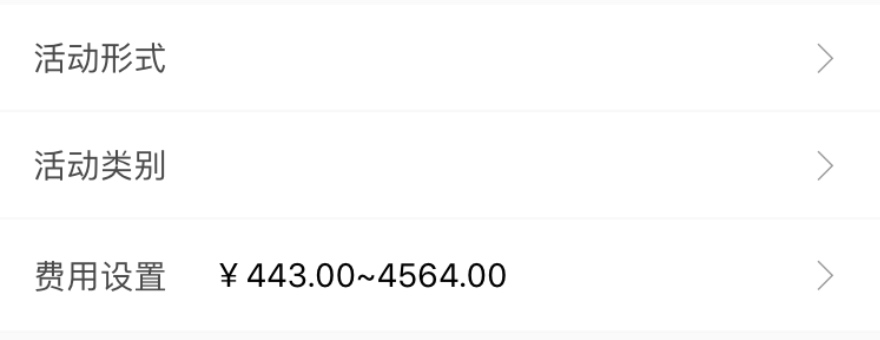
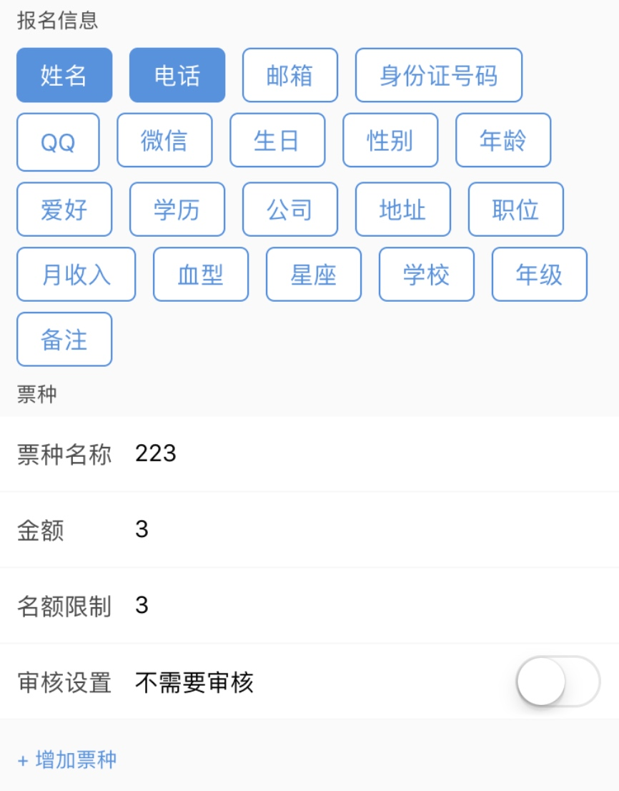
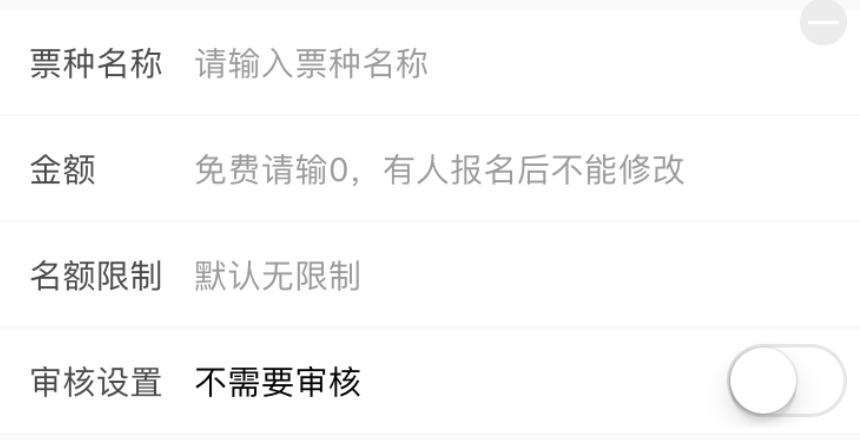
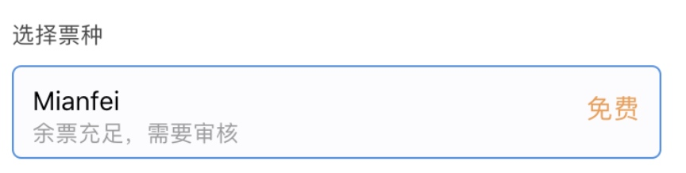
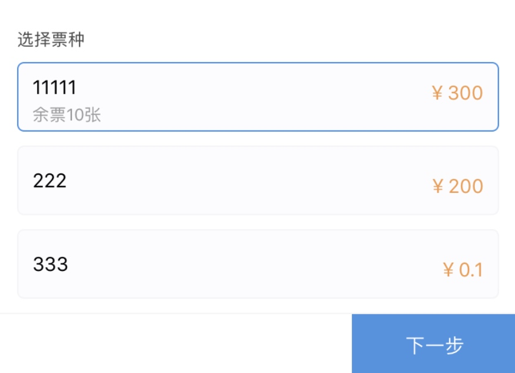
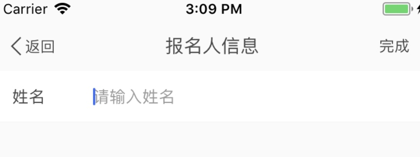
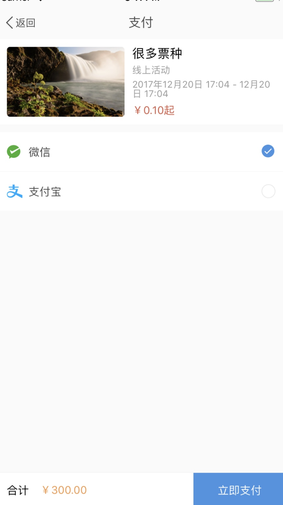
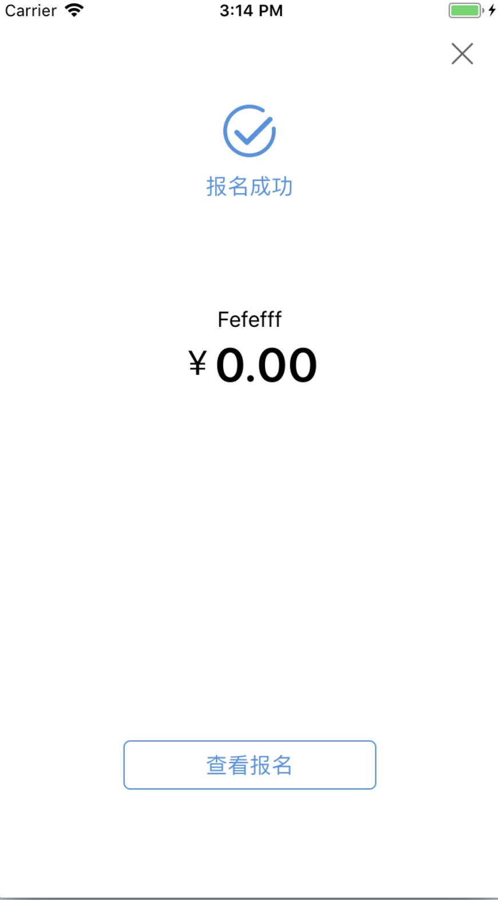

# 一、创建活动
### 费用设置
> 显示票种价格。例：￥1.00~2.00，￥1.00，免费

点击费用设置后进入费用设置页，设置报名必填项和票种

### 报名信息

> 可多选可不选，默认为姓名和电话
> 
> 字段：required
> 格式：[{"姓名": ""}, {"年龄": ""}, ...]

### 票种

> 最少一个，最多10个，大于一个时票种右上角显示减号；金额最高四位数，不填表示免费；名额限制不填表示不限人数

# 二、报名活动

### 立即报名

> 弹出选择票种，在当前选择的票种上显示余票和是否需要审核

### 下一步
> 如果有required，就跳转到报名人信息页，列出所有必填项，每一项不能为空
> 格式为 [{"姓名": "aaa", "电话": "110"}, ...]

> 如果有价格，需要去支付页支付
> 支付流程需要看小程序支付流程

> 报名：enroll/create/，带着required（不需stringify）和支付charge_id、order_no参数（到时候根据小程序支付流程再定）报名，成功后返回到活动详情页，更新状态，并弹出报名成功

# 三、我报名的活动

# 四、活动管理

