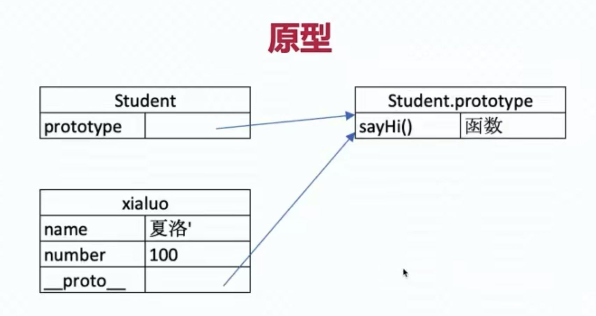

## 原型

```js
class People{}
class Student extends People {   
  constructor(name){
       this.name = name
  }
  sayHi() {
    console.log('姓名', this.name)
  }
}
wang = new Student('王')
wang.sayHi() // 姓名 王
typeof Student //  "function"。class 实际上是函数，所以是语法糖
// __proto__ 隐式原型，在ES标准中叫[[Prototype]]
wang.__proto__  // {constructor: ƒ, sayHi: ƒ}
wang.__proto__.sayHi() // 姓名 undefined
// prototype 显式原型
Student.prototype // {constructor: ƒ, sayHi: ƒ}
Student.prototype === wang.__proto__ // true

// 通过原型定义方法，相比通过实例定义的好处：所有实例都会继承该方法；并且是同一份内存，节省内存
Student.prototype.func = ()=>{}
wang.func = ()=>{} // 不应该

// 在创建新的对象或类时，方法通常应该关联于对象的原型，而不是定义到对象的构造器中，会导致每次构造器被调用时，方法都会被重新赋值一次
function MyObj(name) {
  this.name = name
  this.getName = function() {
    return this.name
  }
}
// 上面的代码没有用到闭包的好处，改为
function MyObj(name) {
  this.name = name
}
MyObj.prototype.getName = function() {
  return this.name
}
```



原型关系

* 每个class都有显式原型
* 每个实例都有隐式原型
* 实例的`__proto__`指向对应class的prototype

基于原型的执行规则

获取wang.name或执行方法wang.sayHi()时，先在实例自身属性和方法寻找，找不到则自动去`__proto__`中查找

### 原型链

```js
// Student继承于People。把Student.prototype当做对象，是通过People new出来的，所以Student.prototype的隐式原型指向Prople的显式原型
People.prototype === Student.prototype.__proto__ // true

wang.hasOwnProperty('name') // true
wang.hasOwnProperty('sayHi') // false
```


## instanceof

顺着隐式原型往上查，看能不能找到对应的显式原型，如果找到，返回true，如果直到Object都不成立，返回false

```js
// 手写instanceof
function ins(left,right){
    let pro = left.__proto__
    while(true){
        if(pro === right.prototype){
            return true
        }
        if(pro === null){
            return false
        }
        pro = pro.__proto__
    }
}
```


## 问题

判断一个变量是数组：a instanceof Array

class的原型本质：原型和原型链图示

属性和方法的执行规则：隐式原型通过链式的方法一步步往上找