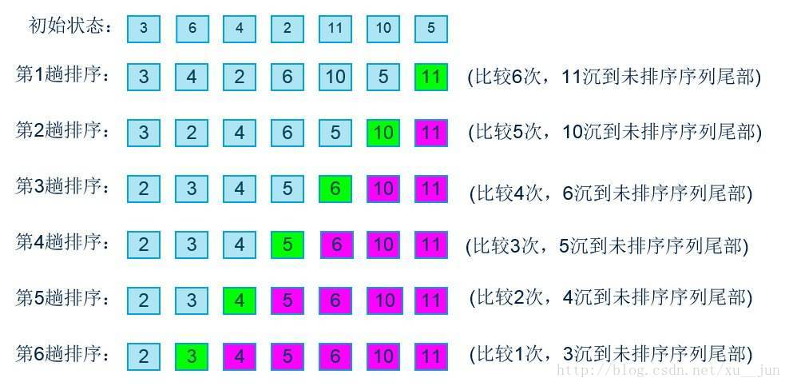
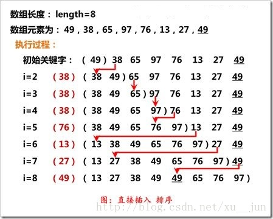

## 查找

### 二分查找/折半查找

前提是数组是有序的

　　　　（1，3，5，7，9，11，13，17，21，28，32）
　　　　　↑ 　　　　　　　↑　　　　　　　　　　↑
　　　　　low　　　　　　mid　　　　　　　　　high

　　　　（1，3，5，7，9，11，13，17，21，28，32）
　　　　　　　　　　　　　　　↑ 　　　　↑　　　↑
　　　　　　　　　　　　　　　low　　　mid　　high

```js
function find(arr, k) {
    // low为范围开始的元素索引，high为结束索引，mid为中间索引
    let low = 0, high = arr.length - 1, mid
    while (low <= high) {
        mid = parseInt((low + high) / 2)
        if (arr[mid] == k)
            return mid
        if (k > arr[mid])
            low = mid + 1 // +1为了防止查找不存在的元素导致死循环
        else
            high = mid - 1 // -1为了防止查找不存在的元素导致死循环
    }
    return -1
}
```


## 排序

### 冒泡

依次比较两个相邻的元素，如果顺序错误就把他们交换过来。重复地进行直到没有相邻元素需要交换，也就是说该元素列已经排序完成

最好的情况是顺序相同 $O(n)$

最坏的情况是顺序相反 $O(n^2)$

所以时间复杂度为 $O(n^2)$



```js
function sort(arr) {
    len = arr.length
    for (let i = 0; i < len; i++) { // 外层循环，循环全部
        for (let j = 0; j < len - i; j++) { // 内层循环，循环剩余的元素，找到最大/最小，排在最后
            if (arr[j] > arr[j + 1]) { // 从小到大，>
                [arr[j], arr[j + 1]] = [arr[j + 1], arr[j]]
            }
        }
    }
    return arr
}
```

### 插入排序

第一个元素默认是已排序元素，取出下一个元素和当前元素比较，如果当前元素大就交换位置。那么此时第一个元素就是当前的最小数，所以下次取出操作从第三个元素开始，向前对比，重复之前的操作

