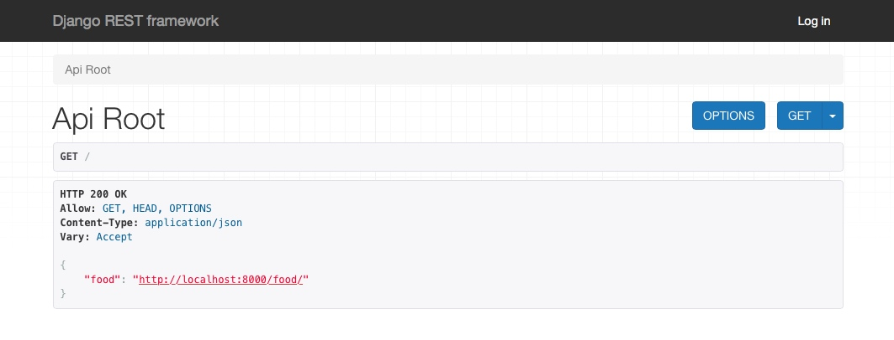
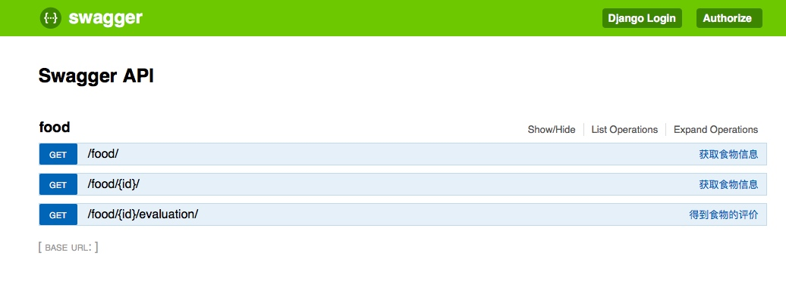

[TOC]
# 搭建、集成
## 新建项目
目录结构

```txt
|____project
| |______init__.py
| |____settings.py
| |____urls.py
| |____wsgi.py
|____templates
```

## 安装依赖
Django REST framework

```shell
# pip3 install djangorestframework
# pip3 install markdown      
# pip3 install django-filter  
```

Django REST Swagger

```shell
# pip3 install django-rest-swagger
```

## 新建app 
food
```txt
|____food
| |______init__.py
| |____admin.py
| |____apps.py
| |____migrations
| | |______init__.py
| |____models.py
| |____tests.py
| |____views.py
|____manage.py
|____project
| |______init__.py
| |____settings.py
| |____urls.py
| |____wsgi.py
|____templates

```

## 创建model

```python
from django.db import models

class Info(models.Model):
    title = models.CharField(max_length=20)
    description = models.CharField(max_length=120, null=True)
    price = models.FloatField(default=0)
    image_bg_url = models.CharField(max_length=50, null=True)

    def __unicode__(self):
        return self.name
```

同步数据库

```shell
# python3 manage.py makemigrations
# python3 manage.py migrate
```
随便插两条数据

## 集成REST
1. 修改project/setting.py
	在INSTALLED_APPS中添加
	
	```python
	INSTALLED_APPS = (
		...
		'rest_framework',
		...
	)

	```
	
	在文件末尾添加
	
	```
	REST_FRAMEWORK = {
		'DEFAULT_PERMISSION_CLASSES': [
			'rest_framework.permissions.DjangoModelPermissionsOrAnonReadOnly',
		]
	}
	```

2. 创建序列化类Serializer
	> 为代码片段的实例（instances）提供序列化和反序列化的途径，使之可以转化为如json的格式 。我们可以借助声明序列器（serializer）来实现类似于Django表单（form）的运作方式。
	
	新建food/serializers.py

	```python
	from rest_framework import serializers
	from food.models import Info
	
	class FoodSerializer(serializers.HyperlinkedModelSerializer):
	    class Meta:
	        # 指定model
	        model = Info
	        # 使用__all__标记全部, 或者只显示某些 fields = ('id', 'title')
	        fields = '__all__'
	```
	
3. 修改food/views.py

	```python
	from rest_framework import renderers
	from rest_framework import viewsets
	from rest_framework.decorators import detail_route
	from rest_framework.response import Response
	from food.models import Info
	from food.serializers import FoodSerializer
	
	
	class FoodViewSet(viewsets.ModelViewSet):
	    # 引号中的文字在swagger显示为注释
	    """
	    获取食物信息
	    """
	    queryset = Info.objects.all()
	    serializer_class = FoodSerializer
	
	    @detail_route(renderer_classes=(renderers.StaticHTMLRenderer,))
	    def evaluation(self, request, *args, **kwargs):
	        """
	        得到食物的评价
	        """
	        food_info = self.get_object()
	        return Response(food_info.id)
	
	    def perform_create(self, serializer):
	        serializer.save(owner=self.request.user)
	```

4. 修改project/urls.py

	```python
	from django.conf.urls import include, url
	from django.contrib import admin
	from rest_framework import routers
	from food import views as food_views

	# 由rest来管理api，不需要写在下面的urlpatterns了。urlpatterns中写view，不写api
	router = routers.DefaultRouter()
	router.register(r'food', food_views.FoodViewSet)
	
	urlpatterns = [
  		url(r'^admin/', include(admin.site.urls)),
  		url(r'^api-auth/', include('rest_framework.urls', namespace='rest_framework')),
  		url(r'^', include(router.urls)),
  	]
	```

5. 运行


## 集成Swagger
1. 修改project/setting.py
	在INSTALLED_APPS中添加
	
	```python
	INSTALLED_APPS = (
		...
		'rest_framework_swagger',
		...
	)

	```
	
	在文件末尾添加
	
	```python
	SWAGGER_SETTINGS = {
  	  'SECURITY_DEFINITIONS': {
  	      'basic': {
  	          'type': 'basic'
  	      }
  	  }
	}
	```
2. 在project/urls.py中添加
	```python
	from rest_framework_swagger.views import get_swagger_view
	urlpatterns = [
		...
		# $表示空行, 在浏览器中访问执行第一句, 直接跳到swagger, 调用get请求执行第二句
		url('^$', schema_view), # 或者'^api$'
		url(r'^', include(router.urls)), # 或者r'^api/'
		...
	]
	```
3. 运行
	


