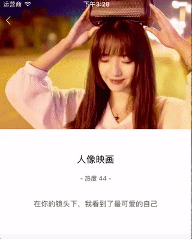
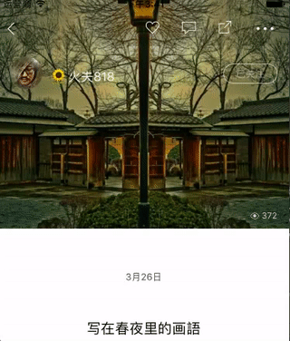

[TOC]

# interpolate 
> 插值动画，可以实现分段动画，绑定到event上非常流畅

1. 下拉放大，上拉变成导航栏动画


```javascript
'use strict';
// 图片高度为255
class Demo extends Component {
  constructor(props) {
    super(props);

    this.state = {
      scrollY: new Animated.Value(0),
      viewRef: null
    }
  }

  _renderHeaderParallaxImage() {
    const {scrollY} = this.state

    let translateY
    if (Platform.OS == 'ios') {
      translateY = scrollY.interpolate({
        inputRange: [255 - 64 + 50, 255 + (64 - 50), 255 + (64 - 50)], 
        outputRange: [255, 255 - 30, 255 - 30],
      })
    } else {
      translateY = scrollY.interpolate({
        inputRange: [255 - 44 + 30 + 20, 255 - 30 + 44 + 20, 255 - 30 + 44 + 20],
        outputRange: [255, 255 - 30, 255 - 30],
      })
    }

    return (
      <Animated.Image
        onLoad={() => this.setState({viewRef: findNodeHandle(this.refs.backgroundImage)})} // for android blur
        ref='backgroundImage'
        pointerEvents='none'
        style={[styles.postParallaxImage, {
          height: 255,
          transform: [{
            translateY: scrollY.interpolate({
              inputRange: [-255, 0, 255 - NavHeight, 255],
              outputRange: [255 / 2, 0, -(255 - NavHeight), -(255 - NavHeight)],
            })
          }, {
            scale: scrollY.interpolate({
              inputRange: [-255, 0, 255],
              outputRange: [2, 1, 1], // -255: 2, 0: 1, 255: 1  当scrollY在-255到0时，scale按照2-1的动画运动；当scrollY在0-255时，scale不变。可以输入任意数量对应的值，但必须是递增或者相等
            })
          }]
        }]}
        source={{uri: IMAGE_URL}}
      >
        <Animated.View style={{
          top: 0,
          width: util.size.width,
          height: 255,
          position: 'absolute',
          backgroundColor: '#00000050'
          opacity: scrollY.interpolate({
            inputRange: [-255, 0, 255 - NavHeight, 255],
            outputRange: [0, 0, 1, 1]
          })
        }}/>

        <Animated.Text style={{
          color: 'white',
          backgroundColor: 'transparent',
          fontSize: 18,
          textAlign: 'center',
          transform: [{translateY: translateY}]
        }}>
          '标题'
        </Animated.Text>

      </Animated.Image>
    )
  }


  render() {
    return (
      <View>
        <StatusBar barStyle='light-content'/>
        {/* 图片放在最下层，listiview的marginTop需要留出64的空白用来显示图片变成的nav bar*/}
        {/* 正常的逻辑是把拉伸图放在listView之上，这里为了显示refreshControl，把拉伸图的层次放在listView之下，所以在listView上放了一个高度为导航栏的空白view。 */}
        {this._renderHeaderParallaxImage()}

        {/* 不可以为listView的style加marginTop，在android上如果有refreshControl会在顶部有高度为44的空白 */}
        <View style={{height: NavHeight}}/>
        <ListView
          scrollEventThrottle={16} // 设置为16足够，不需要设置到1
          showsVerticalScrollIndicator={false}
          refreshControl={
            <RefreshControl
              tintColor='white'
              progressViewOffset={44}
              refreshing={boardArticleReducer.isRefreshing}
              onRefresh={this._onRefresh.bind(this)}
            />
          }
          renderHeader={<View style={{height: 255 - NavHeight}}/>}
          style={{backgroundColor: 'transparent'}} // 因为层次原因，防止把header遮住
          renderRow={<View style={{backgroundColor: 'white'}}/>} // renderRow需要背景色，把title遮住，并且不能设置margin（可以外面套一个大的view，在里面margin）
          // 把Animated.event绑定到onScroll或者手势中
          onScroll={Animated.event([{nativeEvent: {contentOffset: {y: this.state.scrollY}}}])}
          // 或者
          onScroll={(e) => {
            Animated.event([{nativeEvent: {contentOffset: {y: this.state.scrollY}}}])
              .call(this, e)
          }}
        />
      </View>
    );
  }
}
```

2.下拉放大，上拉视差效果


```javascript
// 如果要视差效果，拉伸图的层次应该在listView之下，让拉伸图不遮挡listView的显示，同时listView的header设置为透明色高度为拉伸图的高度，其他地方设置为纯色，把拉伸图挡住
<Animated.Image
  style={{
    height: 300,
    transform: [{
      translateY: scrollY.interpolate({
        inputRange: [-300, 0, 300],
        outputRange: [300 / 2, 0, -300 / 3],
      })
    }, {
      scale: scrollY.interpolate({
        inputRange: [-300, 0, 300],
        outputRange: [2, 1, 1],
      })
    }]
  }}
/>
```

## 监听Animated.Value
animatedValue.addListener(({value}) => {})

## 插值动画可以取任意中间值，不需要一定是最小最大值


