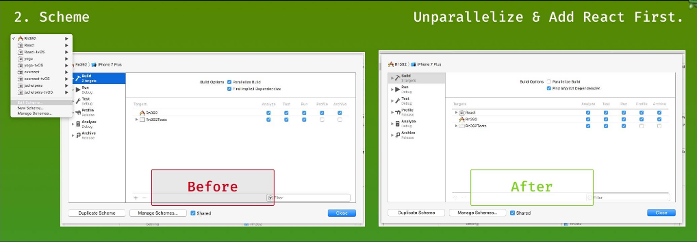

[TOC]
# Xcode8无法书输出的问题

Xcode8会出现原生`NSLog`真机无法输出的问题，可以使用R`CTLog`来输出
```
#import "RCTLog.h"
RCTLog(@"");
```

# 纵向排列的view，里面的text没有垂直居
view:
`justifyContent:'center'`
text:
`flex:0`

# 包含text的view不跟随text的宽度，而是跟随父视图的宽度
设置view的style

```
alignItems:'flex-start'
```

# ListView Bug
## 在其他页面改变DataSource后，ListView消失，需要滚一下才会出现
```
removeClippedSubviews={false}
```
## 不可以为listView的style加marginTop，在android上如果设置为44左右上并且有refreshControl会在顶部有高度为44的空白，当任何一个地方更新状态才会消失。解决办法是使用一个有高度的空白view放在listView之上

# addListener的回调方法中不能执行removeListener，回调方法会失效

# Picker控件的items必须是一个数组，不能是一个个组件，需要把他们加到数组中放在piker标签里

# 遇到RCTViewManager.h not found的情况
在build setting中，header search path添加：
$(SRCROOT)/../node_modules/react-native/React
$(SRCROOT)/../node_modules/react-native/ReactCommon
并设置为**recursive**

# 升级0.40 依然报错<React/.....h/> not found
先编译React，再运行

# 升级0.40 可以成功运行，archive失败
可能修改.a链接文件后，debug运行成功，release失败也可以用这种方法

注意：把React排在第一位，我猜是因为没有build React导致找不到文件，要先build React

# WebView 内显示的高度有问题
网页内JavaScript计算浏览器显示高度，设置startInLoadingState={true}后会使WebView内高度发生改变，需要设置为false

# Image无法显示图片，但是浏览器可以
说明uri中可能有无法识别的字符，比如“|”，使用encodeURI()可能会导致其他字符改变，只能用replace来替换

```javascript
uri = uri.replace(/\|/g, "%7C");
```

# 构建已有项目时遇到重复问题
例如：

`
Paths: /Users/huowenxuan/Desktop/girtu/node_modules/react-native-svg/node_modules/react-native/Libraries/Animated/release/package.json collides with /Users/huowenxuan/Desktop/girtu/node_modules/react-native/Libraries/Animated/release/package.json
`

是react-native-svg中的node_modules有react-native目录，把react-native目录删掉就好了

# Redux中componentWillReceiveProps对比不准确
导致this.props.postCount 永远等于 nextProps.postCount

```javascript
case TYPES.MY_POST_POST_COUNT:
    // 错误，可能会正常render，但是会导致上面的错误
    // state.postCount = action.postCount
    return {
        ...state,
        // 正确
        postCount: action.postCount 
    }
    
// 或者
case TYPES.MY_POST_POST_COUNT:
    // 正确
    let newState = Object.assign({}, state, {postCount: action.postCount})
    return {
        ...newState,
    }
```

# TextInput Android
下划线
设置属性：`underlineColorAndroid="transparent"`

因为有下划线所以导致文字不居中，需要设置style的padding: 0

# RN 0.45.1 运行报错'boost/iterator/iterator_adaptor.hpp' file not found
下载[https://pan.baidu.com/s/1kVDUAZ9#list/path=%2F](https://pan.baidu.com/s/1kVDUAZ9#list/path=%2F)，全部放在~/.rncache

或者下载[boost](https://sourceforge.net/projects/boost/files/boost/1.63.0/)
解压后的boost_1_63_0/放在项目中node_modules/react-native/third-party/中

# @connect
支持修饰符需要安装插件
npm install --save-dev babel-plugin-transform-decorators-legacy

.babelrc

```
{
  "presets": ["react-native"],
  "plugins": ["transform-decorators-legacy"]
}
```

# 运行node服务时报错：Cannot find module 'anymatch'
删除package-lock.json，运行npm install

# ScrollView有时无法设置高度，在外面套一个高度固定的view

```javascript
<View style={{height: 60}}>
    <ScrollView>
    </ScrollView>
</View>
```

# ListView的onEndReached
在第一次渲染时，如果数据不足一屏（比如初始值是空的），这个事件也会被触发。即使在onEndReached中判断length > 0也不准确，length已经大于0，但是还未渲染出来，依然会执行onEndReached方法。设置initialListSize={1}解决

# react-native-navigation切换tab后使用StatusBar设置barStyle不管用
参考：[https://github.com/wix/react-native-navigation/issues/453](https://github.com/wix/react-native-navigation/issues/453)
修改info.plist中`View controller-based status bar appearance`改为`YES`，设置之后下面两个属性才会生效。  
将来不可以使用StatusBar，否则会报错`RCTStatusBarManager module requires that the UIViewControllerBasedStatusBarAppearance key in the info.plist is set to NO`。  
而是使用react-native-navigation提供的方法来修改状态栏

```javascript
static navigatorStyle = {    
    // 在push时维持状态
    statusBarTextColorScheme: 'dark',  // dark or light
    // 在push时候不维持状态
    statusBarTextColorSchemeSingleScreen: 'light', // dark or light
};
```

使用起来更方便，把iOS的status bar style设置default(dark)，只要在需要显示为白色的界面设置statusBarTextColorSchemeSingleScreen: light，其他页面不设置。
StatusBar是一直维持状态

# 0.42以上的版本，Android的TextInput设置为multiline后按回车会收回键盘而不是加入新一行
禁用blurOnSubmit，禁用系统的键盘返回，在按下返回键的方法onSubmitEditing中加\n，但是依然存在问题，首先是setState不能立即响应，然后是不能在光标后加换行，只能在末尾加

```javascript
<TextInput
    multiline={true}
    blurOnSubmit={false}
    onSubmitEditing={() => {
        if (!this.timeout) {
            let newValue = this.state.value
            newValue += '\n'
            this.setState({value: newValue})
        }

        this.timeout = setTimeout(() => {
            clearTimeout(this.timeout)
            this.timeout = null
        }, 100)
        }}
/>
```

# Android上TextInput设置minHeight后即使文字超出，高度也不会改变
使用onChange来动态改变高度，0.46以上版本onChange不包含contentSize，使用onContentSizeChange方法

```jsx
onChange={(event) => {
  this.setState({ height: event.nativeEvent.contentSize.height })
}}
style={[this.props.style, {
  height: Math.max(minHeight, this.state.height),
}]}
```

# 键盘弹起最佳实践
如果下方有需要跟随键盘弹起的view，上面的view设置flex: 1, iOS使用KeyboardSpacer，android不需要，因为会自动弹起，否则会弹起两倍的高度，

其他正常的情况下，需要全屏弹起，使用react-native-keyboard-aware-scroll-view的KeyboardAwareScrollView，有需要的话设置bounces为false。使用ScrollView还有一个好处就是可以点击其他地方收回键盘，Android同样使用，因为也有很多时候Android不会响应键盘弹起。如果一级子view使用space-between，还需要设置子view的高度，如果使用react-natiave-navigation，ios-64，android-78


# 错误：undefined is not an object (evaluating 'ReactPropTypes.string')
"react-native": "^0.45.1",
react必须是：
"react": "16.0.0-alpha.12"
不能是
"react": "^16.0.0-alpha.12"

# 运行iOS，报错`third-party: 'config.h' file not found`，终端执行

    ```
    cd node_modules/react-native/third-party/glog-0.3.4
    ../../scripts/ios-configure-glog.sh
    ```

# 单行TextInput输入超过边界不自动滚
需要设置height且至少比fontSize大一点
例如：`{fontSize: 14, height: 17}`

