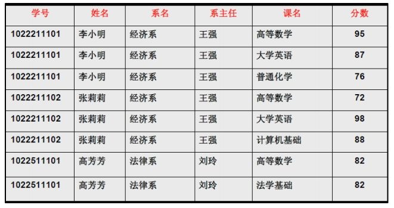
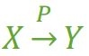
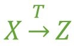
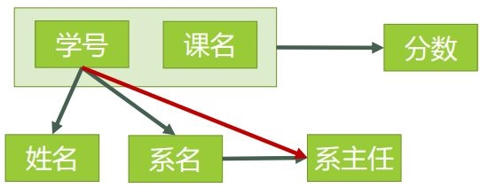
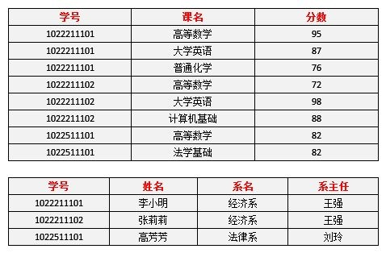
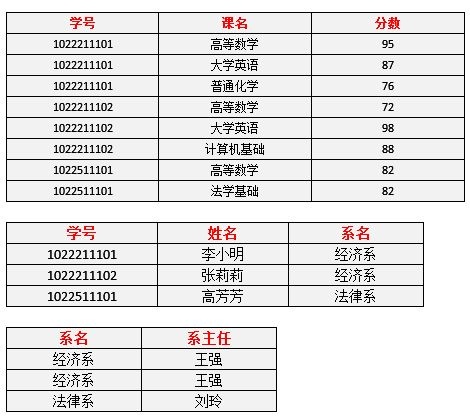
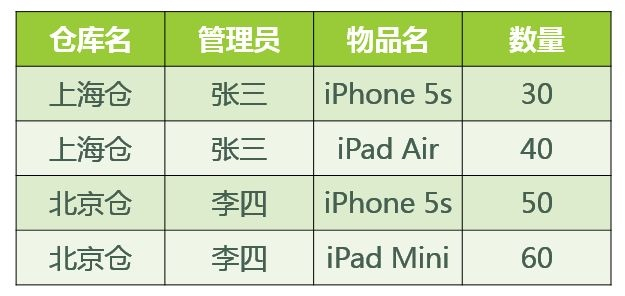

[TOC]

参考：
[解释一下关系数据库的第一第二第三范式？](https://www.zhihu.com/question/24696366)
[数据库范式那些事](http://www.cnblogs.com/CareySon/archive/2010/02/16/1668803.html)

应用数据库范式的好处是更好的组织性、减少冗余、消除异常（插入异常、更新异常、删除异常）。坏处是降低性能

## 第一范式 1NF
每个属性都不可再分，1NF是所有关系型数据库的最基本要求。不符合第一范式则不能称为关系数据库。

错误：

| 编号 | 进货 |
| --- | --- | --- |
|  | 数量\|单价 |
正确：

| 编号 | 进货数量 | 进货单价 | 
| --- | --- | --- |
|  |  |  |

仅仅符合1NF的设计，仍然会存在数据冗余过大，插入异常，删除异常，修改异常的问题。例如表1：

1. 每一名学生的学号、姓名、系名、系主任这些数据重复多次。每个系与对应的系主任的数据也重复多次——数据冗余过大
2. 假如学校新建了一个系，但是暂时还没有招收任何学生（比如3月份就新建了，但要等到8月份才招生），那么是无法将系名与系主任的数据单独地添加到数据表中去的 （注１）——插入异常
    
    注１：根据三种关系完整性约束中实体完整性的要求，关系中的码（注２）所包含的任意一个属性都不能为空，所有属性的组合也不能重复。为了满足此要求，图中的表，只能将学号与课名的组合作为码，否则就无法唯一地区分每一条记录。
    
    注２：码：关系中的某个属性或者某几个属性的组合，用于区分每个元组（可以把“元组”理解为一张表中的每条记录，也就是每一行）。
4. 假如将某个系中所有学生相关的记录都删除，那么所有系与系主任的数据也就随之消失了（一个系所有学生都没有了，并不表示这个系就没有了）。——删除异常
5. 假如李小明转系到法律系，那么为了保证数据库中数据的一致性，需要修改三条记录中系与系主任的数据。——修改异常。

## 第二范式 2NF
在1NF的基础之上，消除了非主属性对于码的部分函数依赖，每一个非主属性都完全函数依赖于码

简单的说，是表中的属性必须完全依赖于全部主键，而不是部分主键.所以只有一个主键的表如果符合第一范式，那一定是第二范式。这样做的目的是进一步减少插入异常和更新异常。

### 概念解释
- 函数依赖：在一张表中，在属性（组）X确定的情况下，必定能确定属性 Y 的值，那么就可以说Y函数依赖于 X，写作 X->Y。例如：知道学号必定可得出姓名，就可以说姓名**函数依赖**于学号，学号->姓名

- 完全函数依赖：在一张表中，若 X->Y，且对于 X 的任何一个真子集（假如属性组 X 包含超过一个属性的话），X'->Y 不成立，那么我们称 Y 对于 X 完全函数依赖，记作：
- 部分函数依赖：假如 Y 函数依赖于 X，但同时 Y 并不完全函数依赖于 X，那么我们就称 Y 部分函数依赖于 X，记作

- 传递函数依赖
假如 Y 不包含于 X，且 X 不函数依赖于 Y，那么我们就称 Z 传递函数依赖于 X ，记作
 
- 码：设 K 为某表中的一个属性或属性组，若除 K 之外的所有属性都完全函数依赖于 K，那么我们称 K 为候选码，简称为码。可以理解为：**假如当 K 确定的情况下，该表除 K 之外的所有属性的值也就随之确定，那么 K 就是码**。一张表中可以有超过一个码

- 主属性：包含在任何一个码中的属性称为主属性

### 判断是否满足2NF
1. 找出数据表中所有的码
    1. 查看所有每一单个属性，当它的值确定了，是否剩下的所有属性值都能确定。
    2. 查看所有包含有两个属性的属性组，当它的值确定了，是否剩下的所有属性值都能确定。
    3. ……
    4. 查看所有包含了六个属性，也就是所有属性的属性组，当它的值确定了，是否剩下的所有属性值都能确定。
    
    诀窍：假如A是码，那么所有包含了A的属性组，如（A，B）、（A，C）、（A，B，C）等等，都不是码了（因为作为码的要求里有一个“完全函数依赖”）。
    表中所有的函数依赖关系：
    
    码只有一个：（学号、课名）
    
2. 根据第一步所得到的码，找出所有的主属性。
    > 学号、课名
3. 数据表中，除去所有的主属性，剩下的就都是非主属性了。
    > 姓名、系名、系主任、分数
4. 查看是否存在非主属性对码的部分函数依赖。
    对于（学号，课名） → 姓名，有 学号 → 姓名，存在非主属性 姓名 对码（学号，课名）的部分函数依赖。
    对于（学号，课名） → 系名，有 学号 → 系名，存在非主属性 系名 对码（学号，课名）的部分函数依赖。
    对于（学号，课名） → 系主任，有 学号 → 系主任，存在非主属性  对码（学号，课名）的部分函数依赖。
    所以表1存在非主属性对于码的部分函数依赖，最高只符合1NF的要求，不符合2NF的要求。

### 让表1满足2NF
为了让表1符合2NF的要求，我们必须消除这些部分函数依赖，只有一个办法，就是将大数据表拆分成两个或者更多个更小的数据表。分解为：

选课（学号，课名，分数）
学生（学号，姓名，系名，系主任）
> 在拆分的过程中，要达到更高一级范式的要求，这个过程叫做“模式分解”

对于选课表，码是（学号，课名），主属性是学号和课名，非主属性是分数。学号确定，并不能唯一确定分数，课名确定，也不能唯一确定分数，所以不存在非主属性分数对于码的部分函数依赖，所以符合2NF的要求。

对于学生表，其码是学号，主属性是学号，非主属性是姓名、系名和系主任，因为码只有一个属性，所以不可能存在非主属性对于码的部分函数依赖，所以此表符合2NF的要求。

模式分解后得到表2：

验证问题是否存在：
1. 李小明转系到法律系只需要修改一次李小明对应的系的值即可。——有改进
2. 数据冗余是否减少了？学生的姓名、系名与系主任，不再像之前一样重复那么多次了。——有改进
3. 删除某个系中所有的学生记录该系的信息仍然全部丢失。——无改进
4. 插入一个尚无学生的新系的信息。因为学生表的码是学号，不能为空，所以此操作不被允许。——无改进

## 第三范式3NF
在2NF的基础之上，消除了非主属性对于码的传递函数依赖

简单的说，第三范式是为了消除数据库中关键字之间的依赖关系

对于表2，是否满足3NF：
1. 对于选课表，主码为（学号，课名），主属性为学号和课名，非主属性只有一个，为分数，不可能存在传递函数依赖，所以选课表的设计，符合3NF的要求。
2. 对于学生表，主码为学号，主属性为学号，非主属性为姓名、系名和系主任。因为 学号 → 系名，同时 系名 → 系主任，所以存在非主属性系主任对于码学号的传递函数依赖，所以学生表的设计，不符合3NF的要求。

为了让数据表设计达到3NF，我们必须进一步进行模式分解为以下形式：
选课（学号，课名，分数）
学生（学号，姓名，系名）
系（系名，系主任）

1. 对于选课表，符合3NF的要求。
2. 对于学生表，码为学号，主属性为学号，非主属性为系名，不可能存在非主属性对于码的传递函数依赖，所以符合3NF的要求。
3. 对于系表，码为系名，主属性为系名，非主属性为系主任，不可能存在非主属性对于码的传递函数依赖（至少要有三个属性才可能存在传递函数依赖关系），所以符合3NF的要求。

新的表：表3

符合3NF要求的数据库设计，基本上解决了数据冗余过大，插入异常，修改异常，删除异常的问题。当然，在实际中，往往为了性能上或者应对扩展的需要，经常 做到2NF或者1NF，但是作为数据库设计人员，至少应该知道，3NF的要求是怎样的

### BC范式
在3NF的基础上，消除主属性对于码的部分函数依赖与传递函数依赖。是在第三范式的基础上的一种特殊情况

一个满足第三范式的表：

问题：
1. 先新增加一个仓库，但尚未存放任何物品，是否可以为该仓库指派管理员？——不可以，因为物品名也是主属性，根据实体完整性的要求，主属性不能为空。
2. 某仓库被清空后，需要删除所有与这个仓库相关的物品存放记录，会带来什么问题？——仓库本身与管理员的信息也被随之删除了。
3. 如果某仓库更换了管理员，会带来什么问题？——这个仓库有几条物品存放记录，就要修改多少次管理员信息。

在某些特殊情况下，即使关系模式符合 3NF 的要求，仍然存在着插入异常，修改异常与删除异常的问题，仍然不是 ”好“ 的设计。

造成此问题的原因：存在着主属性对于码的部分函数依赖与传递函数依赖。（在此例中就是存在主属性【仓库名】对于码【（管理员，物品名）】的部分函数依赖。

解决办法就是要在 3NF 的基础上消除主属性对于码的部分与传递函数依赖。

仓库（仓库名，管理员）
库存（仓库名，物品名，数量）

这样，之前的插入异常，修改异常与删除异常的问题就被解决了

### 第四范式
表中每个非平凡多值依赖X→→Y，X都含有候选码，则属于第四范式

简单的说，第四范式是消除表中的多值依赖，也就是说可以减少维护数据一致性的工作。对于上面bc范式化的表中，对于员工的skill，两个可能的值是”C#,sql,javascript”和“C#，UML,Ruby”,可以看出，这个数据库属性存在多个值，这就可能造成数据库内容不一致的问题，比如第一个值写的是”C#”,而第二个值写的是”C#.net”,解决办法是将多值属性放入一个新表

### 总结
应用的范式越高，表越多，查询时要连接的表越多，增加了查询的复杂度、降低了数据库查询性能

并不是应用的范式越高越好，要看实际情况而定。第三范式已经很大程度上减少了数据冗余，并且减少了造成插入、更新和删除异常了。大多数情况应用到第三范式已经足够，在一定情况下第二范式也可以

                      