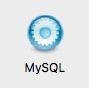

# mac安装
1. 从mysql官网下载dmg，不要使用brew安装，因为在mysql某个版本后，会有一个初始的随机密码，brew不会记录这个密码。dmg安装成功后弹出一个框告诉初始密码。这里是`wAMeaUyQe1!v`
2. 安装成功后打开系统偏好设置中有mysql选项，打开点击start MySQL Server  
	
	
	如果报错：
	Warning:The /usr/local/mysql/data directory is not owned by the 'mysql' or '_mysql' 
	在终端输入
	
	```shell
	sudo chown -R  _mysql:wheel  /usr/local/mysql/data
	```
3. 在命令行中链接mysql

	```shell
	# alias mysql=/usr/local/mysql/bin/mysql
	# alias mysqladmin=/usr/local/mysql/bin/mysqladmin
	```
4. 修改密码
	```
	# mysqladmin -u root -p password root
	```
	提示输入密码，输入刚才的初始密码`wAMeaUyQe1!v`
5. 使用
	```
	# mysql -u root -p
	```

