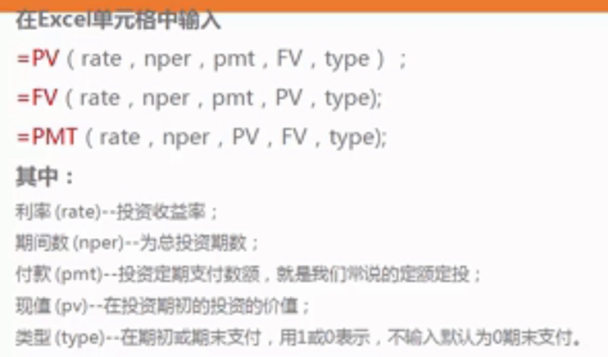

[TOC]

# 计算收益率
## 收益率RATE：PV/FV/PMT公式
已知求未知，五大要素知其四可求另一

PV（present value）：现值，2034年的十万，相当于2014年的多少钱。（算现值）
FV：终值，2014年的十万，相当于2034年的多少钱
PMT：年金，现在开始存钱，每个月存多少钱，30年后我会有多少钱

## 内部收益率：IRR公式，计算相同时间间隔的年化收益率
假如贷款10000，分12月，每月手续费0.66%，每月还本金83.33（不算手续费），看似年化手续费7.92%。实际上，输入到EXCEL，计算年化为14.31%

 

## XIRR：不同时间间隔的年化收益率
输入，注意时间格式和投资、收益的正负
 

                      