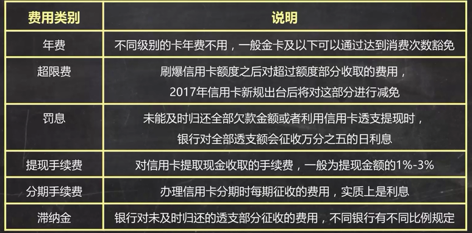

[TOC]

# 信用卡
> 作用：
1. 消费：免息期最多50天
2. 分期：可能有分期利息
3. 提现：一定收取利息，没有免息期
附加品：
1. 卡片福利
2. 征信报告

## 选卡
1. 发卡行
    > 如无特殊偏好，选择股份制银行，如中信、浦发、招行、广发。对信用卡业务投入较多。

2. 使用需求
    > 网上消费比网下消费多，选择特殊的定制卡。通常在网上消费时有更多的积分
    > 经常有差旅需求，选择积分换里程的卡
    > 如果某类消费比较多，选择特定消费可返现金的卡。例如超时、汽车加油
    > 出国旅行，选择全币种卡

3. 持卡福利
    > 看谁家的信用卡积分更值钱。很多类别的消费不算积分，如房贷。查询网站：融360，51信用卡，飞客茶馆

## 信用卡的级别分类

| ~ |年费|额度|服务|用户|
|-|-|-|-|-|
|普卡|一般可用过消费免除|一般额度<=5w|积分、消费福利等|普通用户|
|金卡|同上|一般额度<=10w|常规+额外福利|同上
|白金卡|通常不可免，千元以上|一般5w起，额度不等|多样额外福利|中高端用户|
|黑卡|年费高|超高额/无限额|定制化服务|高端用户|
额度与月收入、职业等，及银行风控政策有关

## 影响办卡的因素
是否具有稳定生活：婚姻状况、家庭住址
是否具有较好的收入：公司固定电话、年收入
是否具有良好的还款意识：信用记录、他行信用卡

## 办卡小技巧
1. 选择自己工资卡所在银行的信用卡，通过率较高
2. 提供相关的资产证明

## 办卡被拒的可能原因
1. 征信逾期
2. 审核电话无人接听
3. 工作行业不符

## 额度
> 授信额度：你能够最多消费多少钱。
> 临时授信额度：过节临时提升额度
> 不免息的授信额度：超限后没有免息期直接开始扣除利息
> 综合授信额度：一家银行的所有卡额度是共享的
> 最低还款额：通常不低于当期透支金额的10%，或者各家银行的规定。**未及时还款时按本月欠款的全额收取利息，每一笔消费从刷卡日开始计算利息**

## 日期
1. 账单日：发卡银行每月会定期对你的信用卡账户当前发生的各项交易，费用等进行汇总结算，并结算利息，计算你当期总欠款额和最小还款额，并未你邮寄对账单。此日期即为你信用卡的账单日（账单日开始新一期的计费，最晚在下个还款日还款。所以，消费，尤其是大额消费，选择账单日刚结束后进行，免息期最长。一年有一次修改账单日的机会）
2. 还款日：还上一个账单周期的最后期限日
3. 免息期：前一个账单日后一天算起，到还款日截止

## 费用

## 技巧
1. 每刷完一笔，将等额现金转入货币基金等活期账户
2. 尽量通过还款提醒来手动还款，而不是信用卡自动还款

  [1]: ./images/1508775384555.jpg "1508775384555.jpg"

