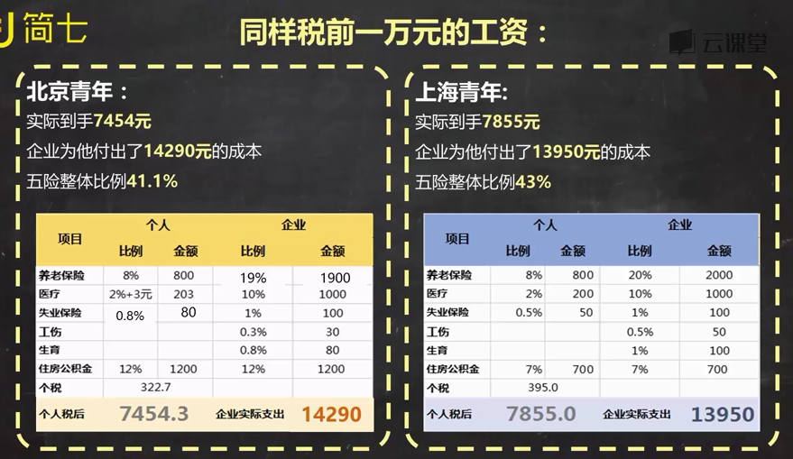

[TOC]

# 保险
## 五险（社保）
养老保险：退休金
医疗保险：享受一定的医疗费用报销
实业保险：实业后可以领取一些津贴
生育保险：自己生孩子、妻子生孩子，都可以领取生育医疗费、生育津贴和产假
工伤保险：在工作期间遭受意外伤害或者得职业病，暂时或永久丧失劳动能力，甚至不幸死亡时，得到补偿

## 缴纳与领用
查看缴纳标准：登陆本市人力资源和社会保障局官网，搜索社保缴纳标准

### 养老保险
缴纳人：个人与企业
缴纳基数：（1）月平均工资在上限：按照实际工资；（2）超出范围：按缴纳上限（上海2016年单位职工个人缴费基数上限为16353 ）

领用：
个人：缴纳基数的8%，存入到个人账户
单位：缴纳基数的20%，存到统筹账户
97年后参加工作，退休后每月养老金为个人养老金（由个人养老金和退休年龄确定）+基础养老金（根据退休当年当地平均工资和缴费年限计算确定，来源于统筹账户）。
**在退休前要累计缴满15年，否则只能领回自己缴纳的部分。（如果财务自由后不再工作，也可以通过自己缴费达到15年）**

### 医疗保险
缴纳人：个人与企业
缴费基数：月平均工资
缴纳比例：（1）个人：各地有差别，2%左右；（2）企业：一般是8%-10%

领用：
个人：医保卡：可以刷卡看门诊；重大疾病或住院，可以统筹报销
单位：一部分到医保卡，一部分到统筹账户

**医保停止缴纳3个月后就不能享受统筹报销部分，需再次缴纳6个月才可恢复待遇（可以自己缴纳）**

### 失业保险
缴纳人：个人与企业
缴费基数：月平均工资
缴纳比例：（1）个人：0.2%-1%；（2）企业：一般是2%

领用：
参考当地最低生活保障水平，可领取3-24个月不等，非常少
领取条件
1. 缴纳满一年
2. 非本人意愿实业
3. 失业后60天内实业登记

### 生育保险
叫那人：企业
缴纳比例：一般是0.5%-1%

领用：
领取条件
1. 计划内的生育（包括二胎）
2. 在特定的医疗机构生产或流产的生育妇女
3. 分娩前已累计缴费的时长（0-12月不等）

待遇：
生育津贴：本企业上一年度月平均工资
医疗服务：药费、治疗费、接生费；生育引起的疾病治疗；手术费、检查费
产假：正常分娩；流产

### 工伤保险
缴纳人：企业
缴纳比例：0.5-2（根据各个行业的风险差别）

领用：
1. 在工作时间和场所内，因工作受到事故伤害
2. 从事与工作有关的预备性或收尾性工作受到事故伤害
3. 因履行工作职责受到暴力等意外伤害
4. 患职业病的
5. 因工外出，由于工作原因受到伤害或发生事故下落不明
6. 上下班途中，受到非本人主要责任的交通事故或城市轨道交通、客运轮渡、火车事故伤害的

## 税前一万，税后多少

## 自由职业者怎么缴纳社保
1. 自己为自己缴纳，一般只能上三险（医疗、养老、失业）
2. 找代理公司上五险一金。本地户口：找当地职业介绍服务中心和人才服务中心；外地户口：社保代理公司

## 社保的意义
不仅仅是为了保障，还与很多事有关：买房买车、创业、子女教育补贴、出国事务
有些地方必须连续三年缴社保才有户口，断一个月都不行
如果离职，需要提前找个中介过度一下，网上有不少帮交保险的社保代理公司，按照最低基数缴纳即可。
如果已经发生了断缴，养老和医疗保险是累积的。如果医保中断，医保待遇从下个月起就停了，重新交还是可以恢复报销的（有等待恢复期）

## 换城市工作怎么办
进行转结，咨询原来城市和新城市的社保中心，一般需要在原单位和原地区的社保中心开具参保缴费凭证，然后再新单位和城市办理。
养老保险中的个人缴纳部分可以全部转走，单位缴纳的可以转移一部分。医疗保险可以转移缴纳年限，个人部分还可以取出自用。

## 增加养老金
养老金替代率=退休时养老金领取水平/退休前工资收入水平（退休前10000/退休后5000=50%）
（1997年之前中国一直都是75%，到2014年已经下降到45%，已经下降到国际基准线之内了）

养老金=基础养老金+个人养老金（可以直接用网上的养老金计算器）
基础养老金=（参保人员办理申领基本养老金手续时上年度全市职工月平均工资+本人指数化月平均缴费工资）/2*（1%*缴费年限）
个人养老金按本人账户储蓄额除以计发月发放

其他方式：
1. 企业年金：企业与员工共同缴纳，委托给独立投资基金。只有央企、国企、效益好的金融企业才有
2. 商业养老保险：和社会养老保险类似，储蓄性保险，持续缴费、由保险公司运作，在未来特定时点进行给付
3. 自己长期投资：适合养老的投资：股指定投、极简投资、神奇公式投资法则

## 
