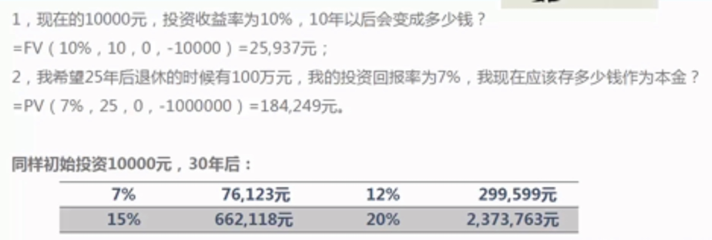
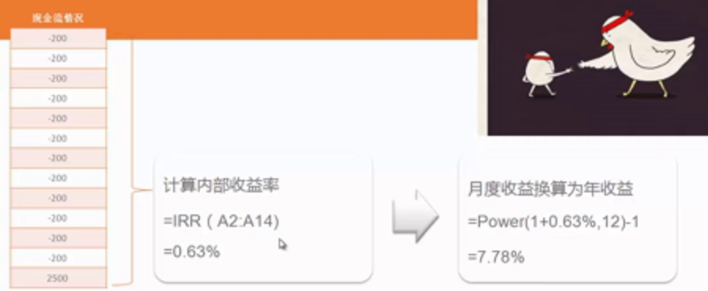
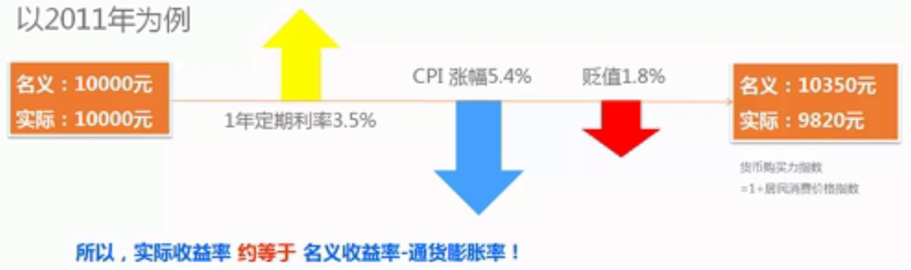
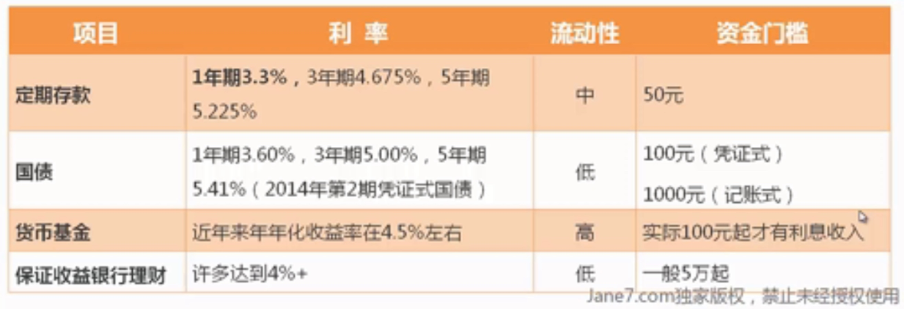
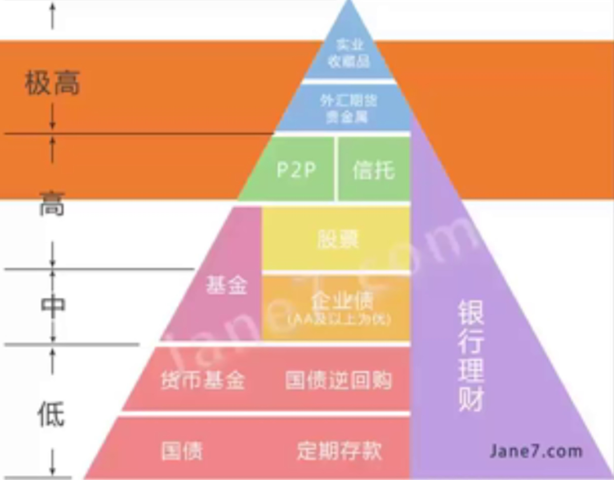
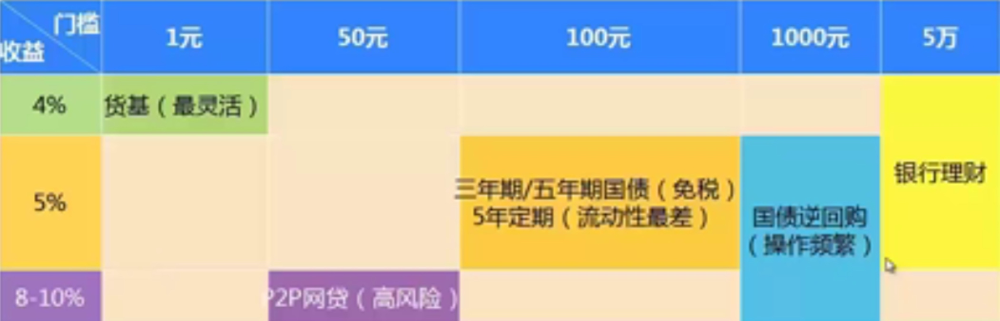
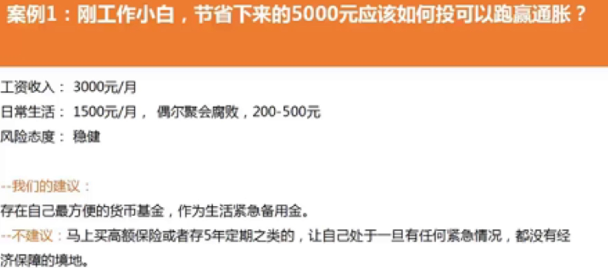
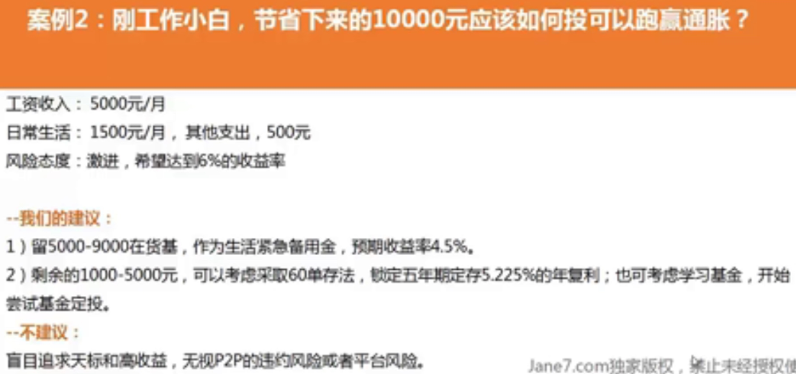
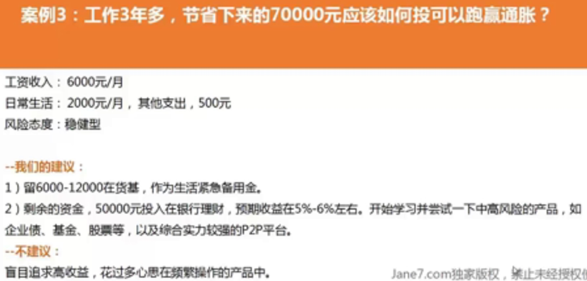

## 理财工具 
**高收益 高风险**

1. 增值
高风险投资：信托、期货、外汇、艺术品
中等风险投资：债券、基金、股票、房产、贵金属

2. 保值
低风险投资：银行理财、货币基金、国债

3. 保障
保险规划
现金计划 

## 支出分类
必要支出 50%
财务储蓄 20%
非必要支出 30%

## 用钱的顺序
不懂的东西不要随便碰。别拿自己的血汗钱开玩笑

## 记账
### 凭证类型
收
支
转：借贷或者信用卡都属于转，只要没有增加减少净资产，就记为转
### 月末分析
* 消费比率=月支出/月收入\*100%。  
主要反映财务收支情况是否合理，控制在40%-60%
* 紧急预备金倍数=现金及现金等价物/最近3个月支出平均金额\*100%  
一般不小于3倍，反映流动资产可以满足未来三个月的开支，对于工作稳定或者收入有保障的家庭，倍数可以较低，可把流动资产投入到收益较高的市场
* 偿债能力=每月偿还债务支出/每月固定收入  
又称债务偿还收入比例，不应超过36%，就是说准备按揭购房购车时，应将月供控制在自己月收入的三分之一以内。

## 储蓄的策略
* 发工资第一时间将10%的收入拨到另一个账户（养鹅账户）
* 将加薪部分的50%转到养鹅账户
* 永远不要动养鹅账户里的钱
* 如果有要买的大件（房、车、旅行），再建立一个梦想账户

### 强制储存
方法一：定存12单/60单发
从第一个月连续每个月都定存一笔钱，连续12个月后，到明年的同一个月，就有了第一笔存款的本金和利息，这时，再存入一笔钱，和到期的这笔钱一起滚动存储，类推，既保证了流动性，又可以享受一年期的定期利率（3.3%左右）。

方法二：货币基金
超灵活，收益高于一年定期，4.5%左右，无法强制存储。钱荒时（季末，年中（6月末），年末）导致收益飙高，到6%左右。
去哪里了解？ 晨星网，看半年、一年内收益水平排名，在前10前5，赎回方便（秒到）
哪里购买？ 银行柜台、网银，不推荐。基金公司网站。基金代销网站：现金宝，钱大掌柜（兴业银行），余额宝，微信理财通，

## 复利
> 单利：本金不变，利不生利
> 复利：每期结束产生的利息变成下期的本金，利滚利
> 日复利：余额宝、汇添富现金宝、华夏活期通
> 月复利：一般的货币基金
> 年复利：一年期定期存款
> 三、五年的银行定期存款，是单利计息 

计算复利

PV（present value）：现值，2034年的十万，相当于2014年的多少钱。（算现值）
FV：终值，2014年的十万，相当于2034年的多少钱
PMT：年金，现在开始存钱，每个月存多少钱，30年后我会有多少钱

例：

## 收益率
> 投资收入-投资成本=投资收益
> 投资收益/投资成本*100%=收益率

对于货币基金（例如余额宝）只有两个指标：万份收益和七日年化收益率。时间都太短，应该查近半年一年的数据。
> 万份收益：一万块投进去，当天会有多少收益。是昨天一天的时间指标
> 七日年化收益：货币基金最近7日的平均收益水平，进行年化后得出的收益率。是前七天的期间指标
>> 年化：
>>> 就是把日收益率、周收益率、月收益率换算成一年挣多少。注意是年化，不是年收益率。
>>> 比如某一日的万份收益率 -> 年化收益率：
>>> 某日万份收益*365/10000=年化收益率（转换后方便比较）

预测年化收益率：如果没有意外发生，根据已知信息，得到的收益率。
约定收益率。

计算我的定投收益率

12个月，没月投200，期末收益2500，计算出月利率IRR是0.63%。然后套入到Power公式，计算出年收益7.78%。

## 通货膨胀
CPI消费物价指数，代表生活成本
> 每月公布的CPI：食品、烟酒、家庭设备、医疗保健、交通通信、娱乐教育文化、衣着、居住八个大类商品和服务价格变化的加权平均数。居住不包括住房，这就是因为房价一直再涨，CPI却涨的没那么多。
> 某类商品的CPI=一组固定商品按当期价格计算的价值/一组固定商品按基期价格计算的价值。
> CPI的同比：跟上年同期比较，以上年为100计算，每个月公布的月上涨指数，今年5月和去年5月
> CPI的环比：跟上个月比较，以上月为100计算

实际收益率≈名义收益率-通货膨胀率

2011年CPI=5.4%，很高。
2012年CPI=2.6%
2013年CPI=2.6%

## 投资
1. ***不亏钱***
2. 本金安全才是最重要的，而不是收益率

### 保本
**不要亏损**
亏损50%，需要上涨100%才能回本。
连续3次亏损50%，需要上涨10倍才能回本。

保本的产品
国家：国债
银行：定期存款，保本型银行理财
其他：货币基金（主要投资在银行间拆借，如A银行向B银行借钱）、国债逆回购等
国家、银行的保本产品，能否打败通胀？

### 货币基金
选择技巧
> 取用方便
> 安全性好
> 收益较高较稳定
> 1. 看一段较长时间的货币基金收益（至少三个月）
> 2. 市场上紧张的时候收益高，经验时间点：年中、年底、季度末
> 3. 规模大的收益好

### 保障
社保+商业保险+应急储备金（3-6个月活期以防意外）

### 投资
投资的适宜性
1. 可获取性：在基金够不够，难不难枪
2. 安全性：这个产品的投资风险，我能不能承受
3. 收益性：赚的钱多不多
4. 流动性：我想用钱的时候，投资的钱能不能马上回来

投资金字塔

收益超过3.5%的固定收益类产品门槛和收益

案例一：5000元

案例二：10000元

案例三：70000元

## 计算
本金翻番的年限=72/利率/100

## 书
《小狗钱钱》
> 轻松，童话故事
> 理财入门
> 养鹅

《不持有的生活》
> 超出自己管理能力的物品，不持有
> 不钟爱的物品，不持有
> 无法回收利用或转送他人的物品，不持有
> 不适合自己、与自己的生活方式不相符的物品，不持有

《小家买基二三事》 [http://www.jane7.com/portal.php?mod=view&aid=87](http://www.jane7.com/portal.php?mod=view&aid=87)
> 简单、趣味的故事
> 基金入门面面观：
> 1. 什么是基金
> 2. 基金分类
> 3. 从哪买
> 4. 如何挑选基金

《小狗钱钱的爸爸叫你实现财务自由》
> 更多使用技巧
> 投资经验+自我提升

《基金定投的基础性知识》1-4
[http://www.jane7.com/forum.php?mod=viewthread&tid=152&highlight=%BB%F9%BD%F0]()
[http://www.jane7.com/forum.php?mod=viewthread&tid=153&highlight=%BB%F9%BD%F0]()
[http://www.jane7.com/forum.php?mod=viewthread&tid=154&highlight=%BB%F9%BD%F0]()
[http://www.jane7.com/forum.php?mod=viewthread&tid=155&highlight=%BB%F9%BD%F0]()

《王二的经济学故事》
王二的经济学故事，是每个人的故事
用一个虚构人物王二的故事，了解生活中方方面面与经济学之间的关系

《邻家的百万富翁》
典型案例，覆盖生活方方面面
-衣食住行
-子女教育
-理财投资
-财富积累

#### 财商启蒙
1）《小狗钱钱》迈出财务自由的第一步，从理财童话开始。适合全年龄段阅读。
2）《穷爸爸，富爸爸》一代人的理财启蒙书。罗伯特·清崎列出财务自由必备的四项技能：会计、投资、市场营销、法律知识。
3）《The Richest Man in Babylon》乔治·克拉森的“巴比伦富翁”系列风靡欧美，翻译过来有很多版本。
4）《邻家的百万富翁》从统计数据中总结出富人共同拥有的习惯，强调了节俭的重要性。
5）《苏黎世投机定律》没有人能靠打工赚取薪水而致富，敢于冒风险的人才有大作为。练武术之前要学会挨打，想通过投机发财先要学会风险管理。
6）《The Millionaire Fastlane（百万富翁快车道）》作者认为创业比投资复利能更快实现财务自由，很多观念具有颠覆性。目前只有英文版。

#### 投资工具入门
1）《银行行长不轻易说的理财经》用接地气的语言介绍各种理财工具，末章理财规划案例是一大亮点。适合上班族小白。
2）《解读基金：我的投资观和实践》基金入门代表作，基友们的最爱。
3）《股市操练大全》共8册。从K线、量价、均线等基础知识教起，零基础股民可参考。看完这套书，技术分析派向左，价值投资者向右。
4）《史丹·温斯坦称傲牛熊市的秘密》相对靠谱的一本技术分析书籍，核心思路是利用简单技术指标，判断价格运行的可能阶段进行长线投机。据说这套系统比威廉·欧奈尔的CANSLIM法则和亚历山大·艾尔德的三重滤网更实用。
5）《可转债投资魔法书》有想了解可转债的不妨一读。
6）《分级基金与投资策略》系统化介绍分级基金的一本书。

#### 经济、金融、商业入门
1）《人人都爱经济学》内容平实的经济学通俗读物。作者另有一本姐妹篇《写给中国人的经济学》，书后附经济学进阶书目。
2）《七天读懂宏观经济》哈佛商学院课程讲义改编。没有复杂的公式和函数，宏观经济学的脉络被梳理得清晰易懂。
3）《果壳里的金融学》手把手教你用EXCEL计算现金流贴现，债券久期、凸性等金融模型，文科生看起来会有点累。
4）《竞争战略》"波特五力模型"经常用作企业定性分析。作者是20世纪国际商学界三大师之一迈克尔·波特（另外两位是彼得·德鲁克、菲利普·科特勒）
5）《巴伦金融投资词典》目前最好的中英双解金融词典。
（一个视频：【合集】10分钟速成课：经济学【预告+全35集+花絮】http://www.bilibili.com/video/av5525125/）

#### 会计学基础
1）《听故事学会计》会计入门书的代表作，描述了一个企业（卖柠檬汁）完整的运营过程，适合纯小白。
2）《财务智慧》用最简洁的语言把重要知识讲明白，就像一条线，把知识点全部串连起来，巩固之前学的知识。
3）《明明白白看年报》通过阅读财报掌握基本面分析。注意！如果没有一定的会计基本功，直接啃财报书绝对会晕。
4）《财报就像一本故事书》台湾人写的书，通过财务报表理解企业竞争力，活学活用。
5）《轻松读财报》日本“理财天后”胜间和代的著作，说实话比上面的深一些。
6）《挖出财报中的秘密》亮点是讲三大报表之间的关系，教你跳出局部、用整体眼光把握财报。其余部分基础知识都是老生常谈，可略过。

#### 投资基本理念
1）《漫步华尔街》投资入门的经典之作，也是众多民间高手的启蒙书。散户想长期稳定盈利的方法只有一个：买入指数基金，并一直持有。全书主要就讲了这么一件事。
2）《投资者未来》用统计数据证明，股票的长期投资收益最好。书中对于“低预期（市盈率）、高增长率、高股利”公司特别重视。
3）《学会估值，轻松投资》这本书教你如何估值，简单易学，适合对数学头疼的人。

#### 价值投资入门
1）《股市真规则》最系统阐述价值投资的书籍，价投入门书。
2）《巴菲特的护城河》将巴菲特的“经济护城河”理论划分成四种类型进行系统性阐述。最好和上一本结合起来读。
3）《股市稳赚》书中介绍了一个“神奇公式”，通过基本面筛选出既好又便宜的股票。
4）《投资最重要的事》总结了关于股票投资最重要的18个要点，属于纯理念或哲学层面的内容，没有谈到任何操作层面的问题。巴菲特说自己看了两遍。

#### 大师著作
1）《股票作手回忆录》（寰宇出版）描写“投机天才”利弗莫尔操盘生涯的小说体传记，不仅阐明了交易的本质和精髓，还有一套完整的“坐庄”手法。繁体版推荐台译本（附有插图和专访）；简体版推荐丁圣元译本（最全面、专业水平好）
2）《聪明的投资者（第4版）》一代宗师格雷厄姆专门为业余投资者所著，科普版的《证券分析》，价值投资者眼中的“圣经”。巴菲特为该版撰写序言和评论。
3）《怎样选择成长股》公司定性分析指南。巴菲特说他的投资哲学是“85%格雷厄姆加15%费雪”。此书中译本质量较差，建议读英文原版。
4）《彼得·林奇的成功投资》了解彼得·林奇的第一本书，译者刘建位是中国数一数二的巴菲特研究专家。
5）《战胜华尔街》上一本书讲的是方法，这一本书讲的是实例。 推荐上海财经大学版。
6）《戴维斯王朝》戴维斯家族祖孙三代在华尔街投资的历史，著名的“戴维斯双击”效应发明者。
7）《邓普顿教你逆向投资》上个世纪最著名的逆向投资者，擅长通过基本面分析在全球范围寻找便宜货，一旦发现更便宜的目标马上更换。
8）《约翰·聂夫的成功投资》著名的低市盈率投资者，总结出七条低市盈率投资法则是全书的精华。
9）《安全边际》价投大师卡拉曼的代表作。本书出版于1991年，已绝版，且没有公开发行过中文版。
10）《机构投资的创新之路》史文森管理的耶鲁捐赠基金是校产基金中业绩最好的，他在资产配置上的操作值得普通人借鉴。

#### 巴菲特专题
1）《巴菲特传：一个美国资本家的成长》侧重写老巴的投资经历和投资思想的变化，是迄今为止最好的巴菲特传记。
2）《巴菲特写给股东的信》（财信出版）编者劳伦斯将巴菲特历年致股东信按照内容分类，读来轻松有趣、条理清楚，更便于理解。台译本翻译比较流畅。
3）《投资大家巴菲特》张志雄版，共11本，非公开出版物。除股东信以外，还搜集了大量巴菲特的演讲、访谈、股东大会问答实录，以及其他投资大师关于巴菲特的一些言论。
4）《穷查理宝典》巴菲特的黄金搭档查理·芒格的代表作。
5）《巴菲特之道（第3版）》将巴菲特思想引进中国的第一本书，国内价值投资者最早的启蒙书籍。
6）《巴菲特的投资组合》重点介绍数学计算和投资心理等方面。
7）《从牛顿、达尔文到巴菲特》介绍芒格的“格栅理论”，从六大学科的基础概念中寻找出能够运用于投资的思维方式。后改名《股票投资的大智慧》重新出版。
8）《巴菲特法则》巴菲特前儿媳所写，运用实际案例阐述价投理念的典范。
9）《价值投资：从格雷厄姆到巴菲特》分析了价值的3种源泉：资产、盈利能力、成长性。巴菲特无疑是这三方面的集大成者。
10）《巴菲特与索罗斯的投资习惯》比较两位大师的投资策略，总结出23个制胜习惯、12种评价要素、7种错误信念。

#### 华尔街风云
1）《伟大的博弈》侧重介绍华尔街的历史，属于资料翔实的鸿篇巨著。
2）《客户的游艇在哪里》刻画了华尔街的众生相，满满的美式幽默，但对外行来说很难get到槽点。
3）《说谎者的扑克牌》所罗门公司债券部门的陈年八卦，估计也只有内行能看出点门道。
4）《门口的野蛮人》用小说的形式还原当时华尔街最大的一笔收购，后被拍成同名电影。个人不太习惯这种琐碎的写法。
5）《乱世华尔街——一位华人交易员的经历》用轻松戏谑的语言带你走进华尔街，可读性比上面几本要强。

#### 行为经济学
1）《非理性繁荣》2013年诺贝尔经济学奖得主希勒代表作，书中提前预测美国互联网泡沫的破裂。
2）《非同寻常的大众幻想与群众性癫狂》介绍历史上著名的投机泡沫，不局限于金融领域。
3）《逃不开的经济周期》各种流派的经济周期理论汇总。

#### 拓展书目
1）《学习学习再学习》张志雄推荐了55本投资理财类的经典书籍，并做了较为详尽的导读。
2）《一生读书计划——经济书架》重点推介了80本经济学读物，后附参考阅读书目。  

                      