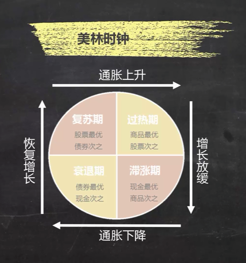
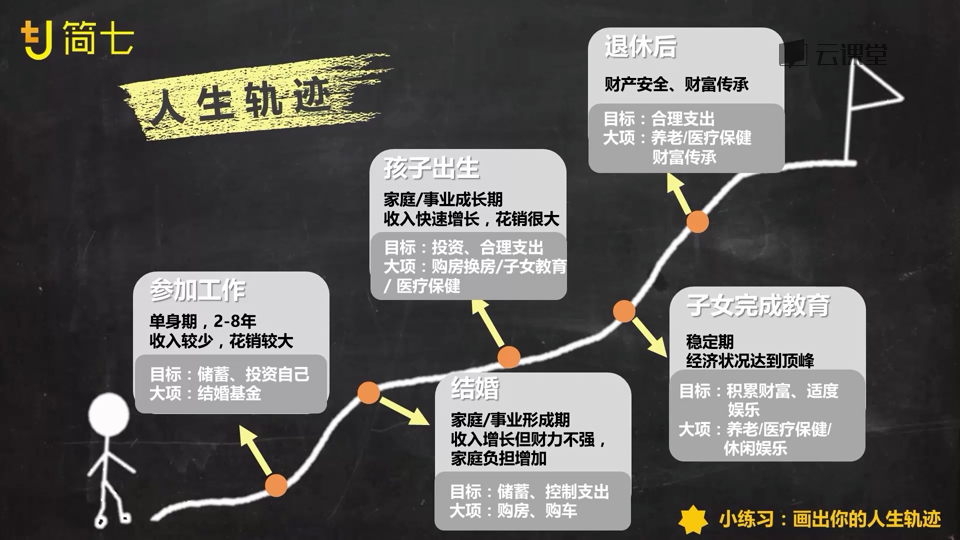
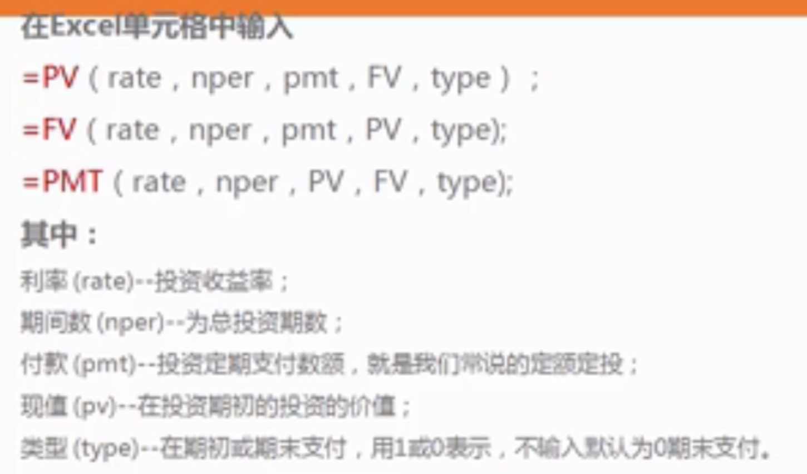
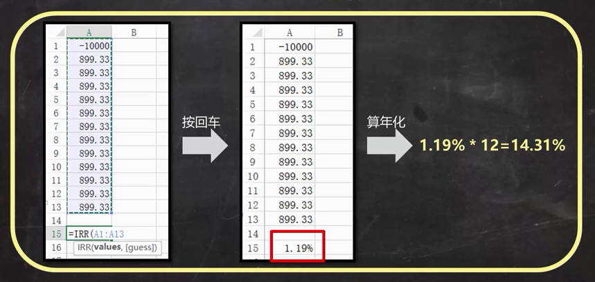
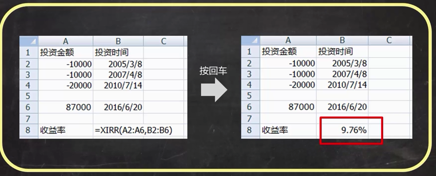
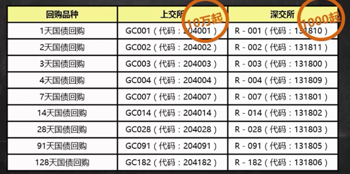

[TOC]

# 简7理财公开课
# 必知的经济指标
1.  判断经济景气度
	1.  GD0P：增速
	2. 采购经理人指数PMI：经济景气度的领先指标，大于50%说明经济在发展，小于寿命在衰退
2. 判断经济引擎：三驾马车
	1. 固定资产投资增速（投资）（厂房、道路等）：衡量固定资产总投资量的变化
	2. 社会消费品零售总额同比增速（消费）：衡量消费品（含商品和服务费）销售总额的增长。我国一直保持在10%左右
	3. 出口增速（出口）“出口量的月度变化
	4. M2：货币供应量的统计口径（基础货币+衍生货币（黄金等）），反应了经济中货币和衍生货币（信贷）的总量
3. 判断货币供应的松紧
	1. 存贷款基准利率：银行贷款利率的制定基准；越小，代表较为宽松的货币政策， 抑制存款，鼓励贷款
	2. 存款准备金率：规定各大银行在央行存放的准备金比例，直接制约银行的放贷能力；越低，越鼓励宽松信贷
4. 判断是否有通货膨胀
	1. 消费者物价指数CPI：衡量日常消费的一揽子商品和服务的价格变化，不包含放假。数字越大，表示通膨压力越大，以不超过3%为宜
	2. 工业生产者出厂价格指数PPI：衡量工业产品出厂价格总水平的变动程度

查询途径：国家统计局网  中国人民银行网站

不同经济发展阶段的资产配置

# 理财规划
## 1. 制定财务目标

 
### SMART原则——实例：买房

| 原则 | 解释 | 实例 |
|-|
|S 明确|足够明确具体|购置价值200万元房产一套|
|M 可测量|有具体的金额要求|需60万首付|
|A 可行性|实现的可行性|现有可投资资产40万，3年内每年的年收入约20万|
|R 相关性|与目标相关的方法|通过储蓄和持续投资来积攒首付|
|T 时限性|完成的时间要求|3年后攒够首付|

## 2. 清点财务：资产负债表
### 1. 资产：
1. 流动性资产：是否能够迅速变现
2. 投资性资产：未来是否会带来收益
3. 自用性资产：是否用于自己使用

### 2. 负债：
1. 消费性负债：因为消费而产生的负债
2. 投资性负债：因为投资行为而产生的负债
3. 自用性负债：因为购买一些自用性资产而产生的负债

## 3. 收入支出表：记录一段时间内的收支
### 1. 收支项目
1. 工作收入
    1. 主动收入：必须花时间去获得
    2. 被动收入：不用工作也能获得，利息、投资所得……
2. 生活支出
    1. 必要支出
    2. 非必要支出
3. 财产性收入：房产收入…
4. 财产性支出：房贷利息、消费型保险的支出……
5. 非经常性收入：意外收入，彩票
6. 非经常性害处；意外损失、事故等

  
## 4. 财务体检三大指标
### 1. 安全指标
1. 应急能力：遇到突发事件，暂时没有经济来源时，也可以维持现有生活水平
    > 检测方法：流动资产/日常必需月支出，3-6之间表示应急能力合格（能维持3-6个月）

2. 偿债能力：避免陷入债务危机
    > 检测方法：
    短期债务：流动资产/短期负债，不小于2
    中长期债务：债务/总资产，不超过总资产的50%-60%
    每月还款/月收入，不超过30%/40%
    实际借款利率，不超过10%为宜

3. 保障能力：遇到难以承受的重大风险时，能否靠现有保障维持生活水平
    > 检测方法：是否配备合适的商业保险

### 2. 成长指标
1. 储蓄能力：你的储蓄能力是否满足资产的稳步增长  
    > 检测方法：每月储蓄额/每月收入 >30%说明储蓄能力合格

2. 生息资产比例：你的投资是否能实现资产的合理增长  
    > 检测方法：投资资产/总资产 >50%说明投资增值能力合格  
    
3. 投资回报率：投资收益水平是否合格
    > 检测方法：每一年投资收益/总投资资产。新手：5%年收益就是不错的开头。巴菲特几年的平均回报率也就是20%左右。

### 3. 财富自由度：衡量离财富自由有多远
> 检测方法：被动收入/支出。若>1，说明已基本实现财务自由；应该存的钱=理想生活的花费/现有投资收益率

# 计算收益率
## 收益率RATE：PV/FV/PMT公式
已知求未知，五大要素知其四可求另一

PV（present value）：现值，2034年的十万，相当于2014年的多少钱。（算现值）
FV：终值，2014年的十万，相当于2034年的多少钱
PMT：年金，现在开始存钱，每个月存多少钱，30年后我会有多少钱

## 内部收益率：IRR公式，计算相同时间间隔的年化收益率
假如贷款10000，分12月，每月手续费0.66%，每月还本金83.33（不算手续费），看似年化手续费7.92%。实际上，输入到EXCEL，计算年化为14.31%

 

## XIRR：不同时间间隔的年化收益率
输入，注意时间格式和投资、收益的正负
 

# 投资
## 投资必知的思维框架
过去10年，80%以上的基金赚钱，大部分买基金的人却亏钱
### 是否适合投资需要：投资五维
* 收益
* 风险
* 流动性
* 费用
* 投资限制

### 三个分析角度，把复杂产品化繁为简
* 基础资产
* 具体策略
* 产品发行

## 投资前，开启4大账户
### 银行卡
> 至少需要两张银行卡，工资卡：日常消费，专门卡：投资专用。可以都绑定到网商银行，转账方便，免跨行手续费。

### 货币基金账户
> 作用：日常消费，大额还款（如房租，押一付三，每个月都存入房租），偿还信用卡（和房租一样，利用时间差做低风险活动性高的投资），存紧急预备金（3-6月工资）
    
1. 互联网平台的基金账户：余额宝，理财通（微信）等
2. 银行卡自带的货币基金

### 互联网基金账户
开设渠道：

|平台类型|费率|基金数量是否全|
|-|-|-|
|银行|手续费一般不打折|不全|
|第三方销售平台（最合适）|大部分四折，千6|比较全|
|券商|补丁，常见的千12-15，有些打折|很全|
|基金公司官网|不定，有活动时甚至全免|很全|

如何挑选第三方基金平台？

1. 证监会官网——中介机构——监管对象——合法机构名录。可下载到公开募集基金销售机构名录，只要能找到公司名称，就是有资质的。即使销售平台跑路，买基金的钱不会受影响。
2. 交易费用折扣力度，交易费用会侵蚀我们的利益！比较划算的平台：天天基金网、蚂蚁财富、好买基金网等，手续费都只要1折
3. 操作方便，满足个性化需求。智能定投（能放大收益）、回测数据、社区交流

### 股票账户
不炒股也需要股票账户，用途：

1. 购买场内基金、封闭基金
2. 国债逆回购
3. 购买债券
4. 购买券商理财产品
5. 可转债
6. 融资融券
...

选择券商：

* 交易费用：证券公司按成交额的一定比例向买卖双方都收取的费用，一般低于万三，最低五元
* 方便程度：附近有线下网点——某些业务必须线下办理（开立创业板、销户等）。交易软件体验——券商的技术实力+省心的操作，考虑操作界面是否顺手、想看的股票分析指标、账户分析指标是否都有，打新功能是不是很方便。
2016年软件体验排行与所属券商：同花顺、东方财富网、大智慧、涨乐财富通（华泰证券）、国泰君安君弘（国泰证券）、海通e海通财（海通证券）、招商智远一户通（招商证券）、金太阳（国信证券）、平安证券（平安证券）、自选股
* 服务：不同券商有不同需求。

## 投资四原色
* 现金类投资
* 债权投资
* 权益类投资
* 商品实物类投资

|~|投资产品类型|收益|风险|流动性|费用|参与门槛|学习难度|
|-|-|-|-|-|-|-|-|
|货币类|现金及等价物：短期存款、货币基金、国库券等|低|低|高|小|低|低|
|债券类|政府债券、各类公司机构债券、债券型基金、P2P等（银行理财）|中-高|中-高（借款无法按时足额偿还）|中|中|低|中|
|权益类|股票、股票型基金|高|高|中-低|中|低|高|
|商品类|房产、黄金、石油等|高|高（商品价格下跌）|低|高|高|高|

没有一个单一投资品是完美的，能满足所有的需求。学会组合这4大类不同的投资品，就会有更好的结果
从长远看，我们要实现财富的稳健增长，无法绕开股权投资

## 投资品
### 活期理财
活期理财的安全性、到账速度（流动性）、交易限制比收益更应该关注。
某些时期资产配置的策略是`现金为王`，这个现金就是货币类投资品，而不是取出来。
活期产品不只是货币基金、活期存款这种特别安全的产品，活期产品≠现金类投资。甚至P2P这种高风险的产品也是活期产品。

#### 货币基金
> 专门投资风险小的货币市场的一种开放式基金。主要是政府、银行及大型企业发型的短期产品

收益：一般大大高于银行活期存款，年化收益率在2%-3%左右
交易：方便快捷，费用低廉

技巧：
1. 金额别太少（计息规则复利计，四舍五入）
2. 看收益：七日年化收益率（近七日的平均收益率，进行年化计算得来，所以可能出现被平均）、万份收益（一万元投资当天所获得的收益）

要不要追高？
如果某基金的七日年化或者万份收益突然飙高，不抢购：不追高，因为看到的收益是过去的情况，进入的时间损失了自己的收益，有可能等到开始计算时候，往往已经恢复到正常水平

选择
建议购买规模较大（2亿以上），且过去一年、半年、3个月收益率较好、表现稳定的货币基金

购买时间
在月末、季末、年末购买。在金融机构面临**年末**考核时点比较缺点，导致短期借贷利率升高、购买这些短期融资工具的货基收益上升

不同类别的货币斤，计息时间不相同

|类型|交易时间|交易规则|
|-|-|-|
|场外开放式货币基金|随时能买卖|交易日15:00前购买，算当日买入，从接下来一个交易日开始确认份额计息；交易日15:00后买入，则算作下一交易日买入；节假日买入，算在节假日结束后第一个交易日买入；赎回则要看各家平台的规则，一般都可以当如赎回，赎回当日不计息
|场内货币基金|只有交易日才能买|不同基金有差别，一些基金交易的计息规则是算头不算尾，买入当天就计息

**Shibor指数**——上海银行间同业拆借利率：查看市场是否缺钱，上升级即缺钱，所有类型的资产都会升高。[http://www.shibor.org](http://www.shibor.org)

#### 活期理财产品
1. 银行T+0（随存随取）理财产品
    > 主要投向国债、金融债、央行票据及其他信用评级较高的、流动性较高的金融工具，风险低
    > 缺点；一般至少5万元起投门槛

    年化收益比货基高一点点

2.  券商理财产品
    > 使用股票账户投资于债券公司的理财产品。签订协议后，债券公司会自动抓取股票账户的余额，按天计息，第二天收益后资金会归还账户。缺点是非交易要等下一交易日才可提现，并且无法立即提现到银行账户，但是可以用来购买股票

3. 互联网理财产品
    > 风险逐次上升：
    > 1. 本质上依然是货币基金（京东小金库）
    > 2. 打包后的资金管理计划（众安天天盈、李金锁的富盈宝宝、零活宝），背后有更底层的理财产品，可能是保险理财、债券、股票等
    > 3. P2P
    
    > 对于不熟悉的产品，一定要看产品说明书，仔细分析底层投资品、投资比例、产品结构、发行平台

#### 进阶版现金类投资
通常年化收益率在2-4，但一些特殊时点，会飙升到10-50；投资风险低；适合有股票账户、对资金安全要求极高、有一定资金量（比如10w以上）的人

1. 国债逆回购：
    > 一种非常标准的*超短期借款*。在证券交易所的监督下， 通过证券账户把钱借给拿着国债券需要用钱的人，使用期限1、2、3、7、14、28、91、128天。
    > 安全性超强，以国债作为质押，依靠交易所完成交易
    > 平均年收益在3-4左右，比货基稍高；在市场缺钱时（比如月末、季末、年末），收益率可能飙升
    > T+0日到账，T+1日可以取现4
    > 交易步骤：上交所（上海）10万起，深交所1000起。在证券软件中搜索代码，卖出即可
    > 
    > 技巧：①周五、小长假大驾的前一天不要选择1天期，应该选择期限包含节假日的国债逆回购券；②小长假或大假倒数第二天，逆回购成交价比较高，是逆回购的好时机；③月末、季末、年末，市场资金面紧张价格通常很高，尤其是这些时间点的周四，一般会超过10%，最划算
    
2. 场内货币基金套利
    > 原理：很多基金场内场外都可交易，但是交易价格不同，场内的基金和股票一样，随着市场供求关系不断变化的，有时候高于100，有时候低于100，而场外基金交易一直都是按照100元的净值进行申购赎回。所以，如果场内基金低于100，在场内买入，再按100元确定的价格在场外赎回，就赚到了套利收益
    > 投资无手续费
    > 关键点
    > 1. 选对基金：可以场内买卖，场外申赎的基金；T+0，可以当天购买，当天卖出的基金；本身规模和流动性比较大。例如华宝添益、银华日利
    > 2. 选对券商：开户券商必须是该基金的**一级交易商**
    > 举例华宝添益：①场内搜索511990，在价格低于100时，折价买入华宝添益基金；②立刻按100元的净值，场外赎回，场外赎回的基金代码不同（511991）。

### 国债
> 国家向我们借钱，是安全性最高的投资品之一
收益率：高于同期的银行定期存款
配置：货基、银行理财、债基等常见的固定收益类产品都会配置一部分的国债

往往把短期国债利率视作市场的无风险利率
一般国债发行量较大的年份，反映国家在用积极的财务政策
也能反映人们的避险情绪，买的多很可能说明市场整体比较动荡，其他类投资品表现不佳，这时安全第一
近几年国债收益率不断下降，未来各种固定收益产品利率下降也是大势所趋

类别：

1. 凭证式国债：银行、柜台、网上银行购买。从购买之日起计息，不计复利；可提前取出，根据持有时间不同，有不同的计息方式（提前支取手续费一般为千分之一）
2. 电子储蓄式国债：银行、网上银行、购买。每年付息；半年以上才能提前提取，会按照票面利率扣掉一定天数的利息（时间越短扣除天数越多），再加上提前支取手续费千分之一。
3. 记账式国债：开通了相应业务的银行或者证券账户搜索国债代码买卖。缺点是利率不如前两种；存在买卖差价可能会有亏损；交易不活跃，流动性不是很好，可能存在卖不出去的情况。不好
4. 国债ETF基金：投资于剩余期限在4-7年的国债。优点：存量大活跃度高，分散投资管理，流动性好，买入当天就能卖出；缺点：可能亏损，风险更高。购买方式：与股票类似，证券账户搜索511010购买。投资门槛：至少1万的起购金额。

**年利率是以年为单位的总利率，而不是一年的利率，也不是年化利率**

这里
----------

# 信用卡
> 作用：
1. 消费：免息期最多50天
2. 分期：可能有分期利息
3. 提现：一定收取利息，没有免息期
附加品：
1. 卡片福利
2. 征信报告

## 选卡
1. 发卡行
    > 如无特殊偏好，选择股份制银行，如中信、浦发、招行、广发。对信用卡业务投入较多。

2. 使用需求
    > 网上消费比网下消费多，选择特殊的定制卡。通常在网上消费时有更多的积分
    > 经常有差旅需求，选择积分换里程的卡
    > 如果某类消费比较多，选择特定消费可返现金的卡。例如超时、汽车加油
    > 出国旅行，选择全币种卡

3. 持卡福利
    > 看谁家的信用卡积分更值钱。很多类别的消费不算积分，如房贷。查询网站：融360，51信用卡，飞客茶馆

## 信用卡的级别分类

| ~ |年费|额度|服务|用户|
|-|-|-|-|-|
|普卡|一般可用过消费免除|一般额度<=5w|积分、消费福利等|普通用户|
|金卡|同上|一般额度<=10w|常规+额外福利|同上
|白金卡|通常不可免，千元以上|一般5w起，额度不等|多样额外福利|中高端用户|
|黑卡|年费高|超高额/无限额|定制化服务|高端用户|
额度与月收入、职业等，及银行风控政策有关

## 影响办卡的因素
是否具有稳定生活：婚姻状况、家庭住址
是否具有较好的收入：公司固定电话、年收入
是否具有良好的还款意识：信用记录、他行信用卡

## 办卡小技巧
1. 选择自己工资卡所在银行的信用卡，通过率较高
2. 提供相关的资产证明

## 办卡被拒的可能原因
1. 征信逾期
2. 审核电话无人接听
3. 工作行业不符

## 额度
> 授信额度：你能够最多消费多少钱。
> 临时授信额度：过节临时提升额度
> 不免息的授信额度：超限后没有免息期直接开始扣除利息
> 综合授信额度：一家银行的所有卡额度是共享的
> 最低还款额：通常不低于当期透支金额的10%，或者各家银行的规定。**未及时还款时按本月欠款的全额收取利息，每一笔消费从刷卡日开始计算利息**

## 日期
1. 账单日：发卡银行每月会定期对你的信用卡账户当前发生的各项交易，费用等进行汇总结算，并结算利息，计算你当期总欠款额和最小还款额，并未你邮寄对账单。此日期即为你信用卡的账单日（账单日开始新一期的计费，最晚在下个还款日还款。所以，消费，尤其是大额消费，选择账单日刚结束后进行，免息期最长。一年有一次修改账单日的机会）
2. 还款日：还上一个账单周期的最后期限日
3. 免息期：前一个账单日后一天算起，到还款日截止

## 费用

## 技巧
1. 每刷完一笔，将等额现金转入货币基金等活期账户
2. 尽量通过还款提醒来手动还款，而不是信用卡自动还款

  [1]: ./images/1508775384555.jpg "1508775384555.jpg"
