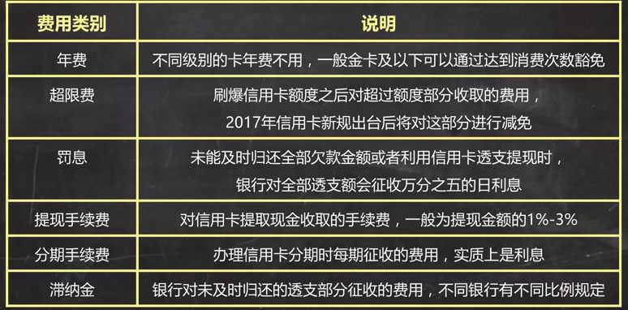

[TOC]

# 简7理财公开课
# 必知的经济指标
1.  判断经济景气度
	1.  GD0P：增速
	2. 采购经理人指数PMI：经济景气度的领先指标，大于50%说明经济在发展，小于寿命在衰退
2. 判断经济引擎：三驾马车
	1. 固定资产投资增速（投资）（厂房、道路等）：衡量固定资产总投资量的变化
	2. 社会消费品零售总额同比增速（消费）：衡量消费品（含商品和服务费）销售总额的增长。我国一直保持在10%左右
	3. 出口增速（出口）“出口量的月度变化
	4. M2：货币供应量的统计口径（基础货币+衍生货币（黄金等）），反应了经济中货币和衍生货币（信贷）的总量
3. 判断货币供应的松紧
	1. 存贷款基准利率：银行贷款利率的制定基准；越小，代表较为宽松的货币政策， 抑制存款，鼓励贷款
	2. 存款准备金率：规定各大银行在央行存放的准备金比例，直接制约银行的放贷能力；越低，越鼓励宽松信贷
4. 判断是否有通货膨胀
	1. 消费者物价指数CPI：衡量日常消费的一揽子商品和服务的价格变化，不包含放假。数字越大，表示通膨压力越大，以不超过3%为宜
	2. 工业生产者出厂价格指数PPI：衡量工业产品出厂价格总水平的变动程度

查询途径：国家统计局网  中国人民银行网站

不同经济发展阶段的资产配置

# 理财规划
## 1. 制定财务目标

 
### SMART原则——实例：买房

| 原则 | 解释 | 实例 |
|-|
|S 明确|足够明确具体|购置价值200万元房产一套|
|M 可测量|有具体的金额要求|需60万首付|
|A 可行性|实现的可行性|现有可投资资产40万，3年内每年的年收入约20万|
|R 相关性|与目标相关的方法|通过储蓄和持续投资来积攒首付|
|T 时限性|完成的时间要求|3年后攒够首付|

## 2. 清点财务：资产负债表
### 1. 资产：
1. 流动性资产：是否能够迅速变现
2. 投资性资产：未来是否会带来收益
3. 自用性资产：是否用于自己使用

### 2. 负债：
1. 消费性负债：因为消费而产生的负债
2. 投资性负债：因为投资行为而产生的负债
3. 自用性负债：因为购买一些自用性资产而产生的负债

## 3. 收入支出表：记录一段时间内的收支
### 1. 收支项目
1. 工作收入
    1. 主动收入：必须花时间去获得
    2. 被动收入：不用工作也能获得，利息、投资所得……
2. 生活支出
    1. 必要支出
    2. 非必要支出
3. 财产性收入：房产收入…
4. 财产性支出：房贷利息、消费型保险的支出……
5. 非经常性收入：意外收入，彩票
6. 非经常性害处；意外损失、事故等

  
## 4. 财务体检三大指标
### 1. 安全指标
1. 应急能力：遇到突发事件，暂时没有经济来源时，也可以维持现有生活水平
    > 检测方法：流动资产/日常必需月支出，3-6之间表示应急能力合格（能维持3-6个月）

2. 偿债能力：避免陷入债务危机
    > 检测方法：
    短期债务：流动资产/短期负债，不小于2
    中长期债务：债务/总资产，不超过总资产的50%-60%
    每月还款/月收入，不超过30%/40%
    实际借款利率，不超过10%为宜

3. 保障能力：遇到难以承受的重大风险时，能否靠现有保障维持生活水平
    > 检测方法：是否配备合适的商业保险

### 2. 成长指标
1. 储蓄能力：你的储蓄能力是否满足资产的稳步增长  
    > 检测方法：每月储蓄额/每月收入 >30%说明储蓄能力合格

2. 生息资产比例：你的投资是否能实现资产的合理增长  
    > 检测方法：投资资产/总资产 >50%说明投资增值能力合格  
    
3. 投资回报率：投资收益水平是否合格
    > 检测方法：每一年投资收益/总投资资产。新手：5%年收益就是不错的开头。巴菲特几年的平均回报率也就是20%左右。

### 3. 财富自由度：衡量离财富自由有多远
> 检测方法：被动收入/支出。若>1，说明已基本实现财务自由；应该存的钱=理想生活的花费/现有投资收益率

# EXCEL计算
## 收益率RATE：PV/FV/PMT公式
已知求未知，五大要素知其四可求另一

PV（present value）：现值，2034年的十万，相当于2014年的多少钱。（算现值）
FV：终值，2014年的十万，相当于2034年的多少钱
PMT：年金，现在开始存钱，每个月存多少钱，30年后我会有多少钱

## 内部收益率：IRR公式，计算相同时间间隔的年化收益率
假如贷款10000，分12月，每月手续费0.66%，每月还本金83.33（不算手续费），看似年化手续费7.92%。实际上，输入到EXCEL，计算年化为14.31%

 

## XIRR：不同时间间隔的年化收益率
输入，注意时间格式和投资、收益的正负
 

这里
----------

# 信用卡
> 作用：
1. 消费：免息期最多50天
2. 分期：可能有分期利息
3. 提现：一定收取利息，没有免息期
附加品：
1. 卡片福利
2. 征信报告

## 选卡
1. 发卡行
    > 如无特殊偏好，选择股份制银行，如中信、浦发、招行、广发。对信用卡业务投入较多。

2. 使用需求
    > 网上消费比网下消费多，选择特殊的定制卡。通常在网上消费时有更多的积分
    > 经常有差旅需求，选择积分换里程的卡
    > 如果某类消费比较多，选择特定消费可返现金的卡。例如超时、汽车加油
    > 出国旅行，选择全币种卡

3. 持卡福利
    > 看谁家的信用卡积分更值钱。很多类别的消费不算积分，如房贷。查询网站：融360，51信用卡，飞客茶馆

## 信用卡的级别分类
| ~ |年费|额度|服务|用户|
|-|
|普卡|一般可用过消费免除|一般额度<=5w|积分、消费福利等|普通用户|
|金卡|同上|一般额度<=10w|常规+额外福利|同上
|白金卡|通常不可免，千元以上|一般5w起，额度不等|多样额外福利|中高端用户|
|黑卡|年费高|超高额/无限额|定制化服务|高端用户|
额度与月收入、职业等，及银行风控政策有关

## 影响办卡的因素
是否具有稳定生活：婚姻状况、家庭住址
是否具有较好的收入：公司固定电话、年收入
是否具有良好的还款意识：信用记录、他行信用卡

## 办卡小技巧
1. 选择自己工资卡所在银行的信用卡，通过率较高
2. 提供相关的资产证明

## 办卡被拒的可能原因
1. 征信逾期
2. 审核电话无人接听
3. 工作行业不符

## 额度
> 授信额度：你能够最多消费多少钱。
> 临时授信额度：过节临时提升额度
> 不免息的授信额度：超限后没有免息期直接开始扣除利息
> 综合授信额度：一家银行的所有卡额度是共享的
> 最低还款额：通常不低于当期透支金额的10%，或者各家银行的规定。**未及时还款时按本月欠款的全额收取利息，每一笔消费从刷卡日开始计算利息**

## 日期
1. 账单日：发卡银行每月会定期对你的信用卡账户当前发生的各项交易，费用等进行汇总结算，并结算利息，计算你当期总欠款额和最小还款额，并未你邮寄对账单。此日期即为你信用卡的账单日（账单日开始新一期的计费，最晚在下个还款日还款。所以，消费，尤其是大额消费，选择账单日刚结束后进行，免息期最长。一年有一次修改账单日的机会）
2. 还款日：还上一个账单周期的最后期限日
3. 免息期：前一个账单日后一天算起，到还款日截止

## 费用

## 技巧
1. 每刷完一笔，将等额现金转入货币基金等活期账户
2. 尽量通过还款提醒来手动还款，而不是信用卡自动还款

  [1]: ./images/1508775384555.jpg "1508775384555.jpg"
