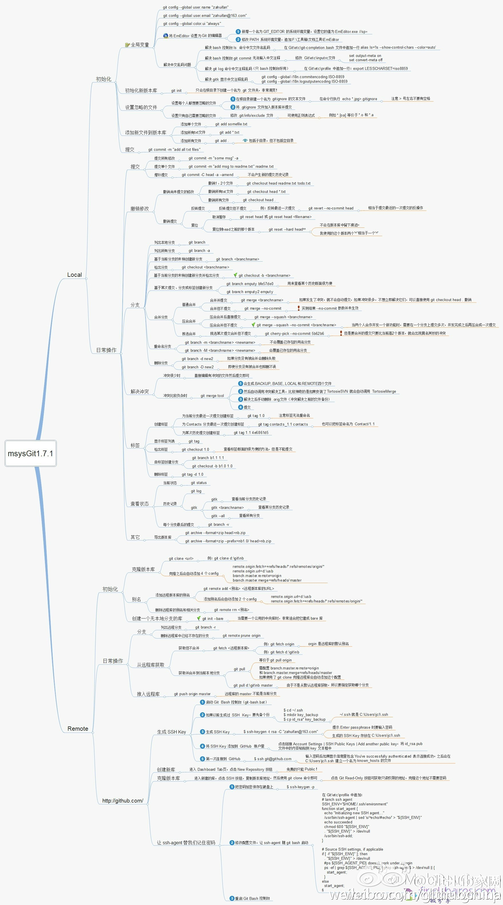

# Git



# 根据commit创建分支
```
git checkout -b <branch-name>  <commit-id>
```

#上传分支
```
git push  origin  api:api2
```
本地api分支上传到远程的api2分支

# 从本地上传一个新的github项目
git remote add origin https://github.com/huowenxuan/***.git
git push -u origin master


