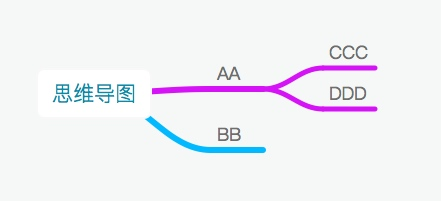

[TOC]
# 思维导图

## 软件

### MindNode
* 平台：mac、iOS
* 优点：美观
* 缺点：平台少

### 百度脑图
* 平台：Web
* 优点：
	1. 美观
	2. 支持几乎所有格式导入导出
	3. 操作简单
	4. 功能全面
	5. 多种主题
* 缺点：移动端不好用，无法拖拽缩放，致命缺点

### Coggle
* 平台：Web
* 优点：美观
* 缺点：
	1. 使用Google登陆
	2. 操作一般

## 在多个平台、多个软件之间编辑的一种方式
将以下思维导图从MindNode或者百度脑图中使用txt的格式导出


导出为以下文本格式，每一级用一个tab隔开
```txt
思维导图
	AA
		CCC
		DDD
	BB
```
这种格式的txt同样可以导入到思维导图软件中，在MindNode中直接粘贴就可以导入
暂时不知道手机怎么输入tab，可以输入一个*，在电脑上替换成tab


                      